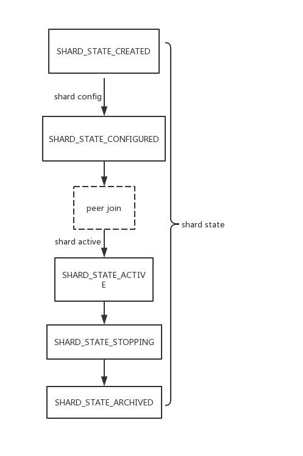
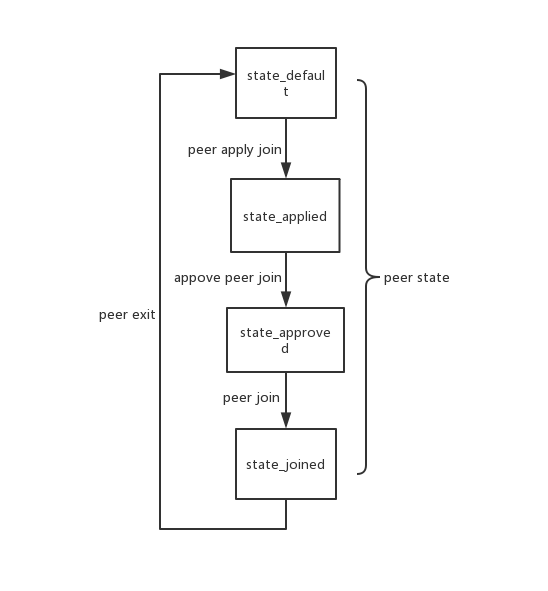

# Shard Management

## 功能

管理ShardId的分配，管理分片的注册。创建与激活。

管理分片的共识切换。

## 设计

Shardmgmt管理shard和节点，节点通过申请、审批的过程进入分片共识，节点加入、退出分片的入口均在ShardMgmt中。

### 分片状态：



### Peer状态：



### 节点状态：


### 共识切换：

1. 分片运行时发现要切换共识，首先调用NotifyRoot通知主链需要进行共识切换；
2. 如果notify失败，手动调用NotifyRoot通知主链分片需要切换共识；
3. 主链收到通知后调用CommitDpos方法切换共识：更新配置，调用shard stake的preCommitDpos方法；
4. shard stake的PreCommitDpos会将共识的view加一并且为这个shard上锁，禁止所有影响和依赖共识信息的操作；
5. 执行完之后，shardmgmt通知分片可以切换共识；
6. 如果通知失败，直接调用notifyShardCommitDpos，通知分片切换共识；
7. 分片收到通知后进行共识切换，将手续费从分片发送到主链上的shard stake合约里，然后通知主链上的shard stake合约可以分账了，通知携带shard的高度和block hash，并且将这些信息保存到db里；
8. 如果通知失败，可以调用shardRetryCommitDPos重新执行分片切共识；
9. shard stake收到通知后，更新每个节点的手续费信息及相应的共识质押信息。

步骤5完成之后，分片可以拿到新的配置；步骤9做完之后，主链也切完了分片的共识；步骤4到步骤9，shard stake会在合约内锁定相应的分片，参考[shard stake共识切换逻辑](shard_stake.md#共识切换逻辑)。


## 实现

### ShardMGMT Init

init方法做的是初始化global shard state和root shard state，即主链。

#### 处理过程

1. 鉴定权限，只有admin能够调用init；
2. 检查version，以此检查是否已经init了；
3. 没有init就设置version，设置global shard state和root shard state。

### Create Shard

创建分片，创建的分片的shard id由global state分配。

#### 参数

```
type CreateShardParam struct {
	ParentShardID types.ShardID
	Creator       common.Address
}
```

#### 处理过程

1. 取global state，生成shard id，更新global state；
2. 保存新的shard state；
3. 从creator的账户中扣除分片创建的手续费；
4. 调用shard stake的initShard方法；
5. 推出ShardCreateEvent；
6. chainMgr做相应处理。

#### CreateShardEvent

```
type CreateShardEvent struct {
	SourceShardID types.ShardID
	Height        uint32
	NewShardID    types.ShardID
}
```

### Config Shard

配置分片，将VBFT配置存入区块；

#### 参数

```
type ConfigShardParam struct {
	ShardID           types.ShardID
	NetworkMin        uint32
	StakeAssetAddress common.Address
	GasAssetAddress   common.Address
	GasPrice          uint64
	GasLimit          uint64
	VbftConfigData    []byte
}
```

#### 处理过程

1. 参数检查，调用权限检查；
2. 验证配置；
3. 将配置保存到shard state；
4. 调用ShardStake的SetMinStake方法，设置节点得最小质押值；
5. 更新shard state；
7. 推出ConfigShardEvent；
8. ChainMgr收到event后做相应处理；

#### ConfigShardEvent

```
type ConfigShardEvent struct {
	ImplSourceTargetShardID
	Height uint32      
	Config *ShardConfig
}
``` 

### Peer Apply Join Shard

申请加入分片的共识，成为共识节点或者候选节点。

分片的共识、候选节点必须是主链的共识或者候选节点。

#### 参数

```
type ApplyJoinShardParam struct {
	ShardId    types.ShardID
	PeerOwner  common.Address
	PeerPubKey string
}
```

#### 处理过程

1. 验证PeerOwner调用；
2. 验证peer是否已经加入了主链的共识，如果没有，不允许参与分片的共识；
3. 更新peer的状态为applied；

###  Approve Peer Join

由分片的creator审批peer可以加入分片共识。

#### 参数

```
type ApproveJoinShardParam struct {
	ShardId    types.ShardID
	PeerPubKey []string
}
```

#### 处理过程

1. 验证是creator调用；
2. 对审批的peer逐个验证，如果状态是applied，则将其状态更新为approved；
3. 如果有peer的状态不是applied，直接返回error；

### Peer Join Shard

审批通过之后，peer可以加入分片共识；加入时需要质押一定数量的token，可能是ONT，也可能是其他资产。

#### 参数

```
type JoinShardParam struct {
	ShardID     types.ShardID
	IpAddress   string
	PeerOwner   common.Address
	PeerPubKey  string
	StakeAmount uint64
}
```

#### 处理过程

1. 验证peer的状态，如果不是approved，直接返回error，否则更新状态为joined；
2. 验证peer在主链上质押的金额要大于stakeAmount，否则返回error；
3. 检查peer是否已经加入了，已经加入则返回error；
4. 将peer的质押信息更新到shard state中；
5. 调用ShardStake的PeerInitStake方法，记录相关信息；
6. 推出PeerJoinShardEvent；
7. chainMgr做相应处理。

#### PeerJoinShardEvent

```
type PeerJoinShardEvent struct {
	ImplSourceTargetShardID
	Height     uint32 `json:"height"`
	PeerPubKey string `json:"peer_pub_key"`
}
```

### Peer Exit Shard

节点退出分片共识，共识节点退出需经历两个共识周期，候选节点退出需经历一个共识周期。

#### 参数

```
type ExitShardParam struct {
	ShardId    types.ShardID
	PeerOwner  common.Address
	PeerPubKey string
}
```

#### 处理过程

1. 验证调用者是peer的owner；
2. 调用ShardStake的PeerExit方法；
3. 设置节点类型，如果节点是共识节点，则将类型设置为QUIT_CONSENSUS_NODE，如果节点是候选节点，则将类型设置为QUITING_CONSENSUS_NODE；
4. 更新节点状态到shard state里。

### Activate Shard

激活shard。

#### 参数

```
type ActivateShardParam struct {
	ShardID types.ShardID
}
```

#### 处理过程

1. 验证调用者是shard的creator；
2. 验证shard state；
3. 将加入的peer区分为共识和候选；
4. 将共识和候选等质押信息更新到shard的config中；
5. 更新shard state；
6. 推出ShardActiveEvent；
7. ChainMgr收到event之后，检测自己是否在shard的peer中，如果在，则启动相应的shard进程。

### Notify Shard Commit Dpos

通知主链分片要切共识。由分片共识模块自动调用。如果发现自动调用后主链失败了，则手动调用该方法重新通知主链。

#### 参数

无

#### 处理过程

notify调用主链上的ShardMgmt的CommitDpos方法。

### Commit Dpos

主链上切分片共识，供ShardMgmt的NotifyShardCommitDpos方法跨分片通知调用。

处理节点退出：将QUIT_CONSENSUS_NODE设置为QUITING_CONSENSUS_NODE，删除QUITING_CONSENSUS_NODE；

更新配置；

调用ShardStake的PreCommitDpos方法；

通知分片配置更新完成。

#### 参数

```
    ShardID   types.ShardID
```

#### 处理过程

1. 验证调用条件；
2. 读取shard state；
3. 对shard state的peer做处理，做节点退出处理；
4. 如果有节点推出，调用ShardStake的PeerExit方法；
5. 读取shard stake的质押信息，更新shard state的配置；
6. 调用shard stake的PreCommitDpos方法；
7. 保存更新之后的shardstate；
8. notify调用分片的ShardCommitDpos。

### Notify Shard Commit Dpos

在主链上切换分片共识后，如果通知分片切换共识失败，则手动调用此方法，通知分片切换共识。

#### 参数

```
    ShardID   types.ShardID
```
#### 处理过程

1. 验证只有分片的creator能调用；
2. 通知分片切换共识。

### Shard Commit Dpos

分片切共识，根据主链的通知，将当前轮共识的手续费发送到主链，同时调用主链上的shard stake的CommitDpos方法。

#### 参数

无

#### 处理过程

1. 调用shard asset的XShardTransferOng将手续费发送到主链的shard stake合约里；
2. 跨分片调用主链上的shard stake的CommitDpos方法；
3. 将跨分片转移ONG的transferId和调用shard stake的height、hash以及feeAmount保存起来，供Shard retry commit Dpos使用；

### Shard Retry Commit Dpos

当Shard Commit Dpos 失败时，调用此方法重试。

#### 参数

无

#### 处理过程

1. 读取上次Shard Commit Dpos时保存的信息；
2. 使用读取出来的transferId调用shard asset的重试跨分片转移ONG；
3. 使用读取出来的feeAmount，height，hash通知调用主链上的shard stake的CommitDPos方法。