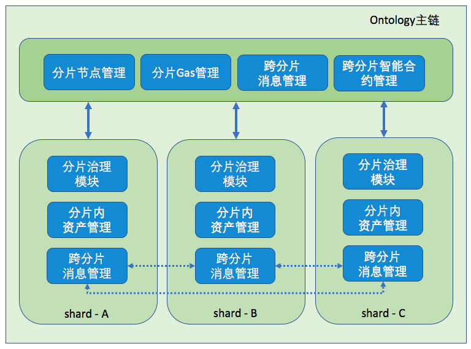
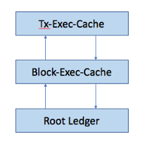

# Ontology XShard

Ontology分片节点框架如下：

所有分片节点都是Ontology root shard节点，参与root shard同步，
在root shard基础上参与各个分片中。

* 节点中每个分片，通过event bus与root shard通信。
* 分片间通过跨分片Merkle消息队列通信

# Transaction Processing

shard区块组成：

* parent block height/hash
* msgs from remote shard
* tx in shard

shard中处理事务流程如下：

1. shard同步root区块
2. shard执行区块
    1. 首先执行root区块
    2. 处理root区块中事件消息
    3. 处理其它shard的事件消息
    4. 处理shard内部的事务
3. shard将整个账本的hash root进入下一轮共识
4. 共识确认账本一致（root账本一致，shard账本一致）

对于root区块中的事件消息：
   root区块中的事件消息，封装到统一TX中
   root区块更新时，添加ROOT_TX交易到shard区块中，作为第一个交易

## Notify from root to shard

由于Shard中会自动执行root shard中的所有区块，即root shard中的所有交易将在所有shard中执行，root shard中生成的notification也在shard中自动生成。

因此有两种root-> shard的通知方式：

1. 当前方式

	1. root中的event notification将自动触发对root chainmgr的通知
	2. root chainmgr构建事件通知，通过eventbus通知到shard
	3. shard chainmgr收集root中通知的消息
	4. shard共识从shard chainmgr中提取其他shard的消息，打包到区块
	
2. shard内部自动处理方式

	1. shard基于root shard账本，执行root shard的区块
	2. root shard区块执行过程中触发对shard的事件通知，如果是对当前shard的事件通知，缓存起来
	3. root shard区块执行结束后，处理区块中产生的所有shard相关事件
	4. 处理区块中remote shard的消息
	5. 处理区块中shard内部的交易

## Notify from shard to root

（root chain中sysmsg_q合约，由proposer将多个交易封装为一个消息的转发，由root中sysq合约处理，将消息解析为交易形式，按照正常交易形式处理跨链交易）

1. root中的区块版本升级，支持sysmsg\_q
2. shard中的区块：对blockhash的签名，对每个msg queue的Merkle root签名
3. shard中区块中签名：
	1. 节点对block hash的签名
	2. 如果msg\_q[i]中有新的消息，节点对msg\_q[i]的Merkle root的签名
	3. 节点对shard ledger hashroot的签名

root中验证sysms_q的有效性：

1. 当前sysq的状态和新的Merkle root的聚合签名，验证跨链消息的有效性
2. payer在root中的资产，只有payer在root中交易的有效签名才可以修改

    1. 如果采用notify方式的payer的支付，只能支付gas手续费（root中没有shard的资产质押余额信息），不能支付其他资产，Notify的交易应用场景？
    2. 无法判断智能合约运行是否会产生资产转移，因此shard无法向root转发跨链消息
    3. **shard只能向root转发治理相关的消息,或者说，root只接受shard发送过来的治理相关的notification**
    4. root shard不支持transactional方式的XShard调用

## Notify from shard to shard

（通过sysmsg\_q合约完成，由proposer完成交易的转发，payer为原交易的payer，gas fee验证中验证payer的gas）

shard中验证sysq的有效性
1.	当前sysq状态，和新的Merkle root的聚合签名，验证跨链消息的有效性
2.	交易执行中的支付

	1.	shard1作恶后果：
		问题：shard1可以控制payer在shard1中的所有资产，可以通过notify控制payer在其他shard中资产，
		方案：只有交易中的消息转发手续费从payer在shard1的质押中支付
	2. shard2作恶：
		问题：shard2中的notify是没有payer签名的交易，shard2借用notify交易操作payer的资产
		方案：
		1. shard2只能操作payer在shard2中质押的资产，无法将当前shard资产转移到其他shard
		2. shard2即使transaction方式只能将当前分片中的资产owner转移，无法实现资产向其他分片的转移
		3. 控制资产合约的调用 （智能合约Metadata中管理）
		4. 控制用户资产的交易额度（TBD）
	3. payer作恶：
		问题：payer通过不同分片间信息不对称，进行双花，将shard1中一份资产和多个remote shard进行资产交易
		方案：交易中所有其它支付从payer在shard2的质押中支付（与shard->root不同）
		notification方式的调用，shard只能操作payer在当前shard质押的资产无法将当前shard的资产转移到其他shard

Notify方式：

	shard1支付消息转发手续费。
	shard2只能验证payer在shard2中质押资产。
	payer只在shard1中进行了交易签名，payer在shard2中质押的资产在shard2中处理。

Transaction方式：

	shard1可以跨分片支付资产，额度限定于payer在shard1中的当前资产额度
	shard2可以跨分片支付资产，额度限定于payer在shard2中的当前资产额度

### CounterFactual

相关交易可以在主链上，或者任意其他shard上的重放。

1.	记录智能合约的所有历史交易
2.	记录智能合约的历史交易的event
3.	记录智能合约状态数据的Merkle
4.	所有跨链的消息都通过sysq进行，由Merkle提供一致性
5.	智能合约状态在不同分片间的有效性证明

目前没有有效方式控制shard的malicious行为，只有通过PoS预防 malicious shard

1. 节点在shard中质押的stake，共识周期切换后才可以提取
2. 用户在shard中质押的资产，应该远小于节点在shard中质押的stake

### Metadata of Smart Contract

所有的智能合约都部署在root shard中，包括如下管理数据：

1.	智能合约Owner，bytecode，等
2.	智能合约运行的分片
3.	智能合约的状态（deployed／activate／frozen）
4.	智能合约允许哪些分片的调用

## Settlement amoung shards

只有Transaction方式的调用会产生shard－shard间的结算。

场景：

* 资产A，由root中智能合约A管理。
* 资产B，由root中智能合约B管理。
* 用户M拥有资产A，并质押在shard1；
* 用户N拥有资产B，并质押在shard2。
* 用户M和用户N通过分片间资产交易合约XA／XB进行资产交换。

交换流程为：

* 用户M在shard1中调用合约XA，将一定份额AM质押到XA，并proposal交易比例。
* 用户N在shard2中调用合约XB，将一定份额BN质押到XB，合约XB调用XA完成资产交换。
	
通过Transaction方式，AM份额的资产A转移到用户N，用户N在shard1中拥有此资产；
BN份额的资产B转移到用户M，用户M在shard2中拥有此资产。

所有资产A仍然在shard1中，所有资产B也仍然在shard2中，只是资产的所有者发生了变化。

用户M可以在shard2中将BN份额的资产B解质押到root chain。
用户N可以在shard1中将AM份额的资产A解质押到root chain。

## Transaction Processing

一个区块的执行分为三个阶段：

1.	parent block的执行
2.	cross-shard msg的处理
3.	shard block的执行

在智能合约执行过程中，智能合约可以通过context判断当前是区块执行的阶段。

执行root的区块时，OverlayDB如下图所示。

处理XShardMsg和shard的区块时，OverlayDB如下图所示：

