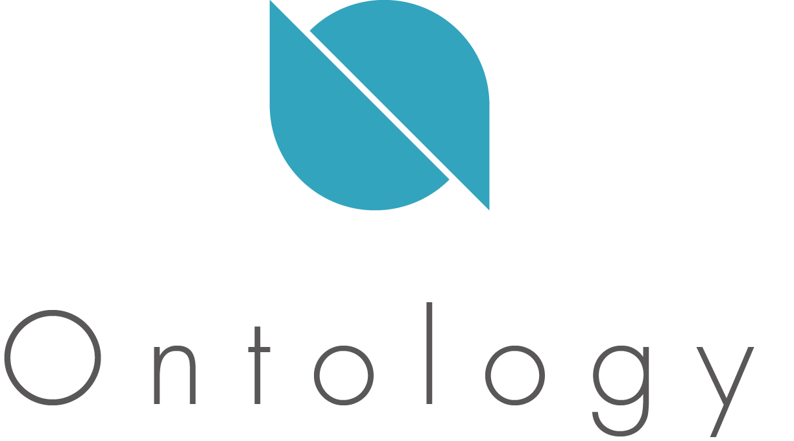

  

<h1 align="center"></h1>

  A New High-Performance Public Chain Infrastructure & Distributed Trust Collaboration Platform

---

English | [中文](/zh-CN/README.md)

## Ontology Infrastructure

- [Ontology](#Ontology)
- [Ontology WASM](#Ontology-wasm)
- [Ontology Crypto](#Ontology-crypto)
- [Ontology Eventbus](#Ontology-eventbus)
- [Ontology RPC, Restful and WebSocket](#Ontology-rpc-restful-and-websocket)
- [Ontology Oracle](#Ontology-oracle)
- [Ontology FPGA](#Ontology-fpga)

## Ontology Protocols and SDK

- [Ontology DID](#Ontology-did)
- [Ontology TS SDK](#Ontology-ts-sdk)
- [Ontology Go SDK](#Ontology-go-sdk)
- [Ontology Java SDK](#Ontology-java-sdk)
- [Ontology Python SDK](#Ontology-python-sdk)

## Ontology Applications

- [ONTO](#onto)
- [Ontology DDXF(Distributed Data eXchange Framework)]

---

## Ontology Documents and Resources

- Introductory White Papers
    - [English](https://ont.io/wp/Ontology-Introductory-White-Paper-EN.pdf)
    - [Chinese](https://ont.io/wp/Ontology-Introductory-White-Paper-ZH.pdf)
    - [Korean](https://ont.io/wp/Ontology-Introductory-White-Paper-KR.pdf) translated by @Sunghwan Kim
    - [Dutch](https://github.com/ontio/documentation/blob/master/nl-NL/Introductory%20White%20Paper%20-%20Dutch%20V1.pdf) translated by @Mark Westerweel
    - [Japanese](https://github.com/ontio/documentation/blob/master/jp_JP/Ontology%20Introductory%20White%20Paper%20JP.pdf) translated by @Miho Nakauchi
    - [Spanish](https://github.com/ontio/documentation/blob/master/es-ES/Introductory%20White%20Paper%20-%20Spanish.pdf) translated by @Alejandro Garcia
    - [Turkish](https://github.com/ontio/documentation/blob/master/tr_TR/Introductory%20White%20Paper%20-%20Turkish.pdf) translated by @Hakan
- Technical White Papers
    - [English](https://github.com/ontio/Documentation/blob/master/Ontology-technology-white-paper-EN.pdf)
    - [Chinese](https://ont.io/wp/Ontology-technology-white-paper-ZH.pdf)
    - [Korean](https://ont.io/wp/Ontology-technology-white-paper-KR.pdf) translated by @Sunghwan Kim
    - [Dutch](https://github.com/ontio/documentation/blob/master/nl-NL/Technology%20White%20Paper%20-%20Dutch%20V1.pdf) translated by @Mark Westerweel
    - [Japanese](https://github.com/ontio/documentation/blob/master/jp_JP/Ontology%20Technology%20White%20Paper%20JP.pdf) translated by @Miho Nakauchi
- Ecosystem White Papers
    - [English](https://ont.io/wp/Ontology-Ecosystem-White-Paper-EN.pdf)
    - [Chinese](https://ont.io/wp/Ontology-Ecosystem-White-Paper-ZH.pdf)
    - [Korean](https://ont.io/wp/Ontology-Ecosystem-White-Paper-KR.pdf) translated by @Sunghwan Kim
    - [Dutch](https://github.com/ontio/documentation/blob/master/nl-NL/Ecosystem%20White%20Paper%20-%20Dutch%20V1.pdf) translated by @Mark Westerweel
    - [Japanese](https://github.com/ontio/documentation/blob/master/jp_JP/Ontology%20Ecosystem%20White%20Paper-JP.pdf) translated by @Miho Nakauchi
- [Documentation Center](https://ontio.github.io/documentation/tutorial_for_developer_en.html)
- [OEPs](https://github.com/ontio/OEPs)

---

### Ontology [top⇈](#ontology-infrastructure)
> Ontology is dedicated to creating a modularized, freely configurable, interoperable cross-chain, high-performance, and horizontally scalable blockchain infrastructure system. Ontology makes deploying and invoking decentralized applications easier.
- [Ontology](https://github.com/ontio/ontology) - main repository

### Ontology WASM [top⇈](#ontology-infrastructure)
> Ontology WASM is a VM for ontology block chain, it can also be used for other stand-alone environment not only for block chains.
- [Ontology WASM](https://github.com/ontio/ontology-wasm) - main repository

### Ontology Crypto [top⇈](#ontology-infrastructure)
> Cryptography Library for Ontology Network.
- [Ontology Crypto](https://github.com/ontio/ontology-crypto) - main repository

### Ontology Eventbus [top⇈](#ontology-infrastructure)
> Ontology Eventbus is an actor model middleware, providing high performance communication between modules or nodes.
- [Ontology Eventbus](https://github.com/ontio/ontology-eventbus) - main repository

### Ontology RPC Restful and WebSocket [top⇈](#ontology-infrastructure)
> Ontology RPC API, Restful API and WebSocket API.
- [Ontology RPC, Restful和WebSocket](https://github.com/ontio/documentation/tree/master/ontology-API) - main repository

### Ontology Oracle [top⇈](#ontology-infrastructure)
> An oracle is a mechanism that relays real-world information to the blockchain.
- [Ontology Oracle](https://github.com/ontio/ontology-oracle-py) - main repository

### Ontology FPGA [top⇈](#ontology-infrastructure)
> Design and FPGA Implementation of Fast Signature Verification.
- [Ontology FPGA](https://github.com/ontio/ontology-fpga) - main repository

### Ontology DID [top⇈](#ontology-infrastructure)
> Ontology DID (also known as ONT ID) is a decentralized identification protocol which is based on the W3C DID specifications. It supports collaborative services such as distributed and diversified ownership confirmation, identification, and authentication of various entities including individuals, legal entities, objects, and contents. Ontology DID establishes a cryptographically-based digital identity for each entity, allowing self-sovereignty of data authorization and ownership confirmation, which makes the identity and data, assets that the user can control.
- [Ontology DID](https://github.com/ontio/ontology-DID) - main repository

### Ontology Java SDK [top⇈](#ontology-infrastructure)
> This is a comprehensive Java library for the Ontology blockchain. Currently, it supports local wallet management, digital identity management, digital asset management, deployment and invoke for Smart Contract, and communication with Ontology Blockchain. In the future it will support more rich functions and applications.
- [Ontology Java SDK](https://github.com/ontio/ontology-java-sdk) - main repository

### Ontology TS SDK [top⇈](#ontology-infrastructure)
> The project is a comprehensive TypeScript library for the Ontology blockchain. Currently, it supports local wallet management, digital identity management, digital asset management, deployment and invoking of Smart Contracts. In the future it will support more rich functions and applications.
- [Ontology TS SDK](https://github.com/ontio/ontology-ts-sdk) - main repository

### Ontology GO SDK [top⇈](#ontology-infrastructure)
> The project is a comprehensive Go library for the Ontology blockchain. Currently, it supports local wallet management, digital asset management, deployment and invoking of Smart Contracts. In the future it will support more rich functions and applications.
- [Ontology GO SDK](https://github.com/ontio/ontology-go-sdk) - main repository

### Ontology Python SDK [top⇈](#ontology-infrastructure)
> Ontology Python SDK contains five key features: an RPC interface, wallet management, digital asset management, identity management and smart contract support. The RPC interface can interact with the Ontology blockchain - including querying and sending transactions. The SDK can manages wallet files and store encrypted private keys of the asset account and identity. It can transfer ONT/ONG, check an account balance, withdraw ONT/ONG and so on. Its identity management functionality can send requests to register an Ontology DID and can receive DDO objects. The Python SDK also support constructing, deploying, and invoking a smart contract.
- [Ontology Python SDK](https://github.com/ontio/ontology-python-sdk) - main repository

### ONTO [top⇈](#ontology-infrastructure)
> ONTO is a comprehensive decentralized client product and gives users self-sovereignty of their digital identities, digital assets, etc.
- [ONTO](https://github.com/ontio/onto) - main repository

### Ontology DDXF [top⇈](#ontology-infrastructure)
> Distributed data exchange framework allows the customization of data trading marketplaces with ensured data and financial security.
- [Ontology DDXF(Distributed Data eXchange Framework)](https://github.com/ontio/ontology-ddxf) - main repository
