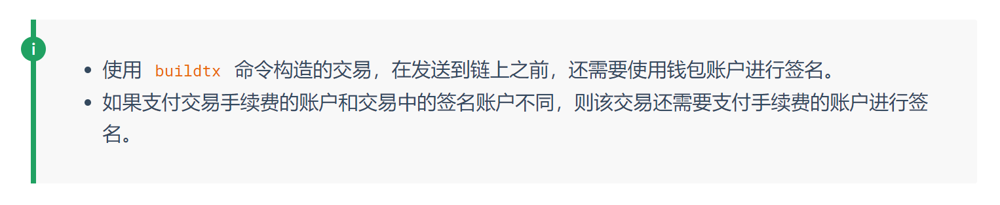
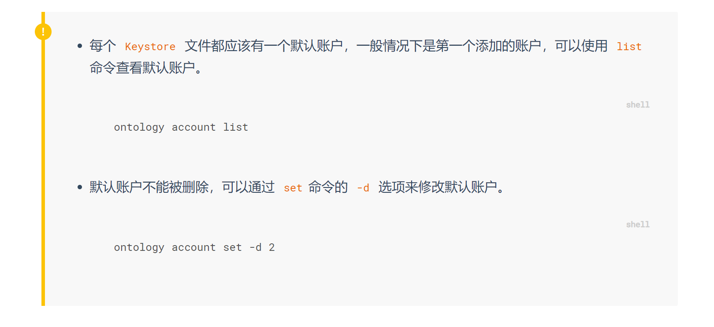
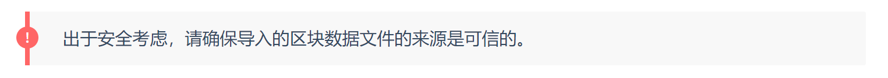

## ONT 文档规范

### 标题

标题统一左对齐，且不带编号。

一级二级标题与下级标题之间需要有解说性文字，如：

```
##安装环境

本节将带领用户完成开发环境的安装。

###安装软件
```

不同层级标题间不要使用相同文字，如避免出现以下情况：

```
##安装环境

本节将带领用户完成开发环境的安装。

###安装环境
```

### 字符

#### 标点符号

标点符号的使用需遵循中英文一致标准，避免中文文字间混用英文标点这类情况。

#### 空格

- 中文和英文字符之间需要空格，例如 ”使用 sdk“
- [链接]() 和非链接文字之间需要空格
- `代码` 和普通文字间空格

#### 代码

单行代码，命令，参数类文字使用 `代码` 样式。如果是代码片段，使用代码块样式，且设置对应语言高亮：

```markdown
```json
{
  "jsonrpc": "2.0",
  "method": "getapplicationlog",
  "params": ["0xff488264c1abf9f5c3c17ed8071f6dd3cd809b25797a43af49316490ded8fb07"],
  "id": 1
}
```
```

### 列表

#### 有序列表

只有步骤类列表用1，2，3的有序列表样式：

1. 打开冰箱
2. 把长颈鹿放进去
3. 关上冰箱

#### 无序列表

没有步骤逻辑的列表用无序列表样式，即前面带 圆点 即可。

```markdown
- 我的下一句话是假话
- 我刚刚说了一句真话
```

#### 列表嵌套

列表中嵌套列表的方式遵循前述规则，注意列表下方跟随文字，注意，表格，或图片时需要根据层级结构正确缩进，如：

```markdown
1. 打开冰箱

2. 选择一个区域把长颈鹿放进去：

   - 冷藏区

     > 注意：冷藏区只适合小长颈鹿

   - 冷冻区

3. 关上冰箱
```

### 表格

表格第一排为标题文字，加粗显示。

表格文字统一左对齐。

```markdown
| Column A | Column B | Column C |
| :------- | :------- | :------- |
| A1       | B1       | C1       |
| A2       | B2       | C2       |
| A3       | B3       | C3       |
```

### 提示类信息

#### 一般性提示信息

- 单段

```html
<p class = "info">内容</p>
```


- 多行列表

```html
<section class = "info">
  <ul>
    <li>内容 <code>代码</code> </li>
    <li>内容 <code>代码</code> </li>
  </ul>
</section>
```



#### 重要提示信息

- 单段

```html
<p class = "warning">内容</p>
```


- 多行列表

```html
<section class = "warning">
  <ul>
    <li>内容 <code>代码</code> </li>
    <li>内容 <code>代码</code> </li>
  </ul>
</section>
```



#### 警告性提示信息

- 单段

使用 HTML 标识：

```html
<p class = "note">内容</p>
```

或者使用框架的原生语法：

```markdown
!>
```



- 多行列表

```html
<section class = "note">
  <ul>
    <li>内容 <code>代码</code> </li>
    <li>内容 <code>代码</code> </li>
  </ul>
</section>
```
