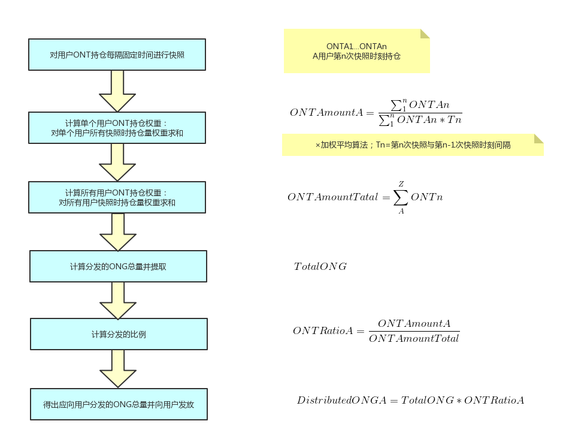

# Ontology 交易所对接文档

ONT中有两种资产：原生资产和合约资产。原生资产如ont和ong。交易所对接时，主要处理这两种类型资产的充值、提现等操作。

本文档大纲如下：

* [Ontology 交易所对接文档](#ontology-交易所对接文档)
	* [1.部署Ontology同步节点](#1部署ontology同步节点)
		* [从源码获取](#从源码获取)
		* [直接从release获取](#直接从release获取)
		* [服务器部署](#服务器部署)
			* [创建钱包](#创建钱包)
			* [启动节点](#启动节点)
	* [2. 使用CLI客户端](#2-使用cli客户端)
		* [安全策略](#安全策略)
		* [CLI说明](#cli说明)
			* [创建钱包](#创建钱包)
			* [生成充值地址等](#生成充值地址等)
	* [3. 处理资产交易](#3-处理资产交易)
		* [交易所需要开发的交易对接程序](#交易所需要开发的交易对接程序)
		* [用户充值](#用户充值)
		* [充值记录](#充值记录)
		* [处理用户提现请求](#处理用户提现请求)
	* [4. 使用Java SDK](#4-使用java-sdk)
		* [账号管理](#账号管理)
			* [不使用钱包管理：](#不使用钱包管理)
				* [随机创建账号：](#随机创建账号)
				* [根据私钥创建账号](#根据私钥创建账号)
			* [使用钱包管理：](#使用钱包管理)
		* [地址生成](#地址生成)
		* [ONT和ONG转账](#ont和ong转账)
			* [1. 初始化](#1-初始化)
			* [2. 查询](#2-查询)
				* [查询ONT，ONG余额](#查询ontong余额)
				* [查询交易是否在交易池中](#查询交易是否在交易池中)
				* [查询交易是否调用成功](#查询交易是否调用成功)
				* [其他与链交互接口列表：](#其他与链交互接口列表)
			* [3. ONT转账](#3-ont转账)
				* [构造转账交易并发送](#构造转账交易并发送)
				* [多次签名](#多次签名)
				* [一转多或多转多](#一转多或多转多)
				* [使用签名机签名](#使用签名机签名)
			* [4. ONG转账](#4-ong转账)
				* [ONG转账](#ong转账)
				* [提取ONG](#提取ong)
	* [4. 给用户分发ONG](#4-给用户分发ong)
		* [什么是ONG](#什么是ong)
		* [计算可提取的ONG总量](#计算可提取的ong总量)
		* [给用户分发ONG](#给用户分发ong)
		* [用户提取ONG](#用户提取ong)
	* [5. 签名服务](#5-签名服务)
	* [附 native 合约地址](#附-native-合约地址)
	* [附2 FAQ](#附2-faq)
	* [附3 主网及sdk更新日志](#附3-主网及sdk更新日志)


## 1.部署Ontology同步节点

部署Ontology同步节点主要有两种方式：

### 从源码获取

克隆ontology仓库到 **$GOPATH/src/github.com/ontio** 目录

```
$ git clone https://github.com/ontio/ontology.git
```

或者

```
$ go get github.com/ontio/ontology
```

用第三方包管理工具glide拉取依赖库

```
$ cd $GOPATH/src/github.com/ontio/ontology
$ glide install
```

用make编译源码

```
$ make
```

成功编译后会生成可执行程序
(使用```make all``` 命令会在tools目录下生成签名服务器）

- `ontology`: 节点程序/以命令行方式提供的节点控制程序

### 直接从release获取

 [release page](https://github.com/ontio/ontology/releases)

### 服务器部署

1. #### 创建钱包

   - 通过CLI，创建节点运行所需的钱包文件 wallet.dat

     ```
     $ ./ontology account add -d
     Use default setting '-t ecdsa -b 256 -s SHA256withECDSA' 
     	signature algorithm: ecdsa 
     	curve: P-256 
     	signature scheme: SHA256withECDSA 
     Password:
     Re-enter Password:

     Index: 1
     Label: 
     Address: AWVNFw74G8Sx9vcxGbmh4gT54ayuwb3bcm
     Public key: 02c17cd91acf618d497f65f1fc4f52de7952c8b2337883f898dda887953cd29dd7
     Signature scheme: SHA256withECDSA

     Create account successfully.
     ```

     ​

   - 目录结构

     ```
        $ tree
        └── ontology
            ├── ontology
            └── wallet.dat
     ```


2. #### 启动节点

   启动节点命令：

   ```./ontology ```

   节点启动默认是关闭websocket和rest端口的，需要开放上述端口，可以配置以下参数

   ```
   RESTFUL OPTIONS:
     --rest            Enable restful api server
     --restport value  Restful server listening port (default: 20334)
     
   WEB SOCKET OPTIONS:
     --ws            Enable websocket server
     --wsport value  Ws server listening port (default: 20335)
   ```

   ​

## 2. 使用CLI客户端

### 安全策略

强制要求：交易所必须使用白名单或防火墙以屏蔽外部服务器请求，否则会有重大安全隐患。

CLI 本身不提供远程开关钱包功能，打开钱包时也没有验证过程。因此，安全策略由交易所根据自身情况制定。由于钱包要一直保持打开状态以便处理用户的提现，因此，从安全角度考虑，钱包必须运行在独立的服务器上，并参考下表配置好端口防火墙。

|               | Mainnet default port |
| ------------- | -------------------- |
| Rest Port     | 20334                |
| Websorcket    | 20335                |
| Json RPC port | 20336                |
| Node port     | 20338                |

### CLI说明

#### 创建钱包

交易所需要创建一个在线钱包管理用户充值地址。钱包是用来存储账户（包含公钥和私钥）、合约地址等信息，是用户持有资产的最重要的凭证，一定要保管好钱包文件和钱包密码，不要丢失或泄露。 交易所不需要为每个地址创建一个钱包文件，通常一个钱包文件可以存储用户所有充值地址。也可以使用一个冷钱包（离线钱包）作为更安全的存储方式。

```
$ ./ontology account add -d
Use default setting '-t ecdsa -b 256 -s SHA256withECDSA' 
	signature algorithm: ecdsa 
	curve: P-256 
	signature scheme: SHA256withECDSA 
Password:
Re-enter Password:

Index: 1
Label: 
Address: AWVNFw74G8Sx9vcxGbmh4gT54ayuwb3bcm
Public key: 02c17cd91acf618d497f65f1fc4f52de7952c8b2337883f898dda887953cd29dd7
Signature scheme: SHA256withECDSA

Create account successfully.
```

**ONT的公钥和私钥生成算法和NEO一致，同一个私钥对应的ONT和NEO的公钥地址是相同的。**

####  生成充值地址等

一个钱包可以存储多个地址，交易所需要为每个用户生成一个充值地址。

充值地址有两种生成方式：

- 用户第一次充值（ONT/ONG）时，程序动态创建 ONT 地址，优点：无需人工定期创建地址；缺点：不方便备份钱包。

  要动态创建地址，可以使用 Java SDK 的 实现，程序会返回创建的地址。参照 Java SDK  [随机创建账号](#随机创建账号)


- 交易所提前创建一批 ONT 地址，并在用户第一次充值（ONT/ONG）时，给用户分配一个 ONT 地址。优点：方便备份钱包；缺点：当地址不足时需要人工创建 ONT 地址。

  要批量创建地址，执行 CLI 的 ./ontology account add -n [n]  -w [wallet file]命令，-d 方括号为可选参数，默认值为 1 -w 为指定钱包文件，默认为wallet.dat。例如要一次创建100个地址:

```
$ ./ontology account add -n 100 -d -w wat.dat
Use default setting '-t ecdsa -b 256 -s SHA256withECDSA' 
	signature algorithm: ecdsa 
	curve: P-256 
	signature scheme: SHA256withECDSA 
Password:
Re-enter Password:

Index: 1
Label: 
Address: ATh1dt4pKZTASu45VeRChPi3iYmk8nYKJH
Public key: 03f8e59f0059d11dcec2902c44a9e7a2466adc9b25a61b1d94d2027d13f78ac45a
Signature scheme: SHA256withECDSA

Index: 2
Label: 
Address: AdYpqD8kn3NwBkkDktqfLfT8jJMCaD7BrB
Public key: 03e05424e711faa1591ee62a20648b45d8328f40c1ad5c479484501445fea62c50
Signature scheme: SHA256withECDSA

Index: 3
Label: 
Address: AY5hDhn2z8ND6F4JF9rQV1a4SDUT4aUr88
Public key: 03de554a6e3eea61aa9f78fa683ce9069ca8980a9f44b85eebe1d2c2e9a611875c
Signature scheme: SHA256withECDSA

....
```


## 3. 处理资产交易

### 交易所需要开发的交易对接程序

1. 使用CLI / API监控新区块
2. 根据交易信息完成用户充值
3. 存储交易所相关交易记录

### 用户充值

关于用户充值，交易所需要了解以下内容：

- 一般来讲，由于每个交易所的策略不同，交易所充值地址里的余额可能并不等于用户在交易所里的余额。

- Ontology 地址中包含 ONT 和 ONG 两种资产，交易所记录用户充值时需要判断充值资产的资产类型，以免把 ONT 和ONG 的充值弄混。

- Ontology钱包是一个全节点，要保持在线才能同步区块，可以通过CLI命令查看当前区块高度， 判断节点状态。

  ```
  $ ./ontology info curblockheight
  CurrentBlockHeight:2
  ```

  ​


- 交易所内的用户之间转账不需要通过区块链，而可以直接修改数据库中的用户余额进行，只有充值提现才上链。

例：

1. 用户向```TA8MoGmzS4T6g3T1CMGEVFiNGkZnn7ixw9```地址进行充值

2. 通过CLI ```./ontology info block <block number | block hash>```  监控区块信息：

   ```
   $ ./ontology info block 209304
   {
      "Hash": "83a70a5380532ededb4f3d65bcd4d3a8cd52f7f87bf1863d68bada59b95133d4",
      "Header": {
         "Version": 0,
         "PrevBlockHash": "e63ede75d1a1784c150edd537b2b5439cc3893be909d5e6970b7baa8b39a5437",
         "TransactionsRoot": "24ac1b3dbecedbac41413ef4578769dd858aab42ccb60b2918c879b129edbf5d",
         "BlockRoot": "8a03e9f3e9adb8abde5b129ba5f833a3555719ffbbf3dd97a931450620a6bbf0",
         "Timestamp": 1528959514,
         "Height": 3016,
         "ConsensusData": 8772979148630824583,
         "ConsensusPayload": "",
         "NextBookkeeper": "AQGN8sEz2dycryR5BxLCQCPYiqKPN5BMnx",
         "Bookkeepers": [
            "0217c25948722c14c1a6fa8e06b78691e722f4598585805671b0beaa7fd6c7662b"
         ],
         "SigData": [
            "a6faf7a3fe356e36977c249f858b8f0a11b719ae310470948e374b69cfb4c3f3d295ac3e81244ebbfc13a4ea94c3deee132ee9ef0caa745b4b6eaf21aeb92c40"
         ],
         "Hash": "83a70a5380532ededb4f3d65bcd4d3a8cd52f7f87bf1863d68bada59b95133d4"
      },
      "Transactions": [
         {
            "Version": 0,
            "Nonce": 4023588455,
            "GasPrice": 0,
            "GasLimit": 30000,
            "Payer": "f72c773b346d3cdf9672fcf9d1a9e0daababa270",
            "TxType": 209,
            "Payload": {
               "Code": "00c66b14e98f4998d837fcdd44a50561f7f32140c7c6c2606a7cc814dd803188dcc41329b6e9faa775a6085269b5db376a7cc808e8030000000000006a7cc86c51c1087472616e736665721400000000000000000000000000000000000000010068164f6e746f6c6f67792e4e61746976652e496e766f6b65",
               "GasLimit": 0
            },
            "Attributes": [],
            "Sigs": [
               {
                  "PubKeys": [
                     "0217c25948722c14c1a6fa8e06b78691e722f4598585805671b0beaa7fd6c7662b"
                  ],
                  "M": 1,
                  "SigData": [
                     "0160ade36dc83fc79e8aee00ca2d7553bbef876a14b511bb68555247903732853134ecae9b9ce053c61b0fb65167e9745fdf7e85bd85861fde901430c3fd4de516"
                  ]
               },
               {
                  "PubKeys": [
                     "0250291da2e26b9f155e19d9a0aae1980124caa55760fcade32217fd93e8a0e750"
                  ],
                  "M": 1,
                  "SigData": [
                     "0106956ada8fb0fe2effe88215b39e607f7faa37f07428b5151a359868b03f701ff04b689bd9a96f5fb3272ee362d6176176f0a04959b953c0c85f220f1198d25f"
                  ]
               }
            ],
            "Hash": "bce10eb97c6cd122131e448ddf415bcd15aabbddd466e6850074c6c839a26596"
         },
         {
            "Version": 0,
            "Nonce": 238868671,
            "GasPrice": 0,
            "GasLimit": 30000,
            "Payer": "f72c773b346d3cdf9672fcf9d1a9e0daababa270",
            "TxType": 209,
            "Payload": {
               "Code": "00c66b14e98f4998d837fcdd44a50561f7f32140c7c6c2606a7cc814dd803188dcc41329b6e9faa775a6085269b5db376a7cc808b0040000000000006a7cc86c51c1087472616e736665721400000000000000000000000000000000000000020068164f6e746f6c6f67792e4e61746976652e496e766f6b65",
               "GasLimit": 0
            },
            "Attributes": [],
            "Sigs": [
               {
                  "PubKeys": [
                     "0217c25948722c14c1a6fa8e06b78691e722f4598585805671b0beaa7fd6c7662b"
                  ],
                  "M": 1,
                  "SigData": [
                     "0167697964e63236565e81ca35670b7b160fe4c5365bd437d54d467a63c83084f1988dc6c429d683a71ee590520a5c3ee1735657a485a9f549a4bbef76258db67b"
                  ]
               },
               {
                  "PubKeys": [
                     "0250291da2e26b9f155e19d9a0aae1980124caa55760fcade32217fd93e8a0e750"
                  ],
                  "M": 1,
                  "SigData": [
                     "01980eb20147a016b7ddf614107f4d178be3d7d66d56a5ecc56e80daa89bfed11b081f4a907c89338bbe1182d692307b2727d1227809f75c18662c5f3f9f0c43b4"
                  ]
               }
            ],
            "Hash": "10ccaf9188e249a7ff61aa68e429f9e5a916ca01bbeb55ccaec38588b1227518"
         }
      ]
   }

   ```

3. 通过CLI ```./ontology info status```根据Transaction Hash 取得block中的所有Transaction信息

```
$ ./ontology info status bce10eb97c6cd122131e448ddf415bcd15aabbddd466e6850074c6c839a26596
Transaction states:
{
   "TxHash": "bce10eb97c6cd122131e448ddf415bcd15aabbddd466e6850074c6c839a26596",
   "State": 1,
   "GasConsumed": 0,
   "Notify": [
      {
         "ContractAddress": "0100000000000000000000000000000000000000",
         "States": [
            "transfer",
            "Ad4pjz2bqep4RhQrUAzMuZJkBC3qJ1tZuT",
            "Aby4Yw4tNEUN28cWY3cYK5Hk3t7opENq8q",
            1000
         ]
      }
   ]
}
```

判断“State” 为 1  代表交易成功，为 0 代表明确失败

解析“Notify"数组：

​     ContractAddress：合约地址	```0100000000000000000000000000000000000000``` 为ONT

​						        ```0200000000000000000000000000000000000000``` 为ONG

​     States：数组

​                第一个元素："transfer" 代表转账操作

​		第二个元素：为from 地址

​                第三个元素：为to 地址

​                第四个元素：为转账数量（**ONT为实际数量为整数，ONG为实际数量×10^9**）

只需过滤 to 地址为交易所为用户生成的充值地址，即可取得用户的充值记录

### 充值记录

同用户充值，交易所需要写代码监控每个区块的每个交易，在数据库中记录下所有充值提现交易。如果有充值交易就要修改数据库中的用户余额。


### 处理用户提现请求

关于用户提现，交易所需要完成以下操作：

1. 记录用户提现，修改用户账户余额。

2. 使用CLI命令对用户提现地址进行转账：

   ```
   $ ./ontology asset transfer --from Ad4pjz2bqep4RhQrUAzMuZJkBC3qJ1tZuT --to AS3SCXw8GKTEeXpdwVw7EcC4rqSebFYpfb --amount 10 
   Password:
   Transfer ONT
     From:Ad4pjz2bqep4RhQrUAzMuZJkBC3qJ1tZuT
     To:AS3SCXw8GKTEeXpdwVw7EcC4rqSebFYpfb
     Amount:10
     TxHash:49a705f6beb6a15b92493db496f56e8bcddc95b803dac1e4a02b4579ce760b3f

   Tip:
     Using './ontology info status 49a705f6beb6a15b92493db496f56e8bcddc95b803dac1e4a02b4579ce760b3f' to query transaction status

   ```

   命令的参数列表如下：

   --wallet, -w  
   wallet指定转出账户钱包路径，默认值为:"./wallet.dat"

   --gasprice  
   gasprice * gaslimit 为账户实际支付的ONG 费用。
   gasprice参数指定转账交易的gas price。交易的gas price不能小于接收节点交易池设置的最低gas price，否则交易会被拒绝。默认值为0。当交易池中有交易在排队等待打包进区块时，交易池会按照gas price有高到低排序，gas price高的交易会被优先处理。

   --gaslimit  
   gaslimit参数指定最大的gas使用上限。但实际gas花费由VM执行的步数与API决定，假定以下2种情况:  
   1. gaslimit>=实际花费，交易将执行成功，并退回未消费的gas；
   2. gaslimt<实际所需花费，交易将执行失败，并消费掉VM已执行花费的gas;  
   
   交易允许最低的gaslimit为30000，少于这个数量交易将无法被打包。
   gaslimit可以通过交易预执行获得。(当然考虑到执行上下文的变化，比如时间，这不是一个确定的值)。  
   为了便于ONT/ONG相关方法的使用,ONT/ONG的所有方法被设定成为最低的gaslimit,即 30000 gas。这部分交易只需要指定gaslimt=30000即可。

   --asset  
   asset参数指定转账的资产类型，ont表示ONT，ong表示ONG。默认值为ont。

   --from   
   from参数指定转出账户地址。

   --to  
   to参数指定转入账户地址。

   --amount   
   amount参数指定转账金额。注意：由于ONT的精度是1，因此如果输入的是个浮点值，那么小数部分的值会被丢弃；ONG的精度为9，因此超出9位的小数部分将会被丢

   ​

   确认交易结果：

   - 使用返回的交易hash直接查询：

     ```
     $ ./ontology info status 49a705f6beb6a15b92493db496f56e8bcddc95b803dac1e4a02b4579ce760b3f
     Transaction states:
     {
        "TxHash": "49a705f6beb6a15b92493db496f56e8bcddc95b803dac1e4a02b4579ce760b3f",
        "State": 1,
        "GasConsumed": 0,
        "Notify": [
           {
              "ContractAddress": "0100000000000000000000000000000000000000",
              "States": [
                 "transfer",
                 "Ad4pjz2bqep4RhQrUAzMuZJkBC3qJ1tZuT",
                 "AS3SCXw8GKTEeXpdwVw7EcC4rqSebFYpfb",
                 10
              ]
           }
        ]
     }

     ```

     ​

   - 同”用户充值“，监控新区块中的交易并过滤出交易所地址向用户提现地址转账的成功交易

3. 从返回的 Json 格式交易详情中提取交易ID，记录在数据库中。

4. 等待区块链确认，确认后将提现记录标志为提现成功。

   类似充值时对区块链的监控，提现也一样，监控时若发现区块中的某个交易 ID 与提现记录中的交易 ID 相等，则该交易已经确认，即提现成功。

5. 如果交易始终没有得到确认，即通过交易hash查询不到对应的event log,则需要

   - 通过rpc/SDK接口查询交易是否在交易池中（参照[Java SDK:ONT和ONG转账](https://github.com/ontio/ontology-java-sdk/blob/master/docs/cn/sdk_get_start.md#2-%E5%8E%9F%E7%94%9F%E8%B5%84%E4%BA%A7ont%E5%92%8Cong%E8%BD%AC%E8%B4%A6))，若在，需要等待共识节点打包出块后再查询

   - 若不在，则可认为该交易失败，需要重新进行转账操作。

   - 若该交易长时间没有被打包，可能是由于gas price过低。

     ​


## 4. 使用Java SDK

Java SDK 使用说明：[Java SDK 使用说明](https://github.com/ontio/ontology-java-sdk/blob/master/docs/cn/sdk_get_start.md) 

### 账号管理

#### 不使用钱包管理：

##### 随机创建账号：

```java
com.github.ontio.account.Account acct = new com.github.ontio.account.Account(ontSdk.defaultSignScheme);
acct.serializePrivateKey();//私钥
acct.serializePublicKey();//公钥
acct.getAddressU160().toBase58();//base58地址
```

##### 根据私钥创建账号

```java
com.github.ontio.account.Account acct0 = new com.github.ontio.account.Account(Helper.hexToBytes(privatekey0), ontSdk.defaultSignScheme);
com.github.ontio.account.Account acct1 = new com.github.ontio.account.Account(Helper.hexToBytes(privatekey1), ontSdk.defaultSignScheme);
com.github.ontio.account.Account acct2 = new com.github.ontio.account.Account(Helper.hexToBytes(privatekey2), ontSdk.defaultSignScheme);

```


#### 使用钱包管理：

[例子](https://github.com/ontio/ontology-java-sdk/blob/master/src/main/java/demo/WalletDemo.java) 

```java

#### 在钱包中批量创建账号:
ontSdk.getWalletMgr().createAccounts(10, "passwordtest");
ontSdk.getWalletMgr().writeWallet();

随机创建:
AccountInfo info0 = ontSdk.getWalletMgr().createAccountInfo("passwordtest");

通过私钥创建:
AccountInfo info = ontSdk.getWalletMgr().createAccountInfoFromPriKey("passwordtest","e467a2a9c9f56b012c71cf2270df42843a9d7ff181934068b4a62bcdd570e8be");

获取账号
com.github.ontio.account.Account acct0 = ontSdk.getWalletMgr().getAccount(info.addressBase58,"passwordtest");

```


### 地址生成

包括单签地址和多签地址,生成方式与NEO地址相同。

```
单签地址生成：
String privatekey0 = "c19f16785b8f3543bbaf5e1dbb5d398dfa6c85aaad54fc9d71203ce83e505c07";
String privatekey1 = "49855b16636e70f100cc5f4f42bc20a6535d7414fb8845e7310f8dd065a97221";
String privatekey2 = "1094e90dd7c4fdfd849c14798d725ac351ae0d924b29a279a9ffa77d5737bd96";

//生成账号，获取地址
com.github.ontio.account.Account acct0 = new com.github.ontio.account.Account(Helper.hexToBytes(privatekey0), ontSdk.defaultSignScheme);
Address sender = acct0.getAddressU160();

//base58地址解码
sender = Address.decodeBase58("AVcv8YBABi9m6vH7faq3t8jWNamDXYytU2")；

多签地址生成：
Address recvAddr = Address.addressFromMultiPubKeys(2, acct1.serializePublicKey(), acct2.serializePublicKey());


```

| 方法名                  | 参数                      | 参数描述                       |
| :---------------------- | :------------------------ | :----------------------------- |
| addressFromMultiPubkeys | int m,byte\[\]... pubkeys | 最小验签个数(<=公钥个数)，公钥 |

### ONT和ONG转账

**对于在主网转账，请将gaslimit 设为20000，gasprice设为500**

参考例子：[例子](https://github.com/ontio/ontology-java-sdk/blob/master/src/main/java/demo/MakeTxWithoutWalletDemo.java)

#### 1. 初始化

```
String ip = "http://polaris1.ont.io";
String rpcUrl = ip + ":" + "20336";
OntSdk ontSdk = OntSdk.getInstance();
ontSdk.setRpc(rpcUrl);
ontSdk.setDefaultConnect(ontSdk.getRpc());

```

#### 2. 查询

##### 查询ONT，ONG余额

```
ontSdk.getConnect().getBalance("AVcv8YBABi9m6vH7faq3t8jWNamDXYytU2");

查ont信息：
System.out.println(ontSdk.nativevm().ont().queryName());
System.out.println(ontSdk.nativevm().ont().querySymbol());
System.out.println(ontSdk.nativevm().ont().queryDecimals());
System.out.println(ontSdk.nativevm().ont().queryTotalSupply());

查ong信息：
System.out.println(ontSdk.nativevm().ong().queryName());
System.out.println(ontSdk.nativevm().ong().querySymbol());
System.out.println(ontSdk.nativevm().ong().queryDecimals());
System.out.println(ontSdk.nativevm().ong().queryTotalSupply());


```

##### 查询交易是否在交易池中

```
ontSdk.getConnect().getMemPoolTxState("d441a967315989116bf0afad498e4016f542c1e7f8605da943f07633996c24cc")


response 交易池存在此交易:

{
    "Action": "getmempooltxstate",
    "Desc": "SUCCESS",
    "Error": 0,
    "Result": {
        "State":[
            {
              "Type":1,
              "Height":744,
              "ErrCode":0
            },
            {
              "Type":0,
              "Height":0,
              "ErrCode":0
            }
       ]
    },
    "Version": "1.0.0"
}

或 交易池不存在此交易

{
    "Action": "getmempooltxstate",
    "Desc": "UNKNOWN TRANSACTION",
    "Error": 44001,
    "Result": "",
    "Version": "1.0.0"
}

```

##### 查询交易是否调用成功

查询智能合约推送内容

```
ontSdk.getConnect().getSmartCodeEvent("d441a967315989116bf0afad498e4016f542c1e7f8605da943f07633996c24cc")


response:
{
    "Action": "getsmartcodeeventbyhash",
    "Desc": "SUCCESS",
    "Error": 0,
    "Result": {
        "TxHash": "20046da68ef6a91f6959caa798a5ac7660cc80cf4098921bc63604d93208a8ac",
        "State": 1,
        "GasConsumed": 0,
        "Notify": [
            {
                "ContractAddress": "0100000000000000000000000000000000000000",
                "States": [
                    "transfer",
                    "Ad4pjz2bqep4RhQrUAzMuZJkBC3qJ1tZuT",
                    "AS3SCXw8GKTEeXpdwVw7EcC4rqSebFYpfb",
                    1000000000
                ]
            }
        ]
    },
    "Version": "1.0.0"
}

```

根据块高查询智能合约事件，返回有事件的交易

```
ontSdk.getConnect().getSmartCodeEvent(10)

response:
{
    "Action": "getsmartcodeeventbyhash",
    "Desc": "SUCCESS",
    "Error": 0,
    "Result": {
        "TxHash": "20046da68ef6a91f6959caa798a5ac7660cc80cf4098921bc63604d93208a8ac",
        "State": 1,
        "GasConsumed": 0,
        "Notify": [
            {
                "ContractAddress": "0100000000000000000000000000000000000000",
                "States": [
                    "transfer",
                    "Ad4pjz2bqep4RhQrUAzMuZJkBC3qJ1tZuT",
                    "AS3SCXw8GKTEeXpdwVw7EcC4rqSebFYpfb",
                    1000000000
                ]
            }
        ]
    },
    "Version": "1.0.0"
}

```

##### 其他与链交互接口列表：

| No   |                    Main   Function                     |     Description      |
| ---- | :----------------------------------------------------: | :------------------: |
| 1    |       ontSdk.getConnect().getGenerateBlockTime()       |   查询VBFT出块时间   |
| 2    |           ontSdk.getConnect().getNodeCount()           |     查询节点数量     |
| 3    |            ontSdk.getConnect().getBlock(15)            |        查询块        |
| 4    |          ontSdk.getConnect().getBlockJson(15)          |        查询块        |
| 5    |       ontSdk.getConnect().getBlockJson("txhash")       |        查询块        |
| 6    |         ontSdk.getConnect().getBlock("txhash")         |        查询块        |
| 7    |          ontSdk.getConnect().getBlockHeight()          |     查询当前块高     |
| 8    |      ontSdk.getConnect().getTransaction("txhash")      |       查询交易       |
| 9    | ontSdk.getConnect().getStorage("contractaddress", key) |   查询智能合约存储   |
| 10   |       ontSdk.getConnect().getBalance("address")        |       查询余额       |
| 11   | ontSdk.getConnect().getContractJson("contractaddress") |     查询智能合约     |
| 12   |       ontSdk.getConnect().getSmartCodeEvent(59)        |   查询智能合约事件   |
| 13   |    ontSdk.getConnect().getSmartCodeEvent("txhash")     |   查询智能合约事件   |
| 14   |  ontSdk.getConnect().getBlockHeightByTxHash("txhash")  |   查询交易所在高度   |
| 15   |      ontSdk.getConnect().getMerkleProof("txhash")      |    获取merkle证明    |
| 16   | ontSdk.getConnect().sendRawTransaction("txhexString")  |       发送交易       |
| 17   |  ontSdk.getConnect().sendRawTransaction(Transaction)   |       发送交易       |
| 18   |    ontSdk.getConnect().sendRawTransactionPreExec()     |    发送预执行交易    |
| 19   |  ontSdk.getConnect().getAllowance("ont","from","to")   |    查询允许使用值    |
| 20   |        ontSdk.getConnect().getMemPoolTxCount()         | 查询交易池中交易总量 |
| 21   |        ontSdk.getConnect().getMemPoolTxState()         | 查询交易池中交易状态 |

#### 3. ONT转账

##### 构造转账交易并发送

```
转出方与收款方地址：
Address sender = acct0.getAddressU160();
Address recvAddr = acct1;
//多签地址生成
//Address recvAddr = Address.addressFromMultiPubKeys(2, acct1.serializePublicKey(), acct2.serializePublicKey());

构造转账交易：
long amount = 1000;
Transaction tx = ontSdk.nativevm().ont().makeTransfer(sender.toBase58(),recvAddr.toBase58(), amount,sender.toBase58(),30000,0);


对交易做签名：
ontSdk.signTx(tx, new com.github.ontio.account.Account[][]{{acct0}});
//多签地址的签名方法：
ontSdk.signTx(tx, new com.github.ontio.account.Account[][]{{acct1, acct2}});
//如果转出方与网络费付款人不是同一个地址，需要添加网络费付款人的签名


发送交易：
ontSdk.getConnect().sendRawTransaction(tx.toHexString());


```


| 方法名       | 参数                                                         | 参数描述                                                     |
| :----------- | :----------------------------------------------------------- | :----------------------------------------------------------- |
| makeTransfer | String sender，String recvAddr,long amount,String payer,long gaslimit,long gasprice | 发送方地址，接收方地址，金额，网络费付款人地址，gaslimit，gasprice |
| makeTransfer | State\[\] states,String payer,long gaslimit,long gasprice    | 一笔交易包含多个转账。                                       |

##### 多次签名

如果转出方与网络费付款人不是同一个地址，需要添加网络费付款人的签名

```
1.添加单签签名
ontSdk.addSign(tx,acct0);

2.添加多签签名
ontSdk.addMultiSign(tx,2,new com.github.ontio.account.Account[]{acct0,acct1});

```


##### 一转多或多转多

1. 构造多个state的交易
2. 签名
3. 一笔交易上限为1024笔转账

```
Address sender1 = acct0.getAddressU160();
Address sender2 = Address.addressFromMultiPubKeys(2, acct1.serializePublicKey(), acct2.serializePublicKey());
int amount = 10;
int amount2 = 20;

State state = new State(sender1, recvAddr, amount);
State state2 = new State(sender2, recvAddr, amount2);
Transaction tx = ontSdk.nativevm().ont().makeTransfer(new State[]{state1,state2},sender1.toBase58(),30000,0);

//第一个转出方是单签地址，第二个转出方是多签地址：
ontSdk.signTx(tx, new com.github.ontio.account.Account[][]{{acct0}});
ontSdk.addMultiSign(tx,2,new com.github.ontio.account.Account[]{acct1, acct2});

```

##### 使用签名机签名

- **构造交易并签名**

1. 构造交易，序列化交易，发送交易给签名机
2. 签名机接收到交易，反序列化，检查交易，添加签名
3. 发送交易

```
序列化交易发送给签名机：
Transaction tx = ontSdk.nativevm().ont().makeTransfer(sender.toBase58(),recvAddr.toBase58(), amount,sender.toBase58(),30000,0);
String txHex = tx.toHexString();

接收方反序列化交易并签名：

Transaction txRx = Transaction.deserializeFrom(Helper.hexToBytes(txHex));
//查看交易中转账内容
System.out.println(Transfers.deserializeFrom(Contract.deserializeFrom(txRx.code).args).json());

签名：
ontSdk.addSign(txRx,acct0);
```

- **对数据做签名**

[例子](https://github.com/ontio/ontology-java-sdk/blob/master/src/main/java/demo/SignatureDemo.java) 

```
com.github.ontio.account.Account acct = new com.github.ontio.account.Account(ontSdk.defaultSignScheme);

byte[] data = "12345".getBytes();
byte[] signature = ontSdk.signatureData(acct, data);

System.out.println(ontSdk.verifySignature(acct.serializePublicKey(), data, signature));

```


#### 4. ONG转账

##### ONG转账

接口与ONT类似：

```
ontSdk.nativevm().ong().makeTransfer...
```

##### 提取ONG

1. 查询是否有ONG可以提取
2. 创建账号
3. 构造交易
4. 签名
5. 发送提取ONG交易

```
查询未提取ong:
String addr = acct0.getAddressU160().toBase58();
String ong = sdk.nativevm().ong().unboundOng(addr);

//提取ong
com.github.ontio.account.Account account = new com.github.ontio.account.Account(Helper.hexToBytes(privatekey0), ontSdk.signatureScheme);
String hash = sdk.nativevm().ong().withdrawOng(account,toAddr,64000L,payerAcct,30000,500);

```

| 方法名       | 参数                                                         | 参数描述                                                     |
| :----------- | :----------------------------------------------------------- | :----------------------------------------------------------- |
| makeClaimOng | String claimer,String to,long amount,String payer,long gaslimit,long gasprice | claim提取者，提给谁，金额，网络付费人地址，gaslimit，gasprice |


## 4. 给用户分发ONG

交易所可以选择是否给用户分发ONG， ONG用于支付Ontology区块链的记账费用和网络等附加服务费。

### 什么是ONG

ONG对应ONT总量为10亿，精度为9。当ONT转账交易发生时，解绑的ONG将会由ONT合约授权给转账发起人和接收人，而ONT持有者所能获得的ONG的数量是由ONT持有者的占ONT总量的百分比决定，若转账交易一直不被触发，则授权给ONT持有者的ONG将会被累加，在下一次转账交易发生时，一次性发放，这部分的ONG需要手动提取到自己的钱包地址中。

### 计算可提取的ONG总量

ONG解绑的数量由时间区间决定，解绑规则如下：每一秒钟解绑一次ONG，解绑的ONG数量并不是一直恒定的不变，而是按照本体解绑分布曲线呈现递减式解绑，本体解绑分布曲线区间为[5, 4, 3, 3, 2, 2, 2, 1, 1, 1, 1, 1, 1, 1, 1, 1, 1, 1]，大约经过每31536000个时间区间块后，按照本体解绑分布曲线，ONG的解绑值将会发生一次变更，大约经过约18年后，全部ONG将会解绑完毕。

**ONG解绑列表**


### 给用户分发ONG

通过CLI查看未解绑ONG余额：```./ontology asset unboundong <address|index|label>```

```
$ ./ontology asset unboundong 1
Unclaim Ong:
  Account:Ad4pjz2bqep4RhQrUAzMuZJkBC3qJ1tZuT
  ONG:23698.8755104

```

通过CLI提取解绑的ONG：```./ontology asset withdrawong <address|index|label>```

--wallet, -w  
wallet指定提取账户的钱包路径，默认值为:"./wallet.dat"

--gasprice  
gasprice参数指定转账交易的gas price。交易的gas price不能小于接收节点交易池设置的最低gas price，否则交易会被拒绝。默认值为0。当交易池中有交易在排队等待打包进区块时，交易池会按照gas price有高到低排序，gas price高的交易会被优先处理。

--gaslimit  
gaslimit参数指定转账交易的gas limit。交易的gas limit不能小于接收节点交易池设置的最低gas limit，否则交易会被拒绝。gasprice * gaslimit 为账户实际支持的ONG 费用。 默认值为30000。

```
$ ./ontology asset withdrawong 1
Password:
Claim Ong:
  Account:Ad4pjz2bqep4RhQrUAzMuZJkBC3qJ1tZuT
  Amount:23698.8755104
  TxHash:c696033f1589a88c7b849dbd2ad0c13a9ca695c3220e4f846f9b1096d0972b80

Tip:
  Using './ontology info status c696033f1589a88c7b849dbd2ad0c13a9ca695c3220e4f846f9b1096d0972b80' to query transaction status

```

同”用户充值“，可根据```./ontology info status c696033f1589a88c7b849dbd2ad0c13a9ca695c3220e4f846f9b1096d0972b80```

查询提取ONG交易的结果。

例如：

假设交易所的所有地址都在一个钱包里，下图显示了交易所向某用户 A 分发 GAS 的流程和计算公式：



### 用户提取ONG

用户提取ONG的流程和提取ONT的流程一致，只需指定asset 参数为ong即可：

```
$ ./ontology asset transfer --from Ad4pjz2bqep4RhQrUAzMuZJkBC3qJ1tZuT --to AS3SCXw8GKTEeXpdwVw7EcC4rqSebFYpfb --amount 10 --asset ong
Password:
Transfer ONG
  From:Ad4pjz2bqep4RhQrUAzMuZJkBC3qJ1tZuT
  To:AS3SCXw8GKTEeXpdwVw7EcC4rqSebFYpfb
  Amount:10
  TxHash:76b19689042d255f3dac2aaf1b30c86fd83c5abfc983d80b8c64fdcc86f33f5e

Tip:
  Using './ontology info status 76b19689042d255f3dac2aaf1b30c86fd83c5abfc983d80b8c64fdcc86f33f5e' to query transaction status


```

使用Java SDK 提取ONG，请参照[Java SDK:ONG转账](https://github.com/ontio/ontology-java-sdk/blob/master/docs/cn/sdk_get_start.md#24-ong%E8%BD%AC%E8%B4%A6)

## 5. 签名服务

[Ontology 签名服务器使用说明](https://github.com/ontio/ontology/blob/master/docs/specifications/sigsvr_CN.md)


## 附 native 合约地址

合约名称 | 合约地址 | Address
---|---|---
ONT Token | 0100000000000000000000000000000000000000| AFmseVrdL9f9oyCzZefL9tG6UbvhUMqNMV
ONG Token | 0200000000000000000000000000000000000000 | AFmseVrdL9f9oyCzZefL9tG6UbvhfRZMHJ
ONT ID | 0300000000000000000000000000000000000000 | AFmseVrdL9f9oyCzZefL9tG6Ubvho7BUwN
Global Params | 0400000000000000000000000000000000000000 | AFmseVrdL9f9oyCzZefL9tG6UbvhrUqmc2
Oracle | 0500000000000000000000000000000000000000 | AFmseVrdL9f9oyCzZefL9tG6UbvhzQYRMK
Authorization Manager(Auth) | 0600000000000000000000000000000000000000 | AFmseVrdL9f9oyCzZefL9tG6Ubvi9BuggV
Governance | 0700000000000000000000000000000000000000 | AFmseVrdL9f9oyCzZefL9tG6UbviEH9ugK
DDXF(Decentralized Exchange) | 0800000000000000000000000000000000000000 | AFmseVrdL9f9oyCzZefL9tG6UbviKTaSnK

## 附2 FAQ
[FAQ](https://github.com/ontio/documentation/blob/master/exchangeDocs/ONT%20%E4%BA%A4%E6%98%93%E6%89%80%E5%AF%B9%E6%8E%A5FAQ.md)

## 附3 主网及sdk更新日志
请参照下面的更新日志，根据需要来决定是否要更新您的sdk版本
[Update note](https://github.com/ontio/documentation/blob/master/exchangeDocs/Ontology%20mainnet%20update%20note.md)

