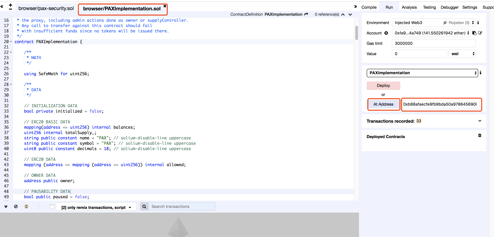
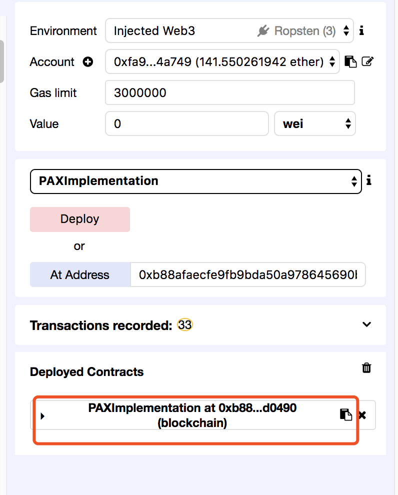
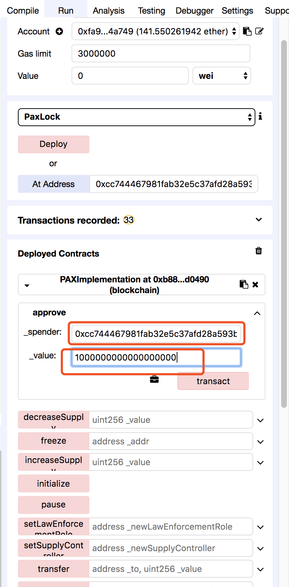
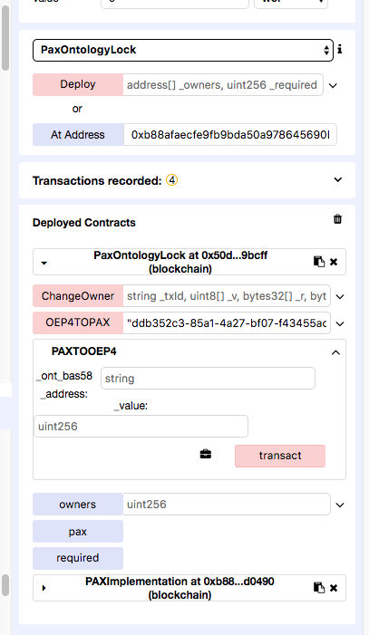

# PAX兑换PAXO流程

## 1. 背景

**PAX**是在以太坊上发行的、**ERC-20**规范的稳定币，现将PAX引入到**Ontology**平台。

`Ontology`在以太坊链上发行PAX销毁合约，PAX(ERC-20 )持有人将Token转入到合约，`Ontology`会部署监控程序监控销毁合约，监控程序会将任意一笔PAX兑换PAXO交易，在`Ontology`链上给用户的ONT钱包地址转入相同数量的`PAXO`，1：1锚定

## 2. PAX->PAXO步骤

以下步骤通过Remix演示，实际场景下需要使用SDK调用合约

### 2.1. PAX ERC-20 Token合约编译

PAX Token合约地址：[Pax Contract](https://github.com/paxosglobal/pax-contracts)

需要把contracts目录下的主合约**PAXImplementation**在REMIX下编译，solidity编译器版本**0.4.24**

编译成功后，在右上角**Run**选项页面，选择**PAXImplementation**合约

在**At Address**输入框输入PAX Token的合约Hash地址:`0x8e870d67f660d95d5be530380d0ec0bd388289e1`

PAX合约加载成功后，如下图

### 2.2. Approve PAX给销毁合约

PAX合约地址`0x8e870d67f660d95d5be530380d0ec0bd388289e1`

调用接口`approve`

参数

- ：**spender**，`address`类型，销毁合约地址:`0x0628ba39a124b772fae5edd52d2aa330e0f1078a`

- ：**value**，`bigint`类型，PAX的精度是18，Approve 1个PAX，Value应输入:1000000000000000000

### 2.3. PAX入金

销毁合约地址：`0x0628ba39a124b772fae5edd52d2aa330e0f1078a`

调用接口：`PAXTOOEP4`

参数

- **_ont_base58_address**: `string`类型,PAX持有人的ONT钱包地址

- **_value**：`bigint`类型，转换PAXO的数量，要求和**2.2**接口的参数value相同，且数量不能超过**2.2**接口Approve的Token数量

调用成功后，用户的PAX会成功减少，用户的PAXO余额会增加。

PAXO的合约hash为`6bbc07bae862db0d7867e4e5b1a13c663e2b4bc8`

可以使用[ONT浏览器](https://explorer.ont.io/)查看余额

