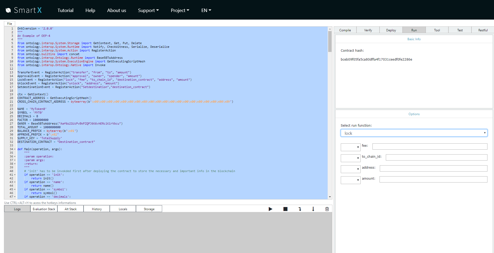

<h1 align="center">Ontology Multichain Developer Manual </h1>
<h4 align="center">Version 1.0 </h4>

English | [中文](Testnet_Dev_Manual_CN.md)

Ontology is dedicated to building a modularized, high-performance, and scalable blockchain infrastructure that supports cross-chain interaction, which makes deploying and calling dApps much easier.

The Ontology Multichain TestNet has already been launched and developers are welcome to have a try. Many features are still under development, and we welcome any suggestions and ideas from developers.

## Features

- Different chains are independent of each other and can realize different features
- Only a few block headers need to be synchronized
- Cross-chain features are modularized and decoupled from smart contract, making cross-chain contract development much easier
- A detailed incentive scheme for miners
- Supports direct interaction between side-chains


## Table of Contents

- [TestNet Environment](#TestNet-Environment)
- [How to Get Test Tokens](#How-to-Get-Test-Tokens)
- [Asset Transfer](#Asset-transfer)
  - [Asset Transfer from Main Chain to Side-Chain](#Asset-Transfer-from-Main-Chain-to-Side-Chain)
  - [Asset Transfer from Side-Chain to Main Chain](#Asset-Transfer-from-Side-Chain-to-Main-Chain)
- [Cross-Chain Contract Development](#Cross-Chain-Contract-Development)
  - [Overview of Cross-Chain Contract](#Overview-of-Cross-Chain-Contract)
  - [Cross-Chain Interface](#Cross-Chain-Interface)
  - [Cross-Chain Contract Development Examples](#Cross-Chain-Contract-Development-Examples)
- [TestNet User Guide](#TestNet-User-Guide)
  - [Cross-Chain Contract Development and Test](#Cross-Chain-Contract-Development-and-Test)

## TestNet Environment

The Ontology Multichain TestNet includes a main chain and a side-chain, which can interact with each other.

|               | Main Chain   | Side-Chain   |
| ------------- | ------------ | ------------ |
| **IP**        | 138.91.6.125 | 138.91.6.193 |
| **rest port** | 20334        | 20334        |
| **ws port**   | 20335        | 20335        |
| **rpc port**  | 20336        | 20336        |
| **chain ID**  | 0            | 1            |

## How to get Test Tokens

Apply for test tokens here: https://developer.ont.io/applyOng

The site allows one address to apply 10 ONG and 100 ONG as test tokens, and cross-chain test will only consume ONG.

The site will distribute test tokens for Polaris TestNet and Multichain TestNet at the same time.

## Asset Transfer

The test tokens users apply are ONG for the MainNet, users must have ONG for the side-chain to pay for transaction fees if they want to use the features of the side-chain. Assets can be freely transferred between the main chain and side-chains, for example, users can convert ONG on a main chain into ONG on a side-chain, and vice versa.

Currently asset transfer feature is not supported by any wallet yet, so it can only be realized using tools on the TestNet.

Asset transfer tool: <https://github.com/siovanus/multichain-transfer>

### Asset Transfer from Main Chain to Side-Chain

Alter config.json file：

```
{
  "ChainID": 0,
  "JsonRpcAddress":"http://138.91.6.125:20336",
  "GasPrice":500,
  "GasLimit":20000
}
```

Run command line `./main --fee 10000000000 --chain-id 1 --amount 150000000000`

--fee represents miner’s fee, --chain-id represents chain ID of the target chain, --amount represents the amount of ONG to be transferred（the decimal is 9）

### Asset Transfer from Side-Chain to Main Chain

Alter config.json file：

```
{
  "ChainID": 1,
  "JsonRpcAddress":"http://138.91.6.193:20336",
  "GasPrice":500,
  "GasLimit":20000
}
```

Run command line `./main --fee 10000000000 --chain-id 0 --amount 150000000000`

--fee represents miner’s fee, --chain-id represents chain ID of the target chain, --amount represents the amount of ONG to be transferred（the decimal is 9）

## Cross-Chain Contract Development

The Ontology multichain ecosystem supports cross-chain contract, which means the contract can realize interaction between two or more chains, for example, the assets of an OEP4 contract can be transferred between the main chain and side-chain.
Part of the dApp contract logic is realized on the main chain, and part of it on the side-chain.

### Overview of Cross-Chain Contract

The Ontology cross-chain contract in fact includes multiple contracts, for example, if dApp developers need to realize cross-chain interaction between Chain A and Chain B, then they need to deploy smart contracts on Chain A and Chain B respectively (let’s call them smart contract A and smart contract B). 
The development of the Ontology cross-chain contract can be divided into two parts, the smart contract part and the cross-chain part:

The smart contract part refers to the logic codes running on a particular chain, which are developed according to the standard smart contract development methods and are used to complete the contract on the chain.

When two chains need to interact, if the logic of chain A has been executed, and the logic of chain B needs to be executed, then the cross-chain interface is required.

### Cross-Chain Interface

For cross-chain contracts, developers only need to focus on one cross-chain interface, that is, the “createCrossChainTx” interface of the cross-chain management contract. This interface stores the executed transaction into Merkle Tree, then miners will generate the merkle proof of the cross-chain transaction and submit it to the cross-chain management contract of chain B. The cross-chain management contract will then validate the merkle proof and call the corresponding methods in smart contract B according to the parameters.

### Cross-Chain Contract Development Example

#### OEP4

Suppose a developer wants to issue assets on chain A and chain B, and he wants the assets on chain A and chain B to be freely transferred, then he needs to issue a type of OEP4 asset that can be used on and freely transferred between chain A and chain B.

The developer first needs to download the OEP4 contract template. Smart contract A is deployed on chain A, and 1 billion tokens are given to a particular owner address by calling init method. Smart contract B is deployed on chain B, and 1 billion tokens are given to the address of smart contract B by calling init method.

To transfer assets of smart contract A and B between chain A and chain B, a lock and an unlock interface are required on the basis of the OEP4 standard interface. The user calls the lock interface on chain A to lock the assets in smart contract A, and the interface then calls the cross-chain management contract to invoke the unlock interface in smart contract B, the unlock interface then releases the assets in smart contract B to the user on chain B, and vice versa.

Calling lock interface:

```python
def lock(fee, to_chain_id, destination_contract, address, amount):
    """
    lock some amount of tokens of this contract, call cross chain method to release to_amount of tokens of another chain's contract
    :param fee: miner fee of this cross chain tx
    :param to_chain_id: chain id of destination chain
    :param address: address of caller
    :param to_amount: amount to lock
    :return:
    """
    if len(address) != 20:
        raise Exception("address length error")
    if CheckWitness(address) == False:
        raise Exception("address checkwitness failed.")
        
    # transfer asset
    res = transfer(address, CONTRACT_ADDRESS, amount)
    if not res:
        raise Exception("transfer failed.")
    
    # call cross chain contract
    input_map = {
        "address": address,
        "amount": amount
    }
    input_bytes = Serialize(input_map)
    param = state(fee, address, to_chain_id, destination_contract, "unlock", input_bytes)
    res = Invoke(0, CROSS_CHAIN_CONTRACT_ADDRESS, "createCrossChainTx", param)
    if not res:
        raise Exception("call cross chain contract failed.")
    
    LockEvent(fee, to_chain_id, destination_contract, address, amount)
    return True
```
The parameters are:
```
fee: Miner’s fee for cross-chain transaction
to_chain_id: Chain ID of target chain
destination_contract: Reversed target contract address
address: Caller’s address, from which miner’s fee is deducted
amount: Amount of asset to be transferred
```

As can be seen, the interface first executes the transfer action to lock the user’s assets on chain A, and then calls the createCrossChainTx method in the cross-chain management contract, which accepts six parameters:

```
fee: Miner’s fee for cross-chain transaction
address: Caller’s address, from which miner’s fee is deducted
to_chain_id: Chain ID of target chain
destination_contract：Reversed target contract address
function: Target cross-chain contract method to be called
input_bytes：Serialized input parameters
```

The method will call the target cross-chain contract address method and the input parameters are input_bytes.

Calling unlock interface:

```python
def unlock(args):
    """
    lock some amount of tokens of this contract, call cross chain method to release to_amount of tokens of another chain's contract
    :param fee: miner fee of this cross chain tx
    :param to_chain_id: chain id of destination chain
    :param address: address of caller
    :param to_amount: amount to lock
    :return:
    """
    if CheckWitness(CROSS_CHAIN_CONTRACT_ADDRESS) == False:
        raise Exception("cross chain contract address checkwitness failed.")
    
    input_map = Deserialize(args)
    address = input_map["address"]
    amount = input_map["amount"]
        
    # unlock asset
    res = transfer(CONTRACT_ADDRESS, address, amount)
    if not res:
        raise Exception("transfer failed.")

    UnlockEvent(address, amount)    
    
    return True
```

The interface accepts input_bytes as input parameters and deserializes input_bytes into input_map, and then executes the subsequent logic and unlocks the assets on chain B to the user.

Please note that this method can only be called by the cross-chain management contract.

Currently the return value of cross-chain methods only supports Boolean data type.

You can download the templates of smart contract A and B here: <https://github.com/siovanus/multiChainContract>

## TestNet User Guide

### Cross-Chain Contract Development and Test

The easiest way to develop and test cross-chain contract on the TestNet is using Cyano and SmartX. 

In Cyano, users can switch between the main chain and side-chain in Settings.


After users have configured Cyano Wallet for the main chain and side-chain, they can then develop, deploy, and test cross-chain contract in SmartX.



For more details, please see [Tutorial](Tutorial_Case.md)
