<h1 align="center">Cross-Chain Tutorial </h1>

English | [中文](Tutorial_Case_CN.md)

## Testnet Environment

The Ontology multichain TestNet includes a main chain and a side-chain, which can interact with each other

|               | Main Chain   | Side-Chain   |
| ------------- | ------------ | ------------ |
| **IP**        | 138.91.6.125 | 138.91.6.193 |
| **rest port** | 20334        | 20334        |
| **ws port**   | 20335        | 20335        |
| **rpc port**  | 20336        | 20336        |
| **chain ID**  | 0            | 1            |


## Asset Transfer

### Asset transfer tool can be downloaded here [multichain-transfer ](https://github.com/siovanus/multichain-transfer)

The`config.json` file is as follows：

```json
{
  "ChainID": 0,
  "JsonRpcAddress":"http://138.91.6.125:20336",
  "GasPrice":500,
  "GasLimit":20000
}
```

- `ChainID` is the chain ID
- `JsonRpcAddress` is this chain's IP address and rpc port

Execute in the commande line `./main -h`to show Help

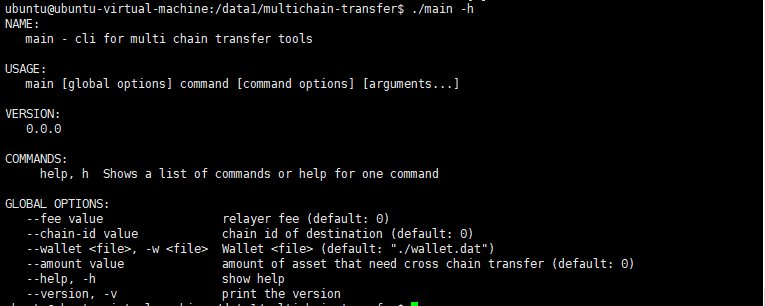

- --fee represents miner's fee
- --chain-id represents chain ID of target chain
- --amount represents amount of ONG to be transferred (the decimal is 9)
- --wallet needs to specify the path of `wallet.dat` file (the current path by default)

<br/>
<br/>

Check `config.json` to see whether you are on the main chain or side-chain

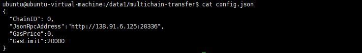

<br/>
<br/>

Run command line, execute: ```./main --fee 10000000000 --chain-id 1 --amount 150000000000```

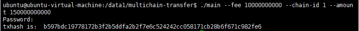

<br/>
<br/>

`config.json` specifies we are currently on the main chain. When executing cross-chain transaction, it specifies `--chain-id 1` ,`--fee 10000000000`,`--amount 150000000000`, which means transferring 150 `ong` to a side-chain whose ID is 1 and deduct 10 `ong` from the current chain

<br/>

You can check if you have received the transfer in `Cyano` wallet. But before that, you need to import `wallet.dat` file into `Cyano`, and make sure you are on the right network

For example, if you want to check the side-chain whose ID is 1, you can alter  `Net` and `Private node ip/address`. Since the IP of the side-chain is `138.91.6.193`, you can alter the IP address in Cyano accordingly

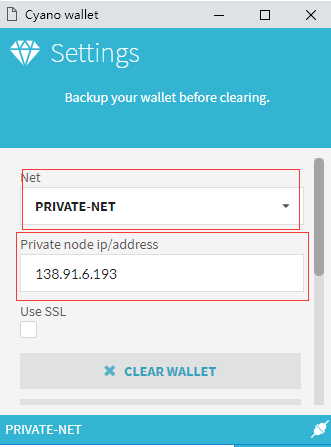

<br/>
<br/>
After the alteration, we can see that we have received the transfer

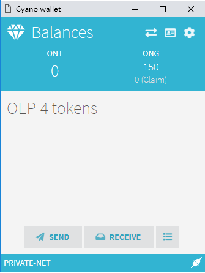
<br/>
<br/>

Transfer from the main chain to side-chain or from side-chain to the main chain follows the same method
<br/>
<br/>
<br/>

### For cross-chain contract, please download [OEP4 contract template](https://github.com/siovanus/multiChainContract/tree/master/OEP4-template)

We can use [SmartX](https://smartx.ont.io) to deploy and run smart contract


#### Deploy Smart Contract

Before you deploy smart contract A on the main chain whose ID is 0, you need to make sure you are on the main chain network by altering `Net` and `Private node ip/address`

Owner manages the smart contract, and you can type in here your own address

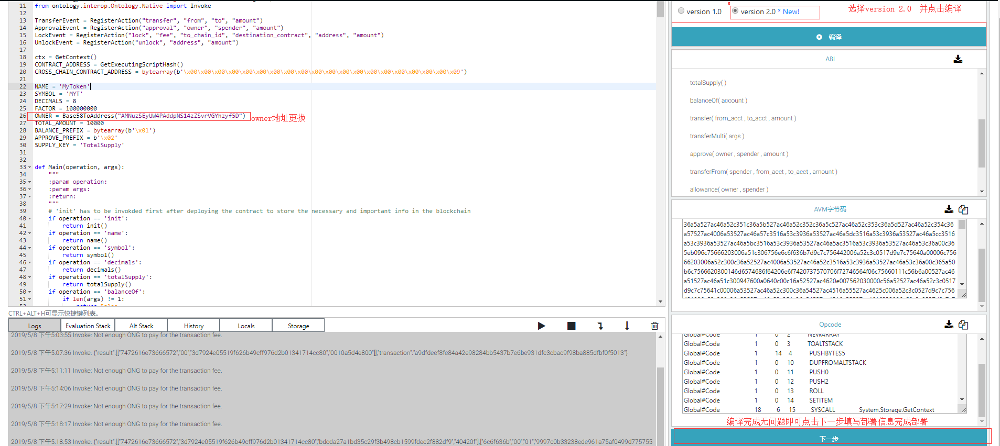
<br/>
<br/>

After deployment, 1 billion tokens are given to the owner address by calling init method

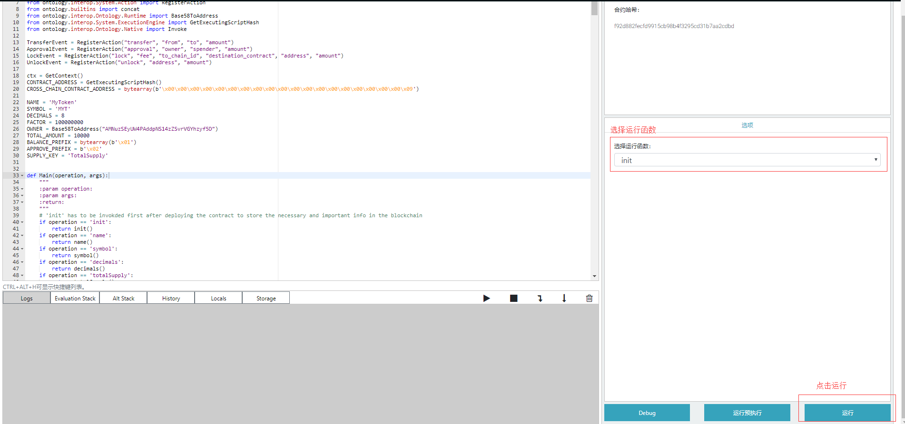
<br/>

You also need to execute setdestination function to set the OEP-4 cross-chain contract address of the side-chain
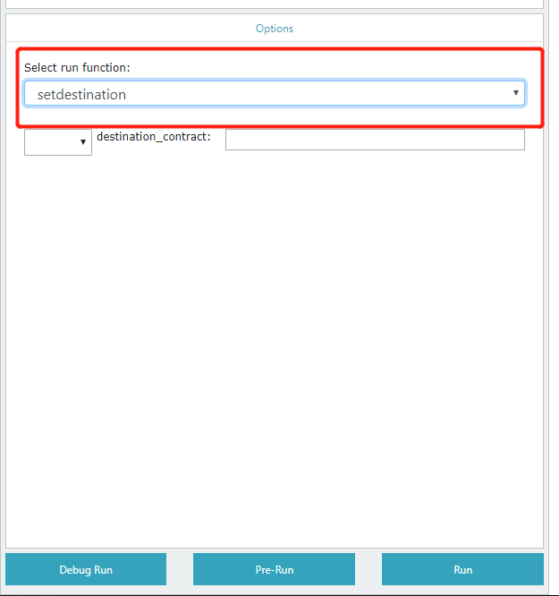
<br/>

`destination_contract` is the reversed contract hash, and you can use `Hex String (Big-endian/Little-endian)` method in SmartX to return the reversed value
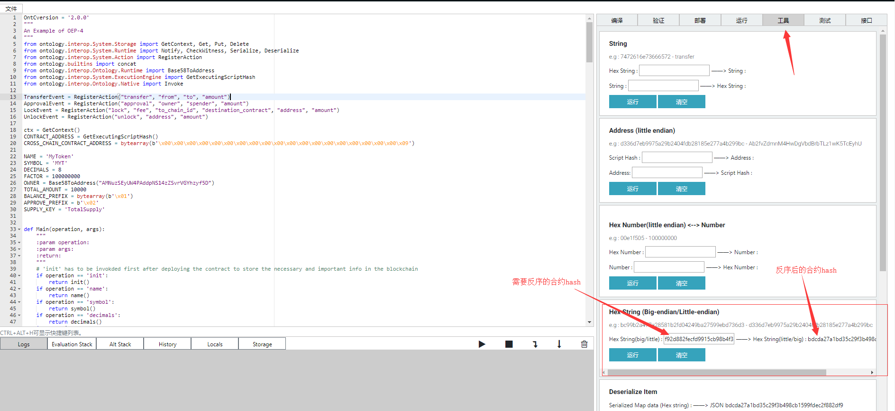
<br/>

<br/>
<br/>

As mentioned above, when you deploy smart contract B on a side-chain whose ID is 1, switch the IP in Cyano to the side-chain IP, then deploy the contract on SmartX. After deployment, 1 billion tokens are given to the address of smart contract B by calling init method
<br/>
<br/>
<br/>

#### Run Contract

**1. Cross-Chain Transfer by Calling Contract Lock Function**
<br/>
Please note that when you transfer from the main chain to side-chain, you need to make sure Cyano is on the main chain network. The lock function specifies the side-chain ID as `to chain_id`.
<br/>
When all is set, you can then execute lock function

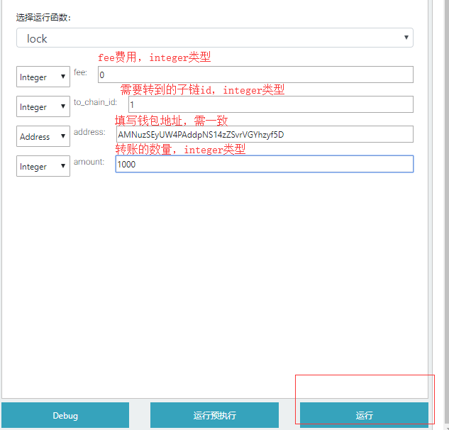
<br/>

When you click "run", Cyano will be invoked to sign. When successfully executed, you can check the result and transaction hash in Logs on the left side of SmartX
<br/>
<br/>

**2. Check the Transfer**
<br/>
Before that, you need to add OEP-4 token address in Cyano. The address is the contract address smart contract B deployed on the side-chain

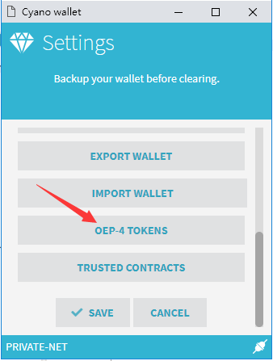

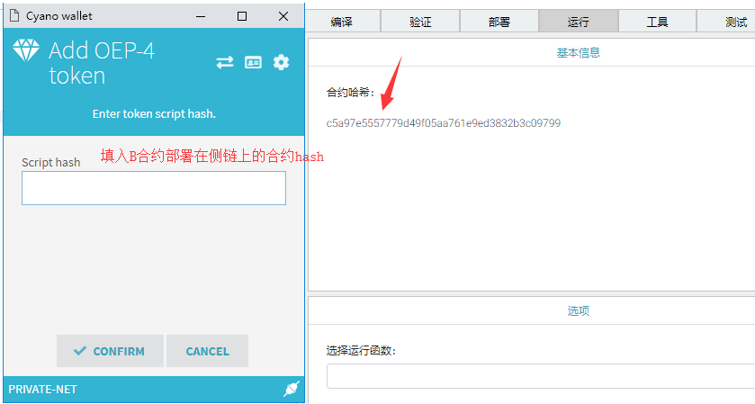

<br/>

<br/>


Then you need to switch the Cyano network to side-chain, for example, if you want to transfer to a side-chain whose chain ID is 1, then you need to switch the Cyano network to 138.91.6.193.

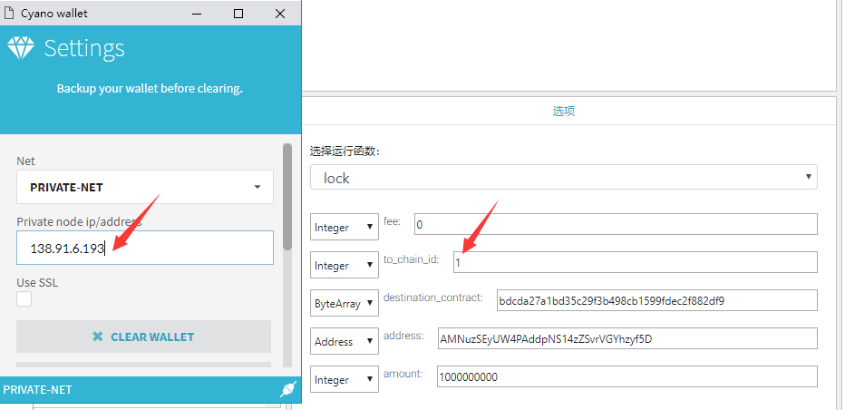

<br/>

You can now see the trsnsferred OEP-4 token

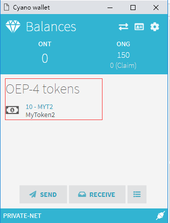
<br/>


Transfer from side-chain to main chain follows the same method
