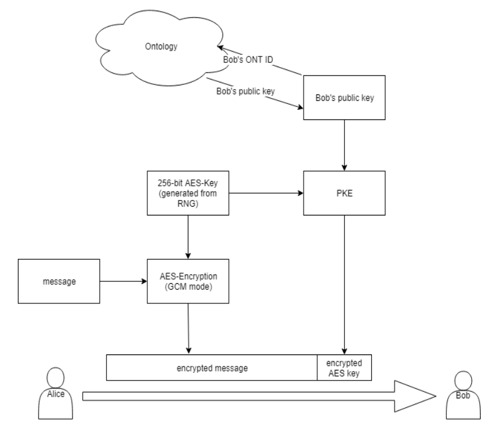

<h1 align="center">端到端（End-to-End）数据加密标准 </h1>

在去中心化的数据协同场景中，数据提供方（Provider）需要安全地将数据传递给需求方（Requestor），即数据仅仅只能对需求方是可见的，而对其他任何第三方都是不可见的，即为密文状态；即使其他人获取了据密文，也依然无法解开。

数据交易双方都拥有 ONT ID，因此我们将 ONT ID 与公钥密码学常见的混合加密机制结合，设计了数据加密与解密算法。

## 名词解释

本小节简要介绍与数据加密算法、解密算法相关名词。

- 公钥加密算法（public key encryption algorithm）
- 对称加密算法（symmetric encryption algorithm）
- 公钥（public key）
- 私钥（private key）
- 对称算法密钥（secret key）

## 数据加密

总体来说，数据加密算法采用著名的“混合加密”模式<sup>[1]</sup>，即利用公钥加密算法（PKE）
加密对称算法密钥（secret key）得到 encryptedKey，然后使用对称加密算法的密钥
加密数据，得到密文（ciphertext）。具体流程包含三个步骤：

1. 获取公钥：访问 Ontology 区块链，获取购买方的公钥列表，并从中随机选择一
个公钥 pk；
2. 随机采样 AES 密钥：随机采样 256 比特数据，作为 AES 分组密码的密钥
secret key；
3. 混合加密： 将 256-bit AES 密钥用公钥加密算法进行加密得到 encryptedKey，
数据使用 AES 算法 GCM 模式进行加密得到 
ciphertext = AES-256-GCM(secret, IV, AAD, data)。

数据加密后的密文包括三个部分：公钥信息、 encryptedKey 和 ciphertext，用 JSON
格式保存密文元信息，其格式在表 1 中定义，样例代码参考`代码样例 1`。其中，
AES-GCM 模式下的认证数据（AAD）为 OntID || PkIndex。(`||`表示字节拼接)

```json
{
    "OntID": "did:ont:AZk5wBNiV8dCPAFXoGvDSvetfufuXJXM8r",
    "PkIndex": 1,
    "IV": "63E8B8136C101AEF06E25FF3",
    "EncryptedKey": "...",
    "CiphertextURL": "https://example.com/ciphertext.dat",
    "AuthTag": "..."
}
```
_代码样例 1. 密文元数据.json_

|字段名|字段大小|备注|
|---|---|---|
|OntID|不定|接收者的 OntID|
|PkIndex|4 字节|接受者公钥索引（4 个字节）|
|IV|12 字节|用于 AES-256-GCM 模式的初始向量|
|EncryptedKey|不定|被公钥加密后的 AES 密钥|
|Ciphertext|不定|用对称加密算法加密后的数据的 URL|
|AuthTag|不定|认证标签，即 MAC|

_表 1.1 密文元数据 JSON 对象字段定义_

算法的输入和输出分别列举在表 2 中。

| 输入 | 输出 |
| ---  | --- |
| I. 接收者 OntID | 密文 JSON 对象 | 
| II. 公钥索引 PkIndex || 
| III. 公钥 pk || 
| IV. 待加密数据 data || 
| V. 认证数据 AAD || 

_表 1.2 数据加密算法输入和输出_

下面我们详细描述加密算法流程。

1. 随机采样 12 字节数据，称为 `IV`；
2. 随机采样 32 字节数据，称为 `secret key`；
3. 使用公钥 `pk` 加密 `secret key`，计算得到 `encryptedKey`；根据公钥类型，选择
对应的公钥加密算法，例如椭圆曲线型公钥，选择使用 `ECIES` 算法<sup>[3]</sup>；
4. 使用 `secret key` 作为 `AES-256-GCM` 模式<sup>[2]</sup>加密算法的密钥， `IV` 作为初始向量， `AAD` 作为认证数据，对数据 `data` 进行加密，得到密文 `ciphertext` 和认证标签`AuthTag`；
5. 构造密文 JSON 对象并返回。



_图 1.3 数据加密算法示意图_

## 数据解密

数据的解密按如下三个步骤进行：
1. 根据 `Ont ID` 和 `PkIndex`，从私钥管理模块中找到对应私钥；
2. 用私钥解密 `encryptedKey` 得出 AES 对称密钥 `secret key`；
3. 用 AES 对称密钥 `secret key`，以 AES-256 算法 GCM 模式解密数据。

下面我们详细描述解密算法流程。

1. 从密文 JSON 对象解出 `IV`, `AAD`, `ciphertext`；
2. 从密文 JSON 对象解出 `encryptedKey`；
3. 使用私钥 `sk` 解密 `encryptedKey`，计算得到 `secret key`；根据公钥类型选择对应的公钥解密算法, 
注意此处 `sk` 为解密用户的私钥, `secret key` 为加密步骤中用户随机产生的 `AES` 秘钥；
4. 使用 `secret key` 作为 `AES-256-GCM` 模式<sup>[2]</sup>解密算法的密钥， `IV` 作为初始
向量， `AAD` 作为认证数据，对 `ciphertext` 进行解密，若解密失败，则返回“失败”，否则返回解密结果。


## 参考文献

1. Wikipedia, Hybrid cryptosystem.
https://en.wikipedia.org/wiki/Hybrid_cryptosystem.
2. McGrew D, Viega J. The Galois/counter mode of operation (GCM).
Submission to NIST Modes of Operation Process. 2004 Jan 15;20.
3. Gayoso Martínez, V., Hernández Encinas, L., & Sánchez Ávila, C. (2010). A
survey of the elliptic curve integrated encryption scheme.