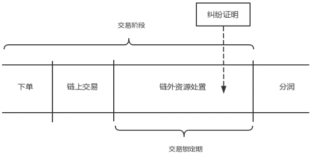

# Resource transaction

经过资源发现阶段，即 RC 在 MP 处根据资源元信息等快速检索到所需资源，将和资源的拥有方 RP 进行交易。资源交易阶段大致以下部分：

1. 下单:在经过资源发现阶段之后，RC 在 MP 处根据资源元信息快速检索到所需资源，双方经由 ONT Sign 签订的资源交易电子合同，设置交易标的物(如资源的使用权)，交易细则，(可选的) 双方质押信息，(可选的)交易锁定期和纠纷处理逻辑，分润逻辑等，并具现化智能合约。为了防止作恶，RP 和 RC 根据电子合同分别质押一定数量(可能为 0)的代币；
2. 链上交易:RP 为该笔资源交易在区块链上生成相对应的 DToken，并将该 DToken 交易给 RC。 另外，RP 也可以进行相关委托，授权 MP 进行相应 DToken 的生成。RC 可以根据合同约定流转该 DToken：
  1. 当 DToken 不涉及链下资源交割时，可采用原子交易的形式，并不设置交易锁定期；
  2. 当交易是资源易资源的形式时，RC 也将为待交易资源生成 DToken。当然该 DToken 也可以采取委托 MP 的形式进行处理。DToken 之间可采用原子交易的形式，并可根据是否需要链下交割设置交易锁定期；
  3. 当交易是资源易代币(例如 ONG)的形式时，代币一方将交易所需数量的代币抵押至交易合约中，并根据是否需要链下交割设置交易锁定期。

 

3. 链外资源处置:链上交易完成后，进入交易锁定期。在交易锁定期内，RC 凭借该 DToken 和 RP对资源进行交割，即对资源进行相应的权利处置。当产生纠纷时，需要提交证明来解决纠纷。证明分为链上(on-chain proof)与链下证明(off-chain proof)。证明可来源于本体主链自身、Ontology Oracle 以及合约所指定的 OJ 等。

## 1. 电子合同

在经过资源发现阶段之后，RC 在 MP 处根据资源元信息快速检索到所需资源，双方可经由 ONT Sign 签订相关的资源交易电子合同。当整个资源交易的过程不涉及 OJ，即不需要 OJ 来进行链下判 定时，可以不签署电子合同。

MP 可以根据其可交易资源的特性，设置电子合同模板来指导其用户快捷地签订电子合同。一般 来说，电子合同主要包括如下内容：

- 交易标的物。交易标的物是某资源的某项权利。
- 交易方。主要指定交易的 RP 和 RC。
- 交易细则。主要约定易标的物交付期限、交付阶段、交付方式等。
- (可选的) 交易锁定期和纠纷处理逻辑。当涉及链下资源交割处置时，建议设置交易锁定期，并设定纠纷处理逻辑。交易锁定期内，交易双方可以进行链下的资源权利交割。当链下交易出现纠纷时，按照纠纷处理逻辑进行纠纷解决，并将纠纷处置结果上链。一般地，纠纷处置结果的上链由 OJ 进行。另外，Ontology Oracle 亦可用于链外纠纷解决。
- (可选的) 双方质押信息。约定交易双方是否需要质押一定量的代币。一般来说，RC 会被要求质押至少与获取交易标的所需代价等价的代币来使交易顺利履行。有时候，RP 也可能会被要求质押一定量的代币以防止其作恶。
- 分润逻辑。主要约定交易完成后如何进行分润。交易被中止或取消也认为是一种完成方式。分润主要在交易双方、MP 以及 OJ 等角色之间进行。

## 2. 交易智能合约

交易智能合约由双方签订的电子合同具现而来。当双方无需签订电子合同时，可直接部署交易智能合约。类似的，MP 可以提供相应的交易智能合约模板。一般地，MP 会帮助交易双方部署相应的交易合约。

交易智能合约记录了交易双方 RC 和 RP 的 ONT ID，OJ 的 ONT ID，以及经由 ONT Sign 签订的电子合同的信息，例如:交易金额，结算币种(e.g. ONG 或 OEP-4 Token)，交易成功或失败的条件，交易锁定期和自动化分润策略等。RC 下单成功之后，会返回一个唯一的交易编号。

为了进行链下资源交割、限制作恶和解决可能产生的链下纠纷，设置交易锁定期，该期限可以以区块高度界定或者现实时间界定。交易锁定期可以定义为双方链上交易结束为开始，到分润阶段开始为结束。该期限内，可以进行链外资源处置，以及(可能的)纠纷产生后的相应处置。链下纠纷由 OJ 在纠纷产生时进行仲裁，并由其或其代理提交证明给交易智能合约。

在执行交易时，资源对应 [DToken](../../framework/spec/data-token.md)。

## 3. 纠纷处置
在交易锁定期内，RC 凭借该 DToken 和 RP 对资源进行交割，即对资源进行相应的权利处置。交易锁定期内由于资源相关权利交割的不顺畅可能会产生纠纷。

通常情况下，由于自动分润逻辑一般会在交易锁定期结束后将 RC 的交易费用传给 RP，因此交易纠纷的处置一般会由 RC 发起。交易纠纷仲裁的发起人需要质押一比交易纠纷申请费用，此费用也可于交易成立时以质押金的形式就进行支付。纠纷仲裁失败一方将付相关费用以及可能的罚没金。

当交易纠纷处理结果裁定发起人失败，将使用交易纠纷申请费用支付所需的仲裁费用;另一方失败，一般使用其抵押金进行支付。

针对一比交易，一般以一次纠纷处置认定的结果为准。

当交易产生纠纷时，需要提交证明来解决纠纷。区块链的不可篡改性、公开透明性，以及合约自动执行的特性，有助于增加数据交易过程的透明性，能够记录分歧的过程，方便交易双方(RP 与 RC) 提交必要的证明。为了加速交易的处理速度以及自动化程度，需要定义交易成功或失败的条件。例如:

- RP 资源在交易锁定期期限内是否可访问，如果 RP 提供不了这个证明，交易会失败；
- RP 提交了 RC 对资源处置的记录证明，交易则会成功。

每个条件都对应一个验证逻辑。当产生纠纷时，需要提交证明来解决纠纷。证明分为链上证明(On-chain Proof)与链下证明(Off-chain Proof)。

- 链上证明的验证直接由区块链节点完成，常见的链上证明包含数字签名、Hash 函数的原像、零知识证明以及 Merkle Proof 等等。通过 Ontology Oracle 导入到链上的链外信息也可以认为是链上证明，由相关处理逻辑进行处理;
- 当出现链上无法处理的纠纷时，需要 OJ 完成对链下证明的验证，OJ 依据双方经由 ONT Sign 签订的电子合同完成对链下事务的确认并进行仲裁，将仲裁结果送入交易的智能合约，仲裁结果即是纠纷认定的一部分。

纠纷责任认定的证据，无论是链上证据还是链下证据，都会影响纠纷责任认定结果，进而将影响交易的分润。纠纷责任的认定可能会提前触发分润。