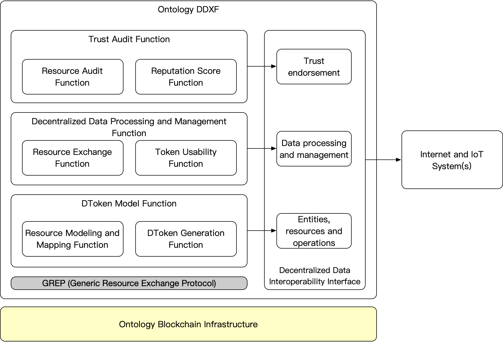
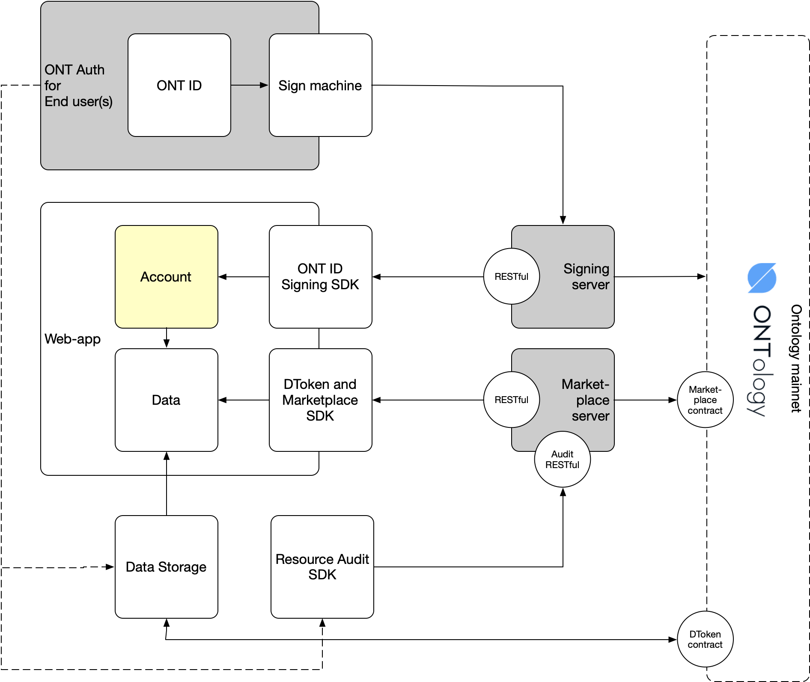

# Ontology Decentralized Data Exchange Framework (DDXF)

The accelerating use of Internet systems is increasing the pressure on the existing infrastructures to meet the needs of end users. Accordingly, there is an increasing demand for connected IoT or Internet systems.

Traditional resource management, including information databases and analytics architectures and infrastructures, remain essential, with the growing data management demands, specific capabilities and capacities are required to be able to handle diverse and complex data streams from different sources. This data needs to be processed and managed properly to maximize its value in a secure manner, while complementing it with other information sources.

Ontology DDXF is to define an infrastracture framework and guidelines to support comprehensive data processing and management frameworks which incorporate reasonable measures to achieve a layered, data-centric paradigm. Due to research, identify and study characteristics of effective data processing and management systems, DDXF is focusing on the data interoperability, classification, format and security issues that affect various stakeholders.

Ontology DDXF uses Ontology blockchain infrastructure, follows an open protocol called [`Ontology GREP (Generic Resources Exchange Protocol)`](./spec/grep.md), and provides a series of functions and interfaces to meet the requirement of trust data interoperability cross multiple systems, which serves multiple business requirements and scenarios, esp., the data exchange scenarios.

## Components and interfaces of DDXF

根据 GREP 协议，DDXF 具备以下能力：

1. 链外多系统资源整合；
2. 数据权限令牌化通证化，支持通证交易，支持跨链资产；
3. 以数据特征变化、令牌传递和通证交易形式实现资源交换和数据交互；
5. 数据加工和交易确权过程支持线下资源和链外仲裁，保证分成激励。

体现在框架功能模块之上，分成`自治资源管理`、`去中心化数据处理和资源交互`、`可信审计和仲裁`三个模块。

### 1. DToken model - self-sovereign data management

The self-sovereign data management is to decouple the privilege of data ownership with data accessibility (or other data processing privileges) and manage data upon different privilege from the data owner(s).

Ontology DDXF provides self-sovereign data management by a combination services of [`data storage`](./data-storage/README.md), [`ONT ID`](../../ontid/framework/README.md), [`DToken`](./spec/data-token.md) and Ontology blockchain infrastructure.

- Data storage provides the capability to store data with data protection and data privacy, with lower cost;
- ONT ID provides the capability to identify the data and the data owner, data handler;
- DToken provides the capability to manage data privileges and ensure the data processing is stored on Ontology blockchain infrastructure;
- Ontology blockchain infrastructure provides the capability for the traceability and trust endorsement.

The DToken model function defines the following features:

- Resource modeling and mapping, provides static modeling and mapping functions, where the off-chain resources from Internet or IoT systems are able to be stored on-line in a form of modeling data and the on-line data will be mapped with on-chain identifiers;
- DToken generation, provides a static identifier mapping capability, where the privileges of data are able to be tokenized to DTokens, the use of DToken will be controlled and logged on-chain.

DToken model provides interfaces to define the entities, resources and operations in DDXF.

[>> Learn more](./data-storage/README.md)

### 2. Decentralized data processing and management - resource exchange

Decentralized data processing and management provides a runtime mechanism to control the business actions of resource exchange, data transfering and data processing.

- Resource exchange, provides runtime for token based resource transfering and exchange.
- Token usability, provides runtime to manage the use of tokens, esp., the use of DToken to access data.

Decentralized data processing and management provides interfaces to process and manage data in DDXF.

[>> Learn more](./marketplace/README.md)

### 3. Trust audit

The DDXF marketplace provides the capability to do resource exchange cross systems. 

Due to different business, data could be owned by the smart devices, end users or systems. Data processing will change the form of data. DDXF is to enable data processing, transfering and exchange with controlling of the ownership and accessibility of the data instances. Audit of off-chain resources and the transactions being taken by end users is to provide trust endorsement of DDXF.

- Resource audit, provides a mechanism to ensure the ownership and accessibility of off-chain resources,  the resource quality and the transaction behaviors;
- Reputation score, based on the use of DDXF, the transactions are able to provide trust endorsement for DDXF customers.

Trust audit provides interfaces to do trust endorsement for transactions, data qualification and users in DDXF.

[>> Learn more](./resource-audit/README.md)

## Scenarios of DDXF

DDXF covers the scenarios of most features in the data interoperability cross systems. The framework also covers the scenarios to bring valuable resources to a potential consumer(s), esp., marketplaces for resources cross systems.

- [>> Learn more](../business/scenarios/README.md)

## Business solutions using DDXF

With DDXF, solutions are ready for different domains.

- [>> Learn more](../business/business/README.md)