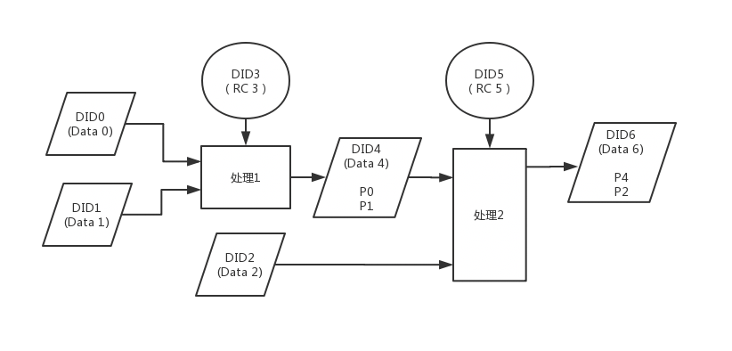

# Data storage service

Storage service in IT systems is refering to the storage of information, turns to be the data storage.

数据，无论是模拟数据还是离散数据，是一种特殊的资源，是对客观事物的逻辑归纳。根据隐私性的考虑，有的数据可以以副本的形式提供给 RC，有的数据是对 RC 不可见的，只能采用 RC 提供的算法进行加工后形成数据结果。数据是多样性的，有的数据是静态数据，而有的数据是动态数据，需要实时采集。 

## 1. 数据存储与访问 

RP 需要为出售的数据准备存储和访问服务。存储方式有多种选择，既可以自己搭建存储服务，也可以选择使用符合接口标准的托管存储平台，如云存储以及某些去中心化存储平台等。若存储在托管平台上，强烈建议将数据进行加密处理。

当 RC 要访问数据时，需要向数据存储服务发送请求令牌，请求以 RC 对 DToken 签名形成 JWT 令牌的形式。数据存储服务查询区块链上的最新状态，检查 DToken 的有效性，同时获取持有者的信息（ONT ID 及绑定的公钥），验证 JWT 令牌的有效性。验证通过后，双方采用各自 ONT ID 下面的公钥建立安全的信道（例如 TLS 连接等），进行数据安全通信。 数据访问分为两种方式：

1. 直接获取数据。此时可以看作交易的是数据的副本所有权。再次流转权等其它权利可以按照交易细则处理。获取数据时根据需要进行解密处理：
  - RC 通过安全信道从存储服务获取到数据。比如实时流数据通过安全信道传递给 RC；
  - 若数据是加密存储的(比如数据以密文的形式存储于某个托管平台)，RC 还需要向 RP 请求解密密钥。RP 同样需要验证请求者身份，通过后向其提供解密密钥。另外，可以通过其它的密码技术来进行数据的安全又简便地分发。比如，可以通过代理重加密技术来处理加密内容的分发，减少加减密的次数。 
2. 请求分析结果。此时可以看作交易的是数据的访问权。当 RP 希望保护数据的隐私，而不希望将原始数据提供给他人时，RC 可以提供数据分析算法。在对原始数据执行分析计算后，结果通过安全的信道发送给 RC。这种情况下还需要执行数据分析运算的环境，这可以由 RP 提供，也可以使用第三方的平台。
  - 为了使计算结果更加可信，可以选择使用可信计算环境执行分析算法。当 RC 也不愿意暴露算法内容时，同样可以采用第三方可信计算环境执行分析算法，并将结果安全传输给 RC 或 RP。 

## 2. 数据权限管理

根据 [`DToken`](../spec/data-token.md) 协议生成数据相关权限的令牌，使用区块链技术将令牌通证化。

- `DToken` 中关于数据访问权限的令牌属性，其使用遵循系统令牌权限管理规范；
- `DToken` 中关于区块链通证属性，其使用参与[`数据集市`](../marketplace/README.md)的资源交换和数据加工、交互过程，遵循区块链高安全、防篡改、可溯源的系统特性。

## 3. 数据自治化使用和交易证明

数据可以被清洗、建模和分析形成新数据，新数据同样拥有 ONT ID。数据使用 DDO 进行描述，形式如下：

```
type DataDDO struct{
  Name // 资源的名称
  Fingerprint // 抽取资源的唯一特征码生成数字指纹作为其特征值，该值也是生成资源 ONT ID 所需的素材。
  Description // 资源的简短描述
  ProviderID // 资源提供者的 ONT ID
  EncKeys // 公钥列表，其对应私钥由该资源的 RP 掌握
  URL // 资源的访问地址
  SourceData // 源数据列表，列出每个源数据的 ONT ID 
  Transformer // 数据处理者的 ONT ID 
} 
```

数据主体将使用数据服务器进行储存，而数据的特征码将保持在链上，根据数据形态的不同，数据的特征码抽取方式也不同，静态数据使用 Hash 值，大量数据块可以采用 Merkle Tree 的形式形成 Merkle root 作为特征码；实时数据抽取数据源的唯一特征码。

对数据特征的描述是一类元数据规约，可以参考 [`schema.org`](https://schema.org) 规范。

### 2.1 <a id="model_data">数据描述模板</a>

发布到链上的数据，需分配一个唯一标识符，是由发布者生成的 ID。同时还需给出名称、描述、关键字、发布者和发布时间，并指明数据类型。其中发布者可以是组织或个人，以 ONT ID 作为标识符。 元数据中可附加一些额外信息，如版本号、许可协议等。各类数据的元数据模板由交易市场制定。RP 发布数据时，输入所需的信息，生成元数据。如下是一个数据集模板：

```
{
  @context: "http://schema.org",
  @type: Dataset,
  identifier: did:ont:xxxx....,
  name: sample data,
  description: "Just a sample for structured data", 
  keywords: "sample, structured",
  publisher: {
    @type: Person,
    identifier: did:ont:yyyy....,
    name: My Name,
    ...
  },
  datePublished: 2019-01-01T00:00:00Z,
  creator: {...},
  version: 1,
  expires: 2020-02-01T00:00:00Z,
  license: "http://example.license.com/v1",
  ...
}
```

必要字段描述如下：

- @type: 指明该数据的类型，需为 schema.org 定义的类型
- identifier: 数据的唯一标识符，是一个 ONT ID
- name: 数据名称
- description: 对数据内容的描述
- keywords: 帮助搜索的关键字，使用’,’ 分割多个关键字
- publisher: 数据发布者，是一个”Person” 对象(或 Orgnization 对象)，其中 identifier 是发布者的 ONT ID，而名字、邮件地址等是可选字段。 

可选字段描述如下：

- creator: 数据集生产者，是一个”Person” 或”Orgnization” 对象
- version: 版本号，可以是一个数字，也可以是一个字符串
- expires: 失效时间
- license: 数据使用的许可协议

### 2.2 数据处理和交易

同 ONT ID 和 DDO 形成对数据处理过程的完整记录和一致性证明。

 

在数据交易的场景中，我们需要排除 RP 的数据服务器无法访问的问题。如果 RC 无法访问数据或者根本没有访问数据的话，那么应当将 RC 质押的 Token 退回到其质押地址中。我们可以使用数字签名来验证 RC 是否访问过数据服务器，即要求 RC 在访问数据服务器时，提供一个合法数字签名（该签名可以通过 RC 的 ONT ID 进行验证）。

一般来说，常见的证明类型有：

- 数字签名：可帮助 RP 证明其确实提供了数据访问;当 RC 来访问完数据之后，向 RC 提供一份证明，证明数据服务器可连接；
- 哈希函数的原像：可用于将数据传输过程中发生的异常现象进行存证，例如，传输异常的 log 文件，异常过程的图片等等。

## Host data storage service

1. [Deploy a storage service](./deployment.md)
   - Use [`Ontology general storage service`](./saas-tenant.md) (SaaS) to run your own resource storage
2. [Data storage service RESTful api](./restful-api.md)
   - [Smart contract api](./smart-contract-api.md) for DToken (to serve DDXF data storage)
3. [Data storage service SDK - java](./sdk/java/javadoc/README.md)
