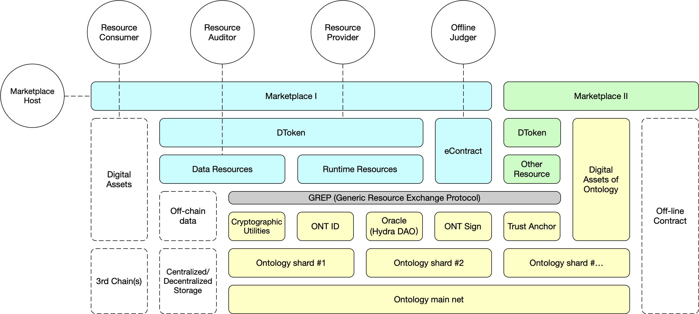

# Generic Resources Exchange Protocol (GREP)
GREP 是一套建立于 Ontlogy 主链基础设施上的去中心化资源交换协议。通过使用 GREP，用户可以快速建立数据等资源的链上确权和流转平台。得益于 Ontology 信任生态体系基础设施的完备性，在去中心化身份标识 ONT ID、去中心多源认证系统 Trust Anchor、可信链外数据连接器 Oracle 以及去中心化电子合同及签章系统 ONT Sign 等多种信任协作组件的协同支撑下， GREP 可以为去中心化资源交换提供坚实的信任基础。 



## 1. Resource tokenization and assetization

通过 GREP，任何人都可以快速而又便捷地建立多样化的资源链上确权和流转平台。

- 资源可以是数字资源，例如，数据、CPU 算力、GPU 算力、存储、链上 Oracle 和可信计算平台等；
- 一些实体资源，例如房产、古董字画等。

平台可以是个通用性平台，能实现多种资源的流转；它可以是一个特定资源的交换平台，精细化地实现某种特定资源的流转。

资源流转是资源以 ONG、OEP-4 代币等的形式，或是以资源或资源的形式。可能的资源流转形式包括但不限于：

- 数据资源流转，例如:医疗大数据(的分析结果)换取 ONG；
- 算力资源流转，例如:可信计算算力换取 PAX；
- 实体资源流转，例如:名画所有权进行分割拍卖等。

资源的流转实际上就是将资源相应权利 Token 化，并进行 Token 流转。对于某个资源来说，其流转的可能是其所有权，或者是使用权以及其它相应的权利。具有链下实体的资源需要进行链下交割，而链下交割的方式将由资源的性质等方面决定。

在 GREP 中，公链 Ontology 提供了重要的去中心化信任基础。GREP 的用户需要为自己生成一个相应 的 ONT ID，并根据交易市场的需要进行注册和/或相关的用户资质认证。资源在交易过程中同样需要在链上进行注册，一般会抽取资源的唯一特征码生成数字指纹，并为资源生成相应的 ONT ID。

## 2. Token-based exchange mechanism

资源交换或数据交互的过程可以看做是 Token 流转和交换的过程，通过智能合约保证执行。 

### 2.1 角色

GREP 定义以下几类角色实现可信的 Token 交换：

- 资源提供者 Resource Privoder (RP):拥有资源的实体，并将资源开放给市场，以资源通过 某种定价体系换取一定的报酬(例如, ONG 或其它某种资源)。此类实体有很多种类，比如数据所有者、算力拥有者、数据收集平台以及具有一定权限的数据托管方等等。
- 资源需求者 Resource Consumer (RC):资源提供者的交易对手方，是需要某种资源的实体，从资源提供者中获取资源的(部分)所有权或者使用权，并为此支付一定的报酬(例如 ONG)。
- 资源认证方 Resource Authenticator(RA):具有一定权威性的第三方，拥有自己的资源质量认证体系，根据该体系可以给资源或者资源提供者提供一定方式的认证增强资源或者资源提供者的可信度。认证根据不同的模式可以收取或者不收取认证费用。与没有经过认证的资源相比，经过认证的资源会拥有更多的潜在买家以及可能获得更高的报酬。
- 链下仲裁者 Off-chain Judge (OJ):资源提供者和资源需求者在资源交易中都认可的链下纠纷仲裁者。链下产生的纠纷(如资源没有获取到)将由链下仲裁者进行裁定。
- 交易市场 Marketplace (MP):是连系资源提供者和资源需求者的纽带，存储资源的元信息，为资源提供灵活的展示和快捷的搜索，收取交易费用。每个交易市场可以按照自身交易的特性提供伸缩化的灵活服务，比如提供元信息模板、解决链下纠纷的电子合同模板等供交易双方具现化 后使用。MP 一般拥有资源交易定价体系。另外，MP 一般也拥有资源交易信息披露体系，可以对公众或者监管部门进行交易信息披露。

### 2.2 Token 交易流程

隐私是 GREP 设计过程中考虑的首要因素。GREP 致力于保护交易双方个人信息、买卖信息的隐私。GREP 遵循的一个重点是：资源（特别是数据资源）本身以及资源元信息不上链。

GREP 提供了资源价值锚定的方法。定价有多种方式，如拍卖定价、集合竞价等。常见的有以下两种：

1. 一口价:由 RP 在发布时给出价格，买卖双方按此价格完成交易。 
```
{
  pricing: fixed // 定价方式为一口价
  price: 10.23 // 价格
  currency: ONG // 定价货币单位，如，ONG、OEP-4 等
} 
```
2. 协商定价：RP 发布数据时不给出具体价格，而是在 RC 购买时双方协商价格。价格商定后将价格写入交易合约。
```
{
  pricing:negotiatory // 定价方式为协商
}
```

GREP 规定了资源交换和数据交互的流程规范。用户根据自身需要选择想要进行交易的场所 MP。可以多次交付的资源可以在不同的 MP 上以不同的方式进行交易，如数据的使用权可以在多个 MP 进行交易。假定用户，包括 RP、RC 以及 OJ 等，都已经根据该 MP 的相应要求进行资质验证。整个资源的流转过程涉及到[资源准备](../../business/scenarios/resource-preparation.md)、[资源发布](../../business/scenarios/resource-publish.md)、[资源交易](../../business/scenarios/resource-transaction.md)、[分润](../../business/scenarios/resource-incentive-share.md)和[交易后评价](../../business/scenarios/tx-evaluation.md)。完整的流程规范在场景之中描述。在交易评价的基础上，GREP 实现的资源交换和数据交互的记录形成[声誉体系](../resource-audit/reputation-score.md)，进一步促进本体可信生态体系。

1. 资源准备
  1. 资源链上注册。RP 针对将要发布的资源在链上生成一个 ONT ID 以及相应的 DDO 信息，作为资源在链上的映射；
  2. 资源认证(可选)。RP 从 RA 处取得对准备发布资源的认证；
  3. 资源定价。根据 MP 提供的定价体系，确定具体的定价方式；
  4. 资源元信息生成。根据 MP 提供的资源元信息模板生成相应的资源元信息。
2. 资源发布
   3. 资源提交。RP 提交资源 ONT ID、元信息、待交易权利以及定价方式等上传给 MP；
   4. 资源信息处理。MP 从链上以及自身数据库等处获取该资源对应的信息；
   5. 资源展示。MP 做资源展示，使得 RC 能根据资源元信息等快速检索相应资源。
3. 资源交易
  1. 资源检索。RC 在 MP 处根据资源元信息等快速检索到所需资源，确定想要交易的资源；
  2. 资源交易电子合同签订(可选)。RP 和 RC 根据 MP 的电子合同模板具现化双方交易的电子合同，指定 OJ，并经由 ONT Sign 进行签名，并在交易智能合约中进行记录。根据 MP或者合同要求，RP 和 RC 可能需要分别向交易智能合约质押一定量的 ONG，用做纠纷处 理和交易后分润；
  3. 资源权利 Token 化和链上转移。RP 根据电子合同生成 DToken，将资源的某项权利，例如(部分)所有权或者使用权，授权给 RC；
  4. 资源链下交易及纠纷裁定。交易进入锁定期，RP 将使用 DToken 来换取对资源相应的处置权利;如果在交易锁定期中产生纠纷，双方提交链上证据或者链下证据。链下证据由 OJ 或 者 Ontology Oracle 将介入并进行裁定。
4. 分润
  1. 交易分润。在锁定期结束后，根据交易结果进行分润。OJ 或者 Ontology Oracle 对纠纷的判定可能会提前触发分润。
5. 交易后评价
  1. 交易评价。在一定的声誉体系内，RP 和 RC 进行双方互相评价，评价可以针对资源或者用户。用户或者资源所得的评价得分将影响在交易市场上的排名以及交易成交可能性。

## 3. Resource verification and audit

链下实体的资源需要进行链下交割。链下行为，例如资源的所有权和合法性的确定，牵涉到现实世界中行为的认定和权利的确定。这种认定的方式需要由双方协定，并在必要的情况下采用去中心化电子合同以及签章系统 ONT Sign 来约定，并明确链下纠纷的处理方式，比如，违约后的链下责任处理方式。

链下仲裁者，在交易双方签定合同时由双方共同指定，是解决链下纠纷的一种较为可靠和高效的方式。链下仲裁者或者其代理人（例如，交易市场）将纠纷裁定结果上链。链下仲裁者不处理链上纠纷，链上纠纷将直接通过链上证明裁定。同时，某些链外证据可以通过 Ontology Oracle 送到链上，在链上进行直接裁定。

## 4. Extension

GREP 是一个开放性协议，随着技术发展和本体生态的衍化，会有越来越多的扩展功能参与本体基础设施之中，GREP 也需要由相应的[协议集合](../extensions/README.md)去配合。

- GREP 支持对资源的定价，提供基于定价的资源交易。在实际的交易过程中，支持 Token 支付。由于目前区块链的 Token 资产位于多条链上，因此 GREP 支持[跨链资产支付](../extensions/cross-chain/README.md)。
