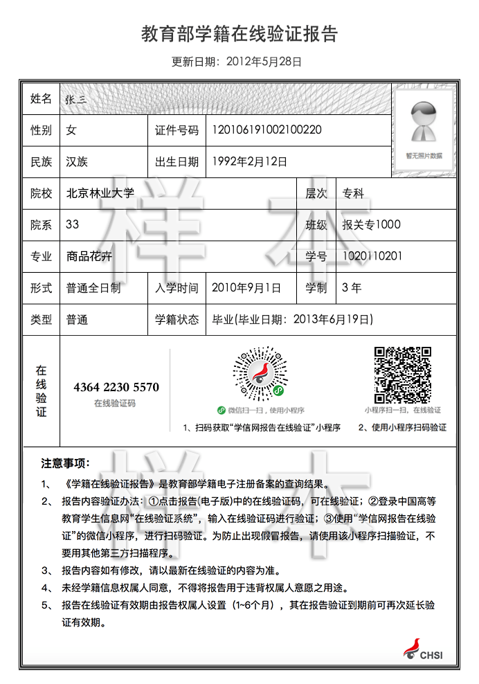

# Trust anchor - issue claim

1. 申请者需提交TA的资格审查的数据，通过可进行下一步；

   资格审查内容需要TA自定义，根据不同的场景可定义不同的审查内容

   例如学信网的学历认证

   

   学信网信任锚通过提供 Restful 服务（或者其他类型的服务），接收用户提交的学籍在线验证码，并向学信网数据库请求对应的学籍信息。

   

2. 签发相应的可信申明

   * 在获得验证报告之后，你需要为你的用户签发相应的可信申明，需页面程序生成 协议二维码，申请者通过Onto Auth 进行签名；
   * 不需要第三方数据认证的情况下，Trust Anchor 可自己签发可信声明，通过Onto Auth 进行签名；
   * 数据认证方也可自己签发Claim

   实施步骤：

   ​	*	需要先注册 [获取可信声明](../web-app/action.md) 的Action Name

   ```json
   {
      "domain": "on.ont",
      "enableONS": true,
      "defaultPayer": "AFmseVrdL9f9oyCzZefL9tG6UbvhUMqNMV",
      "actions": [{
            "type": "getClaim",
            "onchainRec": false
         },
         {
            "type": "...",
            "onchainRec": false
         },
         {
            "type": "...",
            "onchainRec": true,
            "payer": "AFmseVrdL9f9oyCzZefL9tG6UbvhUMqNMV",
            "qrcodeUrl": "",
            "callback": ""
         }
      ]
   }
   ```

   ​	*	通过 Singing-SDK [方法](../../../framework/signing-server/sdk/java/javadoc/[README.md](README.md))获取二维码协议参数

   ```js
   let qrStr = singingSdk.verify('getClaim', 'ad12-dis')
   ```

   

   示例二维码

   

   

3. 签名通过后，TA通过Clain合约执行[上链操作](../../../framework/trust-anchor/smart-contract-api.md)，申请者 通过TA API拿到生成的claim；

   [TA Claim Result API](../../../framework/trust-anchor/restful-api.md#claim_res)

   

4. 申请者拿到claim之后可进行保存，至此，一份区块链上的学籍报告声明签发完成。

   ```json
   {
   	"action": "getClaim",
   	"version": "v1",
   	"error": 0,
   	"id": "10ba038e-48da-487b-96e8-8d3b99b6d18a",
   	"result": {
   		"claimTemplate": "claims:yus_chinese_id_authentication",
   		"claim"："eyJraWQiOiJkaWQ6b250OkFhUEVnNzdmR3FqM2RZUDcxYUFrWnU3M0ZLc01KUWVxaTEja2V5cy0xIiwidHlwIjoiSldULVgiLCJhbGciOiJPTlQtRVMyNTYifQ==.eyJjbG0tcmV2Ijp7InR5cCI6IkF0dGVzdENvbnRyYWN0IiwiYWRkciI6IjM2YmI1YzA1M2I2YjgzOWM4ZjZiOTIzZmU4NTJmOTEyMzliOWZjY2MifSwic3ViIjoiZGlkOm9udDpBSnVhN0M2dGVvRlVzMktoUmVjcWJmYlB3ckY5OWtISGdqIiwidmVyIjoidjEuMCIsImNsbSI6eyJJc3N1ZXJOYW1lIjoiU2Vuc2V0aW1lIiwi5aeT5ZCNIjoi5LiB5bCP57KJIiwi6Lqr5Lu96K+B5Y+3IjoiMzQxMjgxMTk4NzA4MzA2OTA4In0sImlzcyI6ImRpZDpvbnQ6QWFQRWc3N2ZHcWozZFlQNzFhQWtadTczRktzTUpRZXFpMSIsImV4cCI6MTU5NTQxNDMzMywiaWF0IjoxNTYzNzkxOTM1LCJAY29udGV4dCI6ImNsYWltOnl1c19jaGluZXNlX2lkX2F1dGhlbnRpY2F0aW9uIiwianRpIjoiZDNlYzBjZWFkNWEzN2JjNTQ2OTAzODUwY2QxMGY4OTM0NGUyZWVlZGUwM2UxMGJmNTNhZjA1ZGI3YmY4NjY1NCJ9.AZniJRQtytUzoaWAS5CjnqQdTHD4mW9lQnyepwuzwkqA5ZeOM6Jr2ZnHI42R981YHCyRse7qHpC6xhxeQc0XunM=\.eyJUeXBlIjoiTWVya2xlUHJvb2YiLCJNZXJrbGVSb290IjoiYjFmNjUwMGI3MGM0ZGY3YmNlNDQ2MDgxNzIxNDQ1M2E3ZmI4MTZiNjMwZGI1NTRmZDFhM2FhMjgwZDM1ZTA3MSIsIlR4bkhhc2giOiI0MTEyYzE3MDM1OTljMWM1ZThmNmM5NWY4YTNjMGI0ZGYwMDk2MWU0NmIxZDdiMjk3MmY5MjVhYjIyZGM5OTViIiwiQmxvY2tIZWlnaHQiOjMwMzMzNDAsIk5vZGVzIjpbeyJUYXJnZXRIYXNoIjoiZTE0MTcyYzhhNmUxOTM5NDM0NjU2NDhlMWM1ODZhOTE4NmEzNzg0ZWU3ZWUyOWRiOWVkYmY2YWZlMDRmNTM5MCIsIkRpcmVjdGlvbiI6IkxlZnQifSx7IlRhcmdldEhhc2giOiJmNDQwNTMxOTk5YzU0N2RiMDhmNTE2Njc3YzE1MjIxNTQ3NWE2OWRjY2I4MjE3NmU0YmNhMWI3MjYyNjFhMWJlIiwiRGlyZWN0aW9uIjoiTGVmdCJ9LHsiVGFyZ2V0SGFzaCI6IjMzZDQ0ZmIxOTMxZWMwYTVjMjZiMzg1ZmZhYmQwYjUzYTQ5YTE4MDIxZWQxYjljMTEyNmU5ODAzNGFjNzZkNjAiLCJEaXJlY3Rpb24iOiJMZWZ0In0seyJUYXJnZXRIYXNoIjoiYzMzZTg5ZTZhYjcwZjg0YjY2MDkyYThjY2FjMjk5ZWY5MjBlNWQ0NTg2MDc3ZGFlNDk1M2I2MjFhN2Q4NDhjOCIsIkRpcmVjdGlvbiI6IkxlZnQifSx7IlRhcmdldEhhc2giOiI3YTI1MTA1NzkyNmQ5MTc0NGRlYjcyMWYyMjExYjZlZTIwODMwMzRkM2EzOWM5NzFjZDY2ZDhhMzNhMjI1OGU1IiwiRGlyZWN0aW9uIjoiTGVmdCJ9LHsiVGFyZ2V0SGFzaCI6Ijk1ZDY0YThhYmM2NzU5YzU1ZWJjYThiNzU0MGM5OGU0NWUxYzI4NWE4MDk0Zjg4MDdlMjI1NDI4NTRhMDZhOGIiLCJEaXJlY3Rpb24iOiJMZWZ0In0seyJUYXJnZXRIYXNoIjoiNjgxMTY1MmY1ZTI2ZDNjZDk0NjY2ZWI3MDkyMTMxYzU0NThkYTUxYzZmOTBlM2YxMDg3MDU5ODc2M2NjZGVkMSIsIkRpcmVjdGlvbiI6IkxlZnQifSx7IlRhcmdldEhhc2giOiJkNzE1YzllODE3ZmU4NjYzMTkzYjU5N2MzYjZhMjhiNTlmYTY4NWQxZjNmMjVhNjhkZmJhMGYyYzA2Y2I5MjFiIiwiRGlyZWN0aW9uIjoiTGVmdCJ9LHsiVGFyZ2V0SGFzaCI6IjFmMGU4ZTA2YmU5MGQzYTM2MWNlZTk5OWMwYWM5OGVkYjBmNjA4YTViMzNhMTU3ODM4ZTMyNWU0ZmFlMjRkY2MiLCJEaXJlY3Rpb24iOiJMZWZ0In0seyJUYXJnZXRIYXNoIjoiNjA5NDQyYmEyYjk5NWEzYTA4ZTk5ZmE3MTQ3ZDY4NDQ2YjNmY2IzYjNiZTU4ZmQ2MzI3NWU1NDAxM2M1YmM1MSIsIkRpcmVjdGlvbiI6IkxlZnQifSx7IlRhcmdldEhhc2giOiJiMGNkY2I2ZmM1NzRjMzQyMDgyMDYwNzllYzBiNDc4NDM1NGE4YzUwZGI4NTJkNGQ3ZGMzMjY1NjkwOTE5N2Q4IiwiRGlyZWN0aW9uIjoiTGVmdCJ9LHsiVGFyZ2V0SGFzaCI6Ijc5YTgyYzkzZGZiZWNjODhmNzZhYjMzMDk1NWMyZjY0ODlhMmYyNmFkOThhY2FiOGI3NDY4MWViNzJhYjM4YzYiLCJEaXJlY3Rpb24iOiJMZWZ0In1dLCJDb250cmFjdEFkZHIiOiIzNmJiNWMwNTNiNmI4MzljOGY2YjkyM2ZlODUyZjkxMjM5YjlmY2NjIn0="
       }
   }
   ```

   
