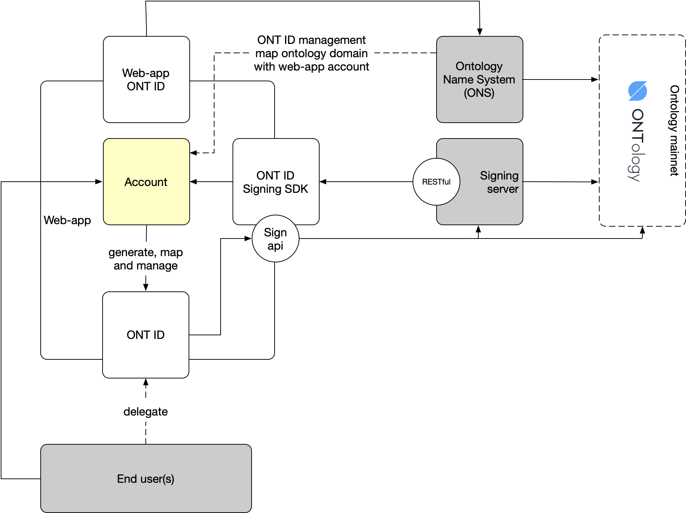

# ONT ID signing server - centralized identity

Centralized identity system is a workaround for self-sovereign identity solution.

Conceptually, `ONT ID` is delegated from end users to web-app server host.

Terms and agreement shall be prepared in advance, for end users to accept the "delegate" action.

Technically, delegated `ONT ID` contails three key features,

1. to generate `ONT ID` with web-app `root key` to manage `owner key` of `ONT ID` DDO on behalf of end user
2. to sign on on-chain actions, e.g., registration, login, on behalf of end user and publish to Ontology mainnet
3. to enable end users to take over the ownership of `ONT ID` if they want

