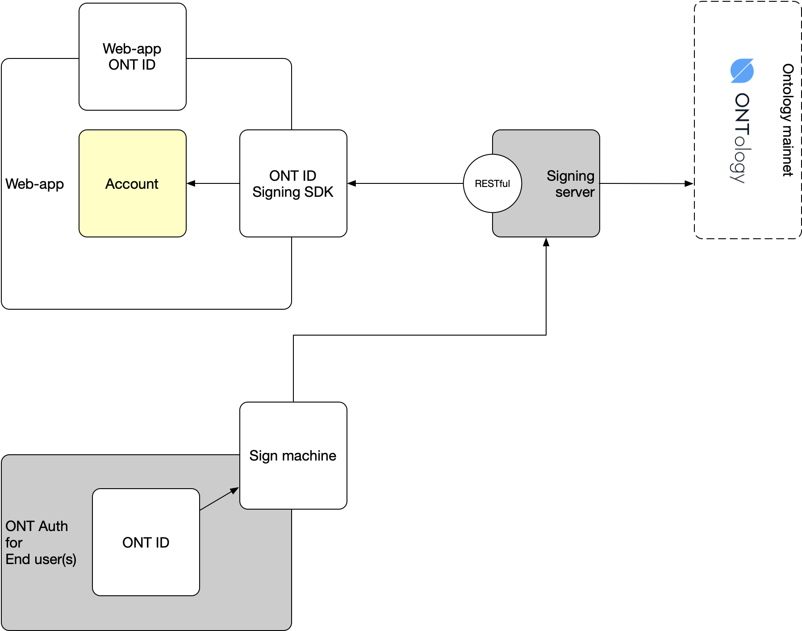
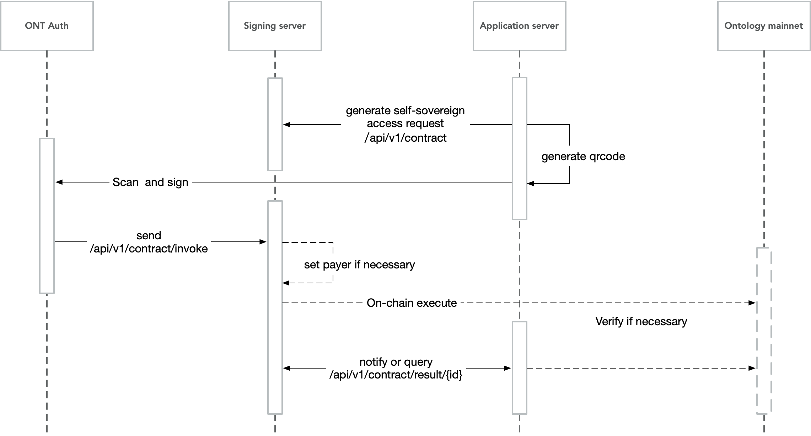
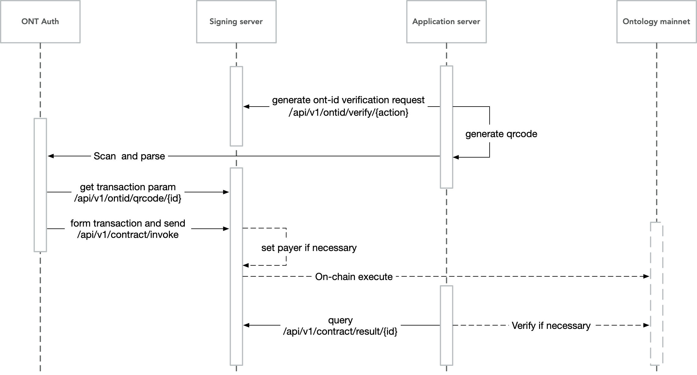
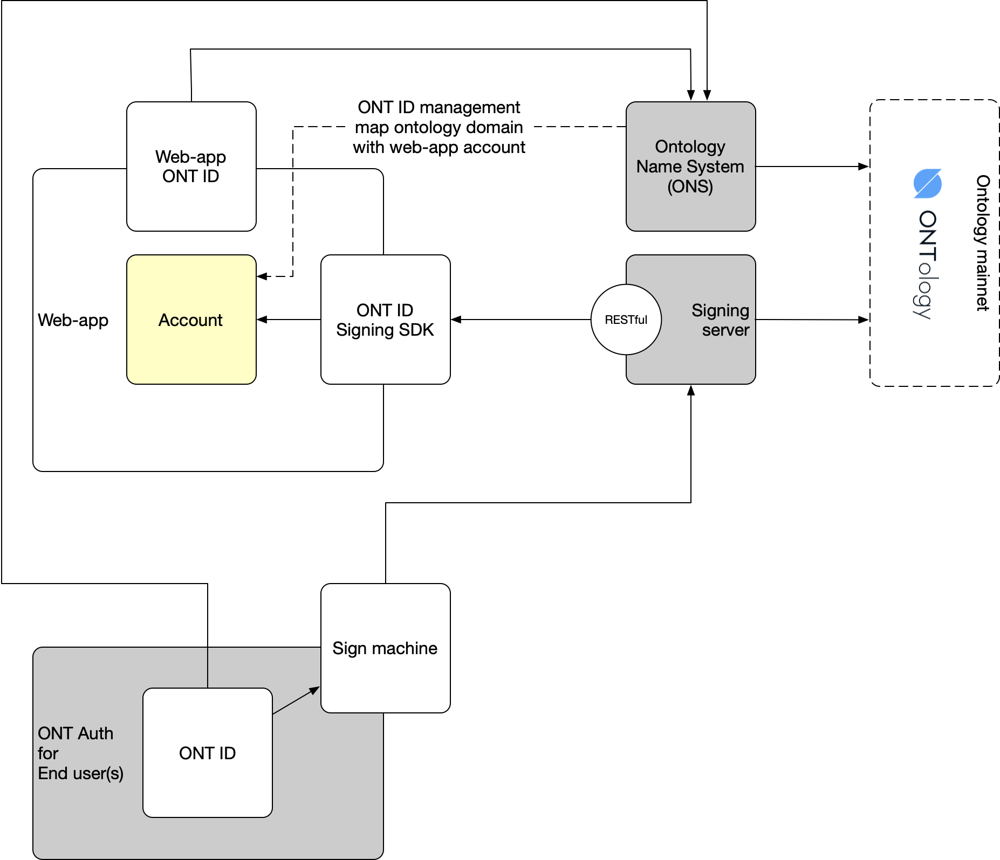
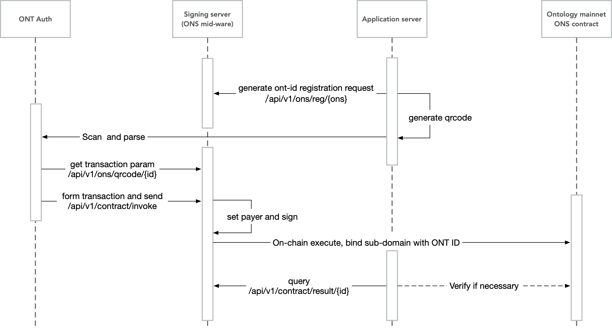
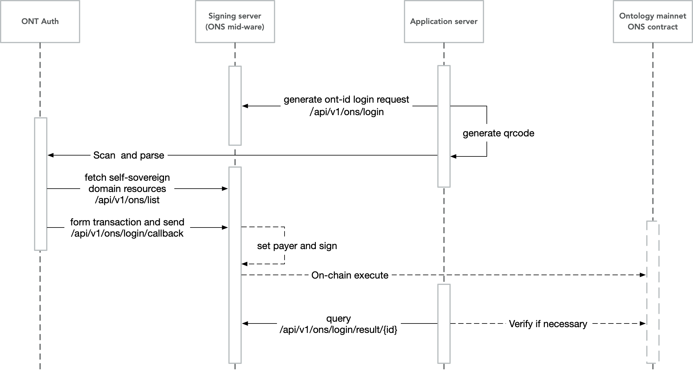

# ONT ID signing server - RESTful api

1. [General Interface](#GIfc)
2. [Self-sovereign Identity](#SSID)
3. [[Optional] Ontology Name System](#ONS)

---

ONT ID services are deployed to Ontology mainnet. Users can access ONT ID services via `RESTful api`. ONT ID SDK is a software development toolkit to encapsulate the capability to access on-chain apis. 

The `RESTful api` and `SDK` is able to cover the following scenarios:

1. Self-sovereign user account management with data privacy protection
   1. To generate self-sovereign identifier (ONT ID) on the user's own behavior.
   2. To register user account with user's ONT ID.
   3. To login applications with user's ONT ID.
   4. To use resources under full control from user.
   5. To combine resource with Ontology on-chain name service.
   6. To benefit from Ontology blockchain infrastructure by its immutable and traceable data processing and management services.
2. User certification to serve your customer better
   1. To generate claims for your customer, as an Ontology Trust Anchor.
   2. To acquire claims from Ontology Trust Anchor.
3. To integrate the reputation of ONT ID users into application and provide reputation feedback.



The following document is focus on the RESTful apis of ONT ID framework.

## <a name='GIfc'></a>General Interface

All on-chain contract can be accessed by general interface. To enable self-sovereign identity system with application, an on-chain signing server shall be setup to sync ONT Auth application with application servers.

The following diagram shows the general sequency to execute an ONT ID request with PC web-app and self-sovereign ONT Auth mobile app.



###  1. <a name='constructTransaction'></a>Construct transaction
```
url：/api/v1/contract
method：POST
```

Request:
```json
{
	"argsList": [{
		"name": "",
		"value": ""
	}, {
		"name": "",
		"value": ""
	}],
	"contractHash": "",
	"method": ""
}
```
| Field Name | Type | Description |
|---|---|---|
|contractHash|String|Contract hash|
|method|String|Contract method|
|argsList|List|Contract parameters|

Response:
```json
{
	"action": "makeTransaction",
	"error": 0,
	"desc": "SUCCESS",
	"result": {
		"callback": "http://192.168.3.121:7878/api/v1/contract/invoke",
		"id": "e1471264-b2d1-45fa-9eb5-1a8ad6ce2b6c",
		"tx": "00d1ed6aa95cf401000000000000409c000000000000f5f7b705b03ae46e48f89c2b99e79fa4391536fe6e0360ea00016f51c10331313151c114000000000000000000000000000000000000000214010b5816b180ffb41e3889b6f42aeaf31fd63209143fc9fa9491df7e93b94db2df99e6af2d67ad34b756c10973656e64546f6b656e67bae44577a468b5bfd00ebbaba7d91204204828470000"
	},
	"version": "v1"
}
```
| Field Name | Type | Description |
| --- | --- | --- |
| action | String | Action name |
| error | int | Error code |
| desc | String | If successful, SUCCESS is shown; if failed, error description is shown |
| result | Map | If successful, result is returned; if failed, "" is returned |
| callback | URL | callback server for mobile app to access Ontology blockchain after personal sign |
| id | String | Identifier to be recorded in the system, to sync with mobile app for ONT Auth |
| tx | String | The raw tx (transaction) in hex string |
| version   | String | Version                        |

###  2. Sign upon tx (transaction) and send tx to Ontology chain
```
url：/api/v1/contract/invoke
method：POST
```

Request:
```json
{
	"action": "string",
	"id": "string",
	"params": {
		"type": "ontid or address",
		"user": "did:ont:AUEKhXNsoAT27HJwwqFGbpRy8QLHUMBMPz or AUEKhXNsoAT27HJwwqFGbpRy8QLHUMBMPz",
		"tx": "01abd7ea9d79c857cd838cabbbaad3efb44a6fc4f5a5ef52ea8461d6c055b8a7cf324d1a58962988709705cefe40df",
		"publickey": "0205c8fff4b1d21f4b2ec3b48cf88004e38402933d7e914b2a0eda0de15e73ba61",
		"signature": "01abd7ea9d79c857cd838cabbbaad3efb44a6fc4f5a5ef52ea8461d6c055b8a7cf324d1a58962988709705cefe40df5b26e88af3ca387ec5036ec7f5e6640a1754"
	},
	"version": "string"
}
```

| Field Name | Type | Description |
|---|---|---|
| action    | String | Action name          |
| id        | String | Recorded ID         |
| version   | String | Version                |
| params    | String | Parameters              |

Response:
```json
{}
```
| Field Name | Type | Description |
| --- | --- | --- |
| result | obj | If successful, empty object "{}" is returned; if failed, error message is returned, due to the contract error codes |

The `params` field in request is an open field to invoke actions, signing server will judge whether to forward the transaction to Ontology chain(s). Two samples,

#### 2.1 <a name='signAndTx'></a>Transaction with signature

```
"params": {
	"type": "ontid or address",
	"user": "did:ont:AUEKhXNsoAT27HJwwqFGbpRy8QLHUMBMPz or AUEKhXNsoAT27HJwwqFGbpRy8QLHUMBMPz",
	"tx": "01abd7ea9d79c857cd838cabbbaad3efb44a6fc4f5a5ef52ea8461d6c055b8a7cf324d1a58962988709705cefe40df",
	"publickey": "0205c8fff4b1d21f4b2ec3b48cf88004e38402933d7e914b2a0eda0de15e73ba61",
	"signature": "01abd7ea9d79c857cd838cabbbaad3efb44a6fc4f5a5ef52ea8461d6c055b8a7cf324d1a58962988709705cefe40df5b26e88af3ca387ec5036ec7f5e6640a1754"
}
```

| Field Name | Type | Description |
|---|---|---|
|tx|String|Transaction in hex string|
|publickey|String|Signed public key|
|signature|String|Signed data|

#### 2.2 <a name='signedTx'></a>Transaction with signed tx string

```
"params": {
	"signedTx": "00d1ed6aa95cf401000000000000409c000000000000f5f7b705b03ae46e48f89c2b99e79fa4391536fe6e0360ea00016f51c10331313151c114000000000000000000000000000000000000000214010b5816b180ffb41e3889b6f42aeaf31fd63209143fc9fa9491df7e93b94db2df99e6af2d67ad34b756c10973656e64546f6b656e67bae44577a468b5bfd00ebbaba7d91204204828470000"
}
```
| Field Name | Type | Description |
|---|---|---|
| signedTx  | String | Signed tx hash |

###  3. <a name='checkTxStatus'></a>Check tx status
```
url：/api/v1/contract/result/{id}
method：Get
```

Request:
| Field Name | Type | Description |
|---|---|---|
|id          |String| Recorded id provided by response of construction of transaction |

Response:
```json
{
    "action": "result",
    "error": 0,
    "desc": "SUCCESS",
    "result": {
        "result": "1"
    },
    "version": "v1"
}
```
| Field Name | Type | Description |
| --- | --- | --- |
| action    | String | Action name                      |
| error      | int    | Error code                        |
| desc       | String | If successful, SUCCESS is shown; if failed, error description is shown |
| result    | String | If successful, "1" is returned; if failed, "0" is returned; if the transaction has not been executed in Ontology blockchain, return `NULL` (retry later) |
| version   | String | Version                       |

## <a name='SSID'></a>Self-sovereign Identity

Any web-app with account system can easily be bound to `system account` with `ONT ID` from end user. The key of user action with ONT ID is to confirm the `ONT ID` belongs to the end user.



### Support actions

The `ONT ID` verificaton can be used in `register`, `login` and any other on-chain transactions.

| Action type | Action name of ontid/verify |
| --- | --- |
| register | register |
| login | login |

New action type can be registered. For detail, please view the [deployment](./deployment.md) document of `signing server`.

### 1. <a name='genQrcode'></a>Generate a qrcode to verify the belonging of ONT ID

```
url：/api/v1/ontid/verify/{action}
method：Get
```

Response:

```json
{
    "action": "register",
    "error": 0,
    "desc": "SUCCESS",
    "result": {
        "callback": "http://192.168.3.121:7878/api/v1/ontid/invoke",
        "id": "a0308abd-d57e-41fe-9554-5fe6435db2fe",
        "qrcodeUrl": "http://192.168.3.121:7878/api/v1/ontid/qrcode/a0308abd-d57e-41fe-9554-5fe6435db2fe",
        "domain": "on.ont",
        "msg": "7ca22b"
    },
    "version": "v1"
}
```
| Field Name | Type | Description |
| --- | --- | --- |
| action    | String | Action name, `register`, `login` or other names predefined for the domain |
| error      | int    | Error code                       |
| desc       | String | If successful, SUCCESS is shown; if failed, error description is shown |
| result    | String | If successful, recorded info is returned; if failed, "" is returned |
| callback  | String | Callback URL address                  |
| id        | String | Reserved id for the close loop of the transaction, random per request, expired in 24 hours by default |
| qrcodeUrl | String | Get tx parameter address           |
| domain | String | The domain of the web-app, registered in ONS. If the signing server is setup by the web-app on its own, this field can leave blank |
| msg | String | Random message to identify the request |
| version   | String | Version                       |

The json data in `result` field is used to generate a qrcode for Ontology authentication mobile app (a.k.a., ONT Auth) to scan. A `version` field shall also be involved in the json code for the qrcode. E.g., in the sample above, the code piece to generate qrcode is,

```json
{
    "callback": "http://192.168.3.121:7878/api/v1/ontid/invoke",
    "id": "a0308abd-d57e-41fe-9554-5fe6435db2fe",
    "qrcodeUrl": "http://192.168.3.121:7878/api/v1/ontid/qrcode/a0308abd-d57e-41fe-9554-5fe6435db2fe",
    "domain": "on.ont",
    "msg": "7ca22b",
    "version": "v1"
}
```

Mobile app (ONT Auth) will let end user sign on the transaction and send back to `signing server` for verification.

Web-app can check for the action (e.g., registration or login) result, and create account and bind account with ONT ID or login the account with the bound ONT ID.

###  2. Check request status 

Ref., [check tx status](#checkTxStatus), the `action` field of response is "**registerResult**", "**loginResult**".

###  3. ONT Auth behavior

1. ONT Auth will access the `qrcodeUrl` from the response of action (e.g., registration or login). The api will then returns the pattern of `ONT ID` / `web app` actions. 
2. ONT Auth will then construct transaction with the action pattern and have the transaction signed with the `ONT ID`'s PK. 
3. The signed transaction will be sent to `signing server`, and the server will check whether the PK is the owner of the `ONT ID`. 
4. When matched, the registration status will be `SUCCESS`.

#### 3.1 Get tx parameters

Get transaction pattern of user action(s). The action with ONT ID is to bind `ONT ID` with web-app account or confirm the `ONT ID` is bound with web-app account, a transaction with `ONT ID PK` signed is to verify ONT ID belonging from ONT Auth.

```
url：/api/v1/ontid/qrcode/{id}
method：Get
```

Request
| Field Name | Type | Description |
|---|---|---|
|id         |String|Id returned from "1. generate qrcode"|

Response:

```json
{
	"action": "signTransaction",
	"id": "80edaf95-4706-41f1-a25b-57447e4e3094",
	"params": {
		"invokeConfig": {
			"contractHash": "fb12993d6f13a2ec911f3bbfe534be90e4deeca4",
			"functions": [{
				"args": [{
					"name": "domain",
					"value": "String:on.ont"
				}, {
					"name": "ontid",
					"value": "String:%ontid"
				}, {
					"name": "idx",
					"value": 1
				}, {
					"name": "validto",
					"value": -1
				}, {
					"name": "msg",
					"value": "String:%msg"
				}],
				"operation": "verifySign"
			}]
		},
		"ontidSign": true,
		"callback": "http://192.168.3.121:7878/api/v1/contract/invoke"
	},
	"version": "v1"
}
```
| Field Name | Type | Description |
| --- | --- | --- |
| action    | String | Action name                     |
| id        | String | Id returned from "1. generate qrcode" |
| params    | Object | Transaction parameters, for detail, please view protocol in `ont-auth` and [`signing server`](../ont-auth/transaction-spec.md) |
| version   | String | Version                       |

#### 3.2 Construct transaction and send

1. ONT Auth will [contruct a registration transaction](#constructTransaction) with the given pattern. 
2. Sign the transaction and send. Ref., [transaction with signed tx string](#signedTx).

## <a name='ONS'></a>[Optional] Ontology Name System

Ontology Name System is an on-chain system to bind resource from users with a combination of domain name and protocol, with resource/data privacy protection.

The resource can be `ONT ID`, `wallet address`, `digital asset`.

ONT ID RESTful api encapsulates ONS combination with web-app account. The account will be treated as a sub-domain of the web-app.



### User registration



####  1. Register name in ONS (Ontology Name System)

```
url：/api/v1/ons/reg/{ons}
method：Get
```

Request:
| Field Name | Type | Description |
|---|---|---|
|ons         |String|Domain name that needs to be registered|

Response:

```json
{
    "action": "registerDomain",
    "error": 0,
    "desc": "SUCCESS",
    "result": {
        "callback": "http://192.168.3.121:7878/api/v1/ons/invoke",
        "id": "a0308abd-d57e-41fe-9554-5fe6435db2fe",
        "qrcodeUrl": "http://192.168.3.121:7878/api/v1/ons/qrcode/a0308abd-d57e-41fe-9554-5fe6435db2fe",
        "domain": "on.ont",
        "msg": "7ca22b"
    },
    "version": "v1"
}
```
| Field Name | Type | Description |
| --- | --- | --- |
| action    | String | Action name                     |
| error      | int    | Error code                       |
| desc       | String | If successful, SUCCESS is shown; if failed, error description is shown |
| result    | String | If successful, recorded info is returned; if failed, "" is returned |
| callback  | String | Callback URL address                  |
| id        | String | Reserved id for the close loop of the transaction, random per request, expired in 24 hours by default |
| qrcodeUrl | String | Get tx parameter address           |
| domain | String | The domain of the web-app, registered in ONS. If the signing server is setup by the web-app on its own, this field can leave blank |
| msg | String | Random message to identify the request |
| version   | String | Version                       |

The json data in `result` field is used to generate a qrcode for Ontology authentication mobile app (a.k.a., ONT Auth) to scan. A `version` field shall also be involved in the json code for the qrcode. E.g., in the sample above, the code piece to generate qrcode is,

```json
{
    "callback": "http://192.168.3.121:7878/api/v1/ons/invoke",
    "id": "a0308abd-d57e-41fe-9554-5fe6435db2fe",
    "qrcodeUrl": "http://192.168.3.121:7878/api/v1/ons/qrcode/a0308abd-d57e-41fe-9554-5fe6435db2fe",
    "domain": "on.ont",
    "msg": "7ca22b",
    "version": "v1"
}
```

Mobile app (ONT Auth) will let end user sign on the transaction and send back to `signing server` for verification.

#### 2. Check request status 

Ref., [check tx status](#checkTxStatus), the `action` field of response is "**registerResult**".

#### 3. ONT Auth behavior

1. ONT Auth will access the `qrcodeUrl` from the response of registration. The api will then returns the pattern of `ONT ID` / `web app` registration. 
2. ONT Auth will then construct transaction with the registration pattern and have the transaction signed with the `ONT ID`'s PK. 
3. The signed transaction will be sent to `signing server`, and the server will check whether the PK is the owner of the `ONT ID`. 
4. When matched, the registration status will be `SUCCESS`, and the ONT ID is combined with a sub-domain under the web-app, in ONS.

##### 3.1 Get tx parameters

Get registration transaction pattern. The registration is to bind `ONT ID` with web-app account and register the resource with ONS on-chain. A transaction with `ONT ID PK` signed is to verify ONT ID belonging from ONT Auth, and the combination of ONT ID with ONS sub-domain will be saved on-chain.

```
url：/api/v1/ons/qrcode/{id}
method：Get
```

Request
| Field Name | Type | Description |
|---|---|---|
|id         |String|Recorded ID|

Response:

```json
{
	"action": "signTransaction",
	"id": "80edaf95-4706-41f1-a25b-57447e4e3094",
	"params": {
		"invokeConfig": {
			"gasLimit": 40000,
			"contractHash": "fb12993d6f13a2ec911f3bbfe534be90e4deeca4",
			"functions": [{
				"args": [{
					"name": "fulldomain",
					"value": "String:ning.on.ont"
				}, {
					"name": "registerdid",
					"value": "String:%ontid"
				}, {
					"name": "idx",
					"value": 1
				}, {
					"name": "validto",
					"value": -1
				}],
				"operation": "registerDomain"
			}],
			"payer": "AcdBfqe7SG8xn4wfGrtUbbBDxw2x1e8UKm",
			"gasPrice": 500
		},
		"ontidSign": true,
		"callback": "http://192.168.3.121:7878/api/v1/contract/invoke"
	},
	"version": "v1"
}
```

| Field Name | Type | Description |
| --- | --- | --- |
| action    | String | Action name                     |
| id        | String | Recorded ID                     |
| params    | Object | Transaction parameters, for detail, please view protocol in `ont-auth` and [`signing server`](../ont-auth/transaction-spec.md) |
| version   | String | Version                       |

*ONT ID and domain is recorded on-chain, so a payer shall be set to pay gas fee.

##### 3.2 Send registration transaction

Sign the transaction and send. Ref., [transaction with signed tx string](#signedTx).

### User login



####  1. New login transaction

```
url：/api/v1/ons/login
method：Get
```

Response:

```json
{
    "action": "getMessage",
    "error": 0,
    "desc": "SUCCESS",
    "result": {
        "callback": "http://192.168.3.121:7878/api/v1/login/callback",
        "id": "e1471264-b2d1-45fa-9eb5-1a8ad6ce2b6c",
        "domain": "on.ont",
        "msg": "7ca22b"
    },
    "version": "v1"
}
```
| Field Name | Type | Description |
| --- | --- | --- |
| action    | String | Action name                     |
| error      | int    | Error code                       |
| desc       | String | If successful, "SUCCESS" is shown; if failed, error description is shown |
| result    | String | If successfully, recorded info is returned; if failed, "" is returned  |
| callback  | String | Callback URL address                  |
| id        | String | Reserved id for the close loop of the transaction, random per request, expired in 24 hours by default |
| domain | String | The domain of the web-app, registered in ONS. If the signing server is setup by the web-app on its own, this field can leave blank |
| msg | String | Random message to identify the request |
| version   | String | Version                      |

The json data in `result` field is used to generate a qrcode for Ontology authentication mobile app (a.k.a., ONT Auth) to scan. A `version` field shall also be involved in the json code for the qrcode. E.g., in the sample above, the code piece to generate qrcode is,

```json
{
    "callback": "http://192.168.3.121:7878/api/v1/login/callback",
    "id": "e1471264-b2d1-45fa-9eb5-1a8ad6ce2b6c",
    "domain": "on.ont",
    "msg": "7ca22b"
    "version": "v1"
}
```

Mobile app (ONT Auth) will let end user sign on the transaction and send back to `signing server` for verification.

####  2. Check request status

```
url：/api/v1/ons/login/result/{id}
method：Get
```

Request:
| Field Name | Type | Description |
|---|---|---|
|id          |String|Id returned from "1. new login"    |

Response

```json
{
    "action": "loginResult",
    "error": 0,
    "desc": "SUCCESS",
    "result": {
        "result": "1",
        "ons": "test.ont.io",
        "ontid": "did:ont:AGWYQHd4bzyhrbpeYCMsxXYQcJo95VtR5q"
    },
    "version": "v1"
}
```
| Field Name | Type | Description |
| --- | --- | --- |
| action    | String | Action name                      |
| error      | int    | Error code                       |
| desc       | String | If successful, "SUCCESS" is shown; if failed, error description is shown |
| result    | String | If successful, "1" is returned; if failed, then "0" is returned; if the transaction has not been executed in Ontology blockchain, return `NULL` (retry later) |
| ons       | String | User domain name                     |
| ontid     | String | User ONT ID                    |
| version   | String | Version                       |

####  3. ONT Auth behavior

ONT Auth will pick the sub-domain/account of the web-app from end-user and verify the ownership of `ONT ID PK`.

#####  3.1 Get ONS list according to ONT ID and parent domain name

Multiple accounts combined with one ONT ID. 

To turn on data privacy protection, a MPC with domain owner (ONT ID web-app host) and ONT ID owner shall sign on the same transaction. *(The document is in progress. Coming soon...)*

```
url：/api/v1/ons/list?domain=on.ont&ontid=did:ont:AGWYQHd4bzyhrbpeYCMsxXYQcJo95VtR5q
method：Get
```

Response:

| Field Name | Type | Description |
|---|---|---|
| ontid    | String | User ONT ID                     |
| domain   | String | Website domain name                    |

Response:

```json
{
    "action": "getOnsList",
    "error": 0,
    "desc": "SUCCESS",
    "result": [
        "test.ont.io",
        "2222.ont.io",
        "1111.ont.io"
    ],
    "version": "v1"
}
```
| Field Name | Type | Description |
| --- | --- | --- |
| action    | String | Action name                      |
| error      | int    | Error code                       |
| desc       | String | If successful, "SUCCESS" is shown; if failed, error description is shown |
| result    | String | If successful, domain name list is returned,; if failed, "" is returned |
| version   | String | Version                       |

##### 3.2 Callback verification

```
url：/api/v1/ons/login/callback
method：Post
```

Request:
```json
{
	"action": "login",
	"version": "v1",
	"id": "10ba038e-48da-487b-96e8-8d3b99b6d18a",
	"params": {
		"type": "ontid",
		"user": "did:ont:AGWYQHd4bzyhrbpeYCMsxXYQcJo95VtR5q",
		"domain": "test.ont.io",
		"msg": "7ca22b",
		"publickey": "0205c8fff4b1d21f4b2ec3b48cf88004e38402933d7e914b2a0eda0de15e73ba61",
		"signature": "01abd7ea9d79c857cd838cabbbaad3efb44a6fc4f5a5ef52ea8461d6c055b8a7cf324d1a58962988709705cefe40df5b26e88af3ca387ec5036ec7f5e6640a1754"
	}
}
```
| Field Name | Type | Description |
|---|---|---|
| action    | String | Action name                      |
| version   | String | Version                       |
| id        | String | Recorded ID                     |
| params    | Object | Callback verification parameters                  |
| type      | String | Type                        |
| user      | String | User ONT ID                   |
| domain    | String | User domain name                     |
| msg | String | Signature verification message, pre-defined in `1. new login` |
| publickey | String | Public key                         |
| signature | String | Signed data                     |

Response:

```json
{
    "result": true,
    "action": "login",
    "id": "10ba038e-48da-487b-96e8-8d3b99b6d18a",
    "error": 0,
    "desc": "SUCCESS"
}
```
| Field Name | Type | Description |
| --- | --- | --- |
| action    | String | Action name                      |
| error     | int    | Error code                        |
| desc      | String | If successful, "SUCCESS" is shown; if failed, error description is shown |
| result    | String | If successful, true is returned; if failed, then "" is returned      |
| version   | String | Version                       |

## Register new action

### 1. Register new transaction

Sign by host of web-app.

### 2. Register new transaction template

Sign by host of web-app.