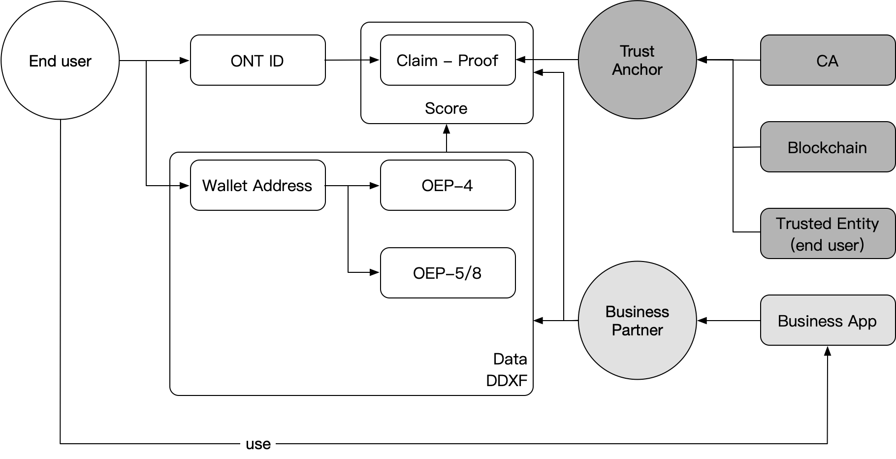
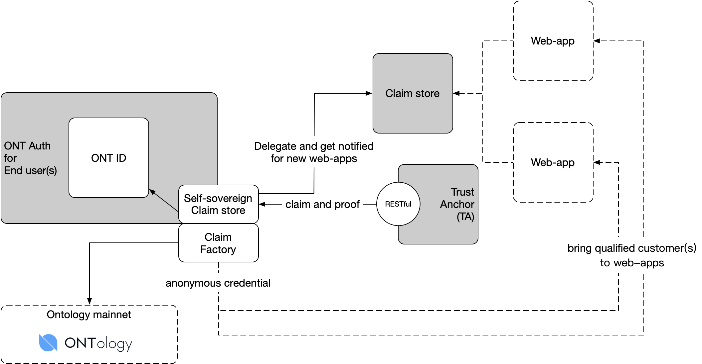
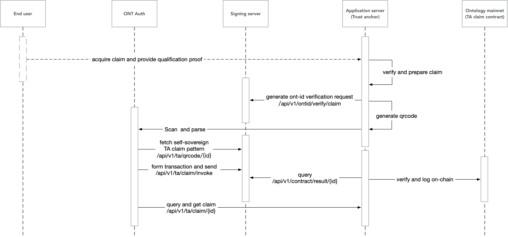
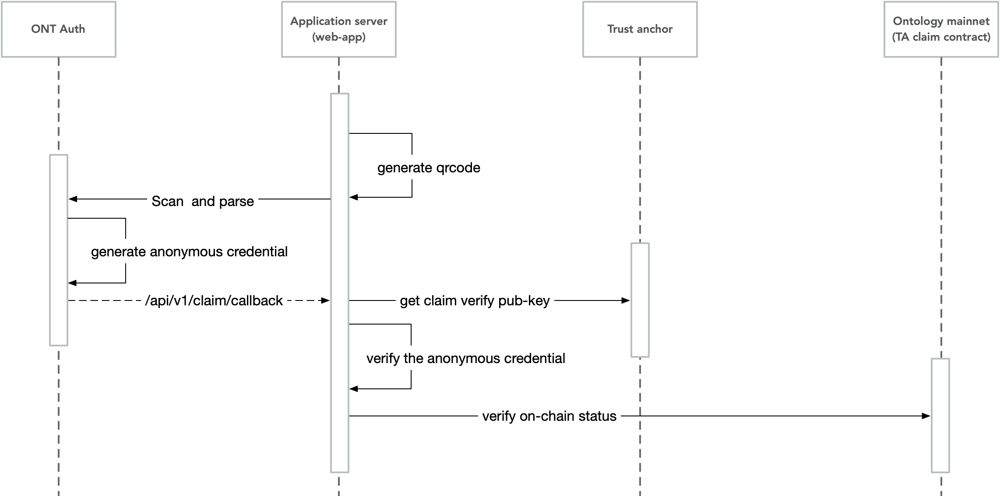

# ONT ID Trust Anchor - RESTful api

1. [Ontology claim system](#claims)
2. [Appendix I. ABI of claim contract](#abi)

Ontology provides standard protocol for entities to provide endorsement on certain professional capabilities for users, the data privacy protection is also involved. The series of endorsements, a.k.a., claims and proofs, increase the qualifiable of users. 

Due to the blockchain infrastructure, the endorsement turns to be "**trust endorsement**", and the endorsement providers in Ontology ecosystem are called the Ontology Trust Anchors (TAs).

Tipical trust anchor usecase in ONT ID framework works in the diagram below.



Technically, `Ontology TA` works with `ONT Auth` and `claim store`, provides user qualification in web-apps.  



The component of Ontology TA list below,

1. [Trust anchor with ONT Auth (self-sovereign claim)](#claims)
   1. ONT ID, owner of the claims
   2. Claim factory, manipulate the claims, create `anonymous credential` for real usecases, in order to enable data privacy protection.
3. [Claim store](../claim-store/README.md)

## <a name='claims'></a>Ontology claim system

### 1. Verifiable claim specification

[>>> Learn more.](../spec/claim.md)

### 2. Claim generation

Ontology claim system reuses the "[general interface](../signing-server/restful-api.md#GIfc)" and "[self-sovereign identity](../signing-server/restful-api.md#SSID)" of `ONT Auth` and `signing server`.



#### 2.1 Request a claim

- End user acquire a claim for certain qualifications, provides proof of the qualification items
- Trust anchor verify the proof and prepare for the claim, the claim follows the `verifiable claim specification`.

#### 2.2 Generate QR code for ONT Auth

Ref., [signing server - generate a qrcode to verify the belonging of ONT ID](../signing-server/restful-api.md#genQrcode)

```
url：/api/v1/ontid/verify/claim
method：Get
```

Response:

```json
{
    "action": "claim",
    "error": 0,
    "desc": "SUCCESS",
    "result": {
        "callback": "http://192.168.3.121:7878/api/v1/ta/claim/invoke",
        "id": "a0308abd-d57e-41fe-9554-5fe6435db2fe",
        "qrcodeUrl": "http://192.168.3.121:7878/api/v1/ta/qrcode/a0308abd-d57e-41fe-9554-5fe6435db2fe",
        "domain": "sampleta.ont",
        "msg": "7ca22b"
    },
    "version": "v1"
}
```

| Field Name | Type   | Description                                                  |
| ---------- | ------ | ------------------------------------------------------------ |
| action     | String | Action name, `claim`                                         |
| error      | int    | Error code                                                   |
| desc       | String | If successful, SUCCESS is shown; if failed, error description is shown |
| result     | String | If successful, recorded info is returned; if failed, "" is returned |
| callback   | String | Callback URL address                                         |
| id         | String | Reserved id for the close loop of the transaction, random per request, expired in 24 hours by default |
| qrcodeUrl  | String | Get tx parameter address                                     |
| domain     | String | The domain of the web-app, registered in ONS. If the signing server is setup by the web-app on its own, this field can leave blank |
| msg        | String | Random message to identify the request                       |
| version    | String | Version                                                      |

#### 2.3 Check request status

Ref., [check tx status](../signing-server/restful-api.md#checkTxStatus), the `action` field of response is "**claimResult**".

#### 2.4 Log on-chain

Ref., [ABI of claim](#abi).

```
Boolean Commit(ByteArray claimId, ByteArray committerId, ByteArray ownerId);
Boolean Revoke(ByteArray claimId, ByteArray ontId);
ByteArray Getstatus(ByteArray claimId); // return status of the claimId
```

| Name           | Type      | Description                             |
| -------------- | --------- | --------------------------------------- |
| claimId        | ByteArray | Hash of the claim                       |
| committerId    | ByteArray | ONT ID of trust anchor                  |
| ownerId, ontId | ByteArray | ONT ID of the entity                    |
| Status         | ByteArray | Serialized byte array of struct ClaimTx |

```c#
ClaimTx
{
    public byte[] claimId;
    public byte[] commiterId;
    public byte[] ownerId;
    public byte status; // 1: actived; 0: revoked
}
```

#### 2.5 ONT Auth behavior

##### 2.5.1 Get tx parameters

Get transaction pattern of user action(s). The transaction with `ONT ID PK` signed is to verify ONT ID belonging from ONT Auth.

```
url：/api/v1/ta/qrcode/{id}
method：Get
```

Request

| Field Name | Type   | Description                            |
| ---------- | ------ | -------------------------------------- |
| id         | String | Id returned from "2.2 generate qrcode" |

Response:

```json
{
	"action": "claim",
	"id": "80edaf95-4706-41f1-a25b-57447e4e3094",
	"params": {
		"invokeConfig": {
			"contractHash": "729635b7135e9eab97daed4e0b48e9f18a71410d",
			"functions": [{
				"args": [{
					"name": "ontid",
					"value": "String:%ontid"
				}, {
					"name": "msg",
					"value": "String:%msg"
				}, {
					"name": "expire",
					"value": "Long:%expire"
				}],
				"operation": "verifySign"
			}]
		},
		"ontidSign": true,
		"callback": "http://192.168.3.121:7878/api/v1/claim/invoke"
	},
	"version": "v1"
}
```

| Field Name | Type   | Description                                                  |
| ---------- | ------ | ------------------------------------------------------------ |
| action     | String | Action name, `claim`                                         |
| id         | String | Id returned from "2.2 generate qrcode"                       |
| params     | Object | Transaction parameters, for detail, please view protocol in `ont-auth` and [`signing server`](../ont-auth/transaction-spec.md) |
| version    | String | Version                                                      |

##### 2.5.2 Construct transaction and send

1. ONT Auth will [contruct a claim invoke transaction](../signing-server/restful-api.md#constructTransaction) with the given pattern. 
2. Sign the transaction and send. Ref., [transaction with signed tx string](../signing-server/restful-api.md#signedTx).

#### 2.6 Get claim from TA

```
url：/api/v1/ta/claim/{id}
method：GET
```

| Field Name | Type | Description |
|---|---|---|
| id  | String | Id returned from "2.2 generate qrcode" |

Response:

```json
{
	"action": "getClaim",
	"version": "v1",
	"error": 0,
	"id": "10ba038e-48da-487b-96e8-8d3b99b6d18a",
	"result": {
		"claimTemplate": "claims:yus_chinese_id_authentication",
		"claim"："eyJraWQiOiJkaWQ6b250OkFhUEVnNzdmR3FqM2RZUDcxYUFrWnU3M0ZLc01KUWVxaTEja2V5cy0xIiwidHlwIjoiSldULVgiLCJhbGciOiJPTlQtRVMyNTYifQ==.eyJjbG0tcmV2Ijp7InR5cCI6IkF0dGVzdENvbnRyYWN0IiwiYWRkciI6IjM2YmI1YzA1M2I2YjgzOWM4ZjZiOTIzZmU4NTJmOTEyMzliOWZjY2MifSwic3ViIjoiZGlkOm9udDpBSnVhN0M2dGVvRlVzMktoUmVjcWJmYlB3ckY5OWtISGdqIiwidmVyIjoidjEuMCIsImNsbSI6eyJJc3N1ZXJOYW1lIjoiU2Vuc2V0aW1lIiwi5aeT5ZCNIjoi5LiB5bCP57KJIiwi6Lqr5Lu96K+B5Y+3IjoiMzQxMjgxMTk4NzA4MzA2OTA4In0sImlzcyI6ImRpZDpvbnQ6QWFQRWc3N2ZHcWozZFlQNzFhQWtadTczRktzTUpRZXFpMSIsImV4cCI6MTU5NTQxNDMzMywiaWF0IjoxNTYzNzkxOTM1LCJAY29udGV4dCI6ImNsYWltOnl1c19jaGluZXNlX2lkX2F1dGhlbnRpY2F0aW9uIiwianRpIjoiZDNlYzBjZWFkNWEzN2JjNTQ2OTAzODUwY2QxMGY4OTM0NGUyZWVlZGUwM2UxMGJmNTNhZjA1ZGI3YmY4NjY1NCJ9.AZniJRQtytUzoaWAS5CjnqQdTHD4mW9lQnyepwuzwkqA5ZeOM6Jr2ZnHI42R981YHCyRse7qHpC6xhxeQc0XunM=\.eyJUeXBlIjoiTWVya2xlUHJvb2YiLCJNZXJrbGVSb290IjoiYjFmNjUwMGI3MGM0ZGY3YmNlNDQ2MDgxNzIxNDQ1M2E3ZmI4MTZiNjMwZGI1NTRmZDFhM2FhMjgwZDM1ZTA3MSIsIlR4bkhhc2giOiI0MTEyYzE3MDM1OTljMWM1ZThmNmM5NWY4YTNjMGI0ZGYwMDk2MWU0NmIxZDdiMjk3MmY5MjVhYjIyZGM5OTViIiwiQmxvY2tIZWlnaHQiOjMwMzMzNDAsIk5vZGVzIjpbeyJUYXJnZXRIYXNoIjoiZTE0MTcyYzhhNmUxOTM5NDM0NjU2NDhlMWM1ODZhOTE4NmEzNzg0ZWU3ZWUyOWRiOWVkYmY2YWZlMDRmNTM5MCIsIkRpcmVjdGlvbiI6IkxlZnQifSx7IlRhcmdldEhhc2giOiJmNDQwNTMxOTk5YzU0N2RiMDhmNTE2Njc3YzE1MjIxNTQ3NWE2OWRjY2I4MjE3NmU0YmNhMWI3MjYyNjFhMWJlIiwiRGlyZWN0aW9uIjoiTGVmdCJ9LHsiVGFyZ2V0SGFzaCI6IjMzZDQ0ZmIxOTMxZWMwYTVjMjZiMzg1ZmZhYmQwYjUzYTQ5YTE4MDIxZWQxYjljMTEyNmU5ODAzNGFjNzZkNjAiLCJEaXJlY3Rpb24iOiJMZWZ0In0seyJUYXJnZXRIYXNoIjoiYzMzZTg5ZTZhYjcwZjg0YjY2MDkyYThjY2FjMjk5ZWY5MjBlNWQ0NTg2MDc3ZGFlNDk1M2I2MjFhN2Q4NDhjOCIsIkRpcmVjdGlvbiI6IkxlZnQifSx7IlRhcmdldEhhc2giOiI3YTI1MTA1NzkyNmQ5MTc0NGRlYjcyMWYyMjExYjZlZTIwODMwMzRkM2EzOWM5NzFjZDY2ZDhhMzNhMjI1OGU1IiwiRGlyZWN0aW9uIjoiTGVmdCJ9LHsiVGFyZ2V0SGFzaCI6Ijk1ZDY0YThhYmM2NzU5YzU1ZWJjYThiNzU0MGM5OGU0NWUxYzI4NWE4MDk0Zjg4MDdlMjI1NDI4NTRhMDZhOGIiLCJEaXJlY3Rpb24iOiJMZWZ0In0seyJUYXJnZXRIYXNoIjoiNjgxMTY1MmY1ZTI2ZDNjZDk0NjY2ZWI3MDkyMTMxYzU0NThkYTUxYzZmOTBlM2YxMDg3MDU5ODc2M2NjZGVkMSIsIkRpcmVjdGlvbiI6IkxlZnQifSx7IlRhcmdldEhhc2giOiJkNzE1YzllODE3ZmU4NjYzMTkzYjU5N2MzYjZhMjhiNTlmYTY4NWQxZjNmMjVhNjhkZmJhMGYyYzA2Y2I5MjFiIiwiRGlyZWN0aW9uIjoiTGVmdCJ9LHsiVGFyZ2V0SGFzaCI6IjFmMGU4ZTA2YmU5MGQzYTM2MWNlZTk5OWMwYWM5OGVkYjBmNjA4YTViMzNhMTU3ODM4ZTMyNWU0ZmFlMjRkY2MiLCJEaXJlY3Rpb24iOiJMZWZ0In0seyJUYXJnZXRIYXNoIjoiNjA5NDQyYmEyYjk5NWEzYTA4ZTk5ZmE3MTQ3ZDY4NDQ2YjNmY2IzYjNiZTU4ZmQ2MzI3NWU1NDAxM2M1YmM1MSIsIkRpcmVjdGlvbiI6IkxlZnQifSx7IlRhcmdldEhhc2giOiJiMGNkY2I2ZmM1NzRjMzQyMDgyMDYwNzllYzBiNDc4NDM1NGE4YzUwZGI4NTJkNGQ3ZGMzMjY1NjkwOTE5N2Q4IiwiRGlyZWN0aW9uIjoiTGVmdCJ9LHsiVGFyZ2V0SGFzaCI6Ijc5YTgyYzkzZGZiZWNjODhmNzZhYjMzMDk1NWMyZjY0ODlhMmYyNmFkOThhY2FiOGI3NDY4MWViNzJhYjM4YzYiLCJEaXJlY3Rpb24iOiJMZWZ0In1dLCJDb250cmFjdEFkZHIiOiIzNmJiNWMwNTNiNmI4MzljOGY2YjkyM2ZlODUyZjkxMjM5YjlmY2NjIn0="
    }
}
```

| Field Name | Type | Description |
| --- | --- | --- |
| action    | String | Action name: `getClaim` |
| id        | String | Recorded ID         |
| version   | String | Version                |
| error | int | Error code |
| result | Object | Returns the claim object. [`claimTemplate`](./template-definition.md) and `claim` |

### 3. Proof and authorization



#### 3.1 Generate QR code

```json
{
	"action": "claimQuery",
	"version": "v1",
  "id": "10ba038e-48da-487b-96e8-8d3b99b6d18a",
	"params": {
		"dappName": "dapp Name",
		"dappIcon": "dapp Icon",
		"claimTemplate": "claims:yus_chinese_id_authentication",
		"expire": 1546415363,
		"callback": "http://101.132.193.149:4027/api/v1/claim/callback"
	}
}
```

| Field Name | Type   | Description                                                  |
| ---------- | ------ | ------------------------------------------------------------ |
| action     | String | Action name, `claimQuery`                                    |
| version    | String | Version                                                      |
| id         | String | Reserved id for the close loop of the transaction, random per request, expired in 24 hours by default |
| params     | Object | Claim requirement parameters                                 |

Claim requirement parameters

| Field Name | Type | Description |
| ---------- | ---- | ----------- |
| [TBD]      |      |             |

#### 3.2 Create anonymous credential

Ref., [anonymous credential](../claim-store/anonymous-credential.md).

#### 3.3 Send anonymous credential

```
url：/api/v1/claim/callback
method：POST
```

The corresponding claim of the local claim template and post to callback
```json
{
	"action": "claimCallback",
	"version": "v1",
	"id": "10ba038e-48da-487b-96e8-8d3b99b6d18a",
	"params":  {
		"claim"："eyJraWQiOiJkaWQ6b250OkFhUEVnNzdmR3FqM2RZUDcxYUFrWnU3M0ZLc01KUWVxaTEja2V5cy0xIiwidHlwIjoiSldULVgiLCJhbGciOiJPTlQtRVMyNTYifQ==.eyJjbG0tcmV2Ijp7InR5cCI6IkF0dGVzdENvbnRyYWN0IiwiYWRkciI6IjM2YmI1YzA1M2I2YjgzOWM4ZjZiOTIzZmU4NTJmOTEyMzliOWZjY2MifSwic3ViIjoiZGlkOm9udDpBSnVhN0M2dGVvRlVzMktoUmVjcWJmYlB3ckY5OWtISGdqIiwidmVyIjoidjEuMCIsImNsbSI6eyJJc3N1ZXJOYW1lIjoiU2Vuc2V0aW1lIiwi5aeT5ZCNIjoi5LiB5bCP57KJIiwi6Lqr5Lu96K+B5Y+3IjoiMzQxMjgxMTk4NzA4MzA2OTA4In0sImlzcyI6ImRpZDpvbnQ6QWFQRWc3N2ZHcWozZFlQNzFhQWtadTczRktzTUpRZXFpMSIsImV4cCI6MTU5NTQxNDMzMywiaWF0IjoxNTYzNzkxOTM1LCJAY29udGV4dCI6ImNsYWltOnl1c19jaGluZXNlX2lkX2F1dGhlbnRpY2F0aW9uIiwianRpIjoiZDNlYzBjZWFkNWEzN2JjNTQ2OTAzODUwY2QxMGY4OTM0NGUyZWVlZGUwM2UxMGJmNTNhZjA1ZGI3YmY4NjY1NCJ9.AZniJRQtytUzoaWAS5CjnqQdTHD4mW9lQnyepwuzwkqA5ZeOM6Jr2ZnHI42R981YHCyRse7qHpC6xhxeQc0XunM=\.eyJUeXBlIjoiTWVya2xlUHJvb2YiLCJNZXJrbGVSb290IjoiYjFmNjUwMGI3MGM0ZGY3YmNlNDQ2MDgxNzIxNDQ1M2E3ZmI4MTZiNjMwZGI1NTRmZDFhM2FhMjgwZDM1ZTA3MSIsIlR4bkhhc2giOiI0MTEyYzE3MDM1OTljMWM1ZThmNmM5NWY4YTNjMGI0ZGYwMDk2MWU0NmIxZDdiMjk3MmY5MjVhYjIyZGM5OTViIiwiQmxvY2tIZWlnaHQiOjMwMzMzNDAsIk5vZGVzIjpbeyJUYXJnZXRIYXNoIjoiZTE0MTcyYzhhNmUxOTM5NDM0NjU2NDhlMWM1ODZhOTE4NmEzNzg0ZWU3ZWUyOWRiOWVkYmY2YWZlMDRmNTM5MCIsIkRpcmVjdGlvbiI6IkxlZnQifSx7IlRhcmdldEhhc2giOiJmNDQwNTMxOTk5YzU0N2RiMDhmNTE2Njc3YzE1MjIxNTQ3NWE2OWRjY2I4MjE3NmU0YmNhMWI3MjYyNjFhMWJlIiwiRGlyZWN0aW9uIjoiTGVmdCJ9LHsiVGFyZ2V0SGFzaCI6IjMzZDQ0ZmIxOTMxZWMwYTVjMjZiMzg1ZmZhYmQwYjUzYTQ5YTE4MDIxZWQxYjljMTEyNmU5ODAzNGFjNzZkNjAiLCJEaXJlY3Rpb24iOiJMZWZ0In0seyJUYXJnZXRIYXNoIjoiYzMzZTg5ZTZhYjcwZjg0YjY2MDkyYThjY2FjMjk5ZWY5MjBlNWQ0NTg2MDc3ZGFlNDk1M2I2MjFhN2Q4NDhjOCIsIkRpcmVjdGlvbiI6IkxlZnQifSx7IlRhcmdldEhhc2giOiI3YTI1MTA1NzkyNmQ5MTc0NGRlYjcyMWYyMjExYjZlZTIwODMwMzRkM2EzOWM5NzFjZDY2ZDhhMzNhMjI1OGU1IiwiRGlyZWN0aW9uIjoiTGVmdCJ9LHsiVGFyZ2V0SGFzaCI6Ijk1ZDY0YThhYmM2NzU5YzU1ZWJjYThiNzU0MGM5OGU0NWUxYzI4NWE4MDk0Zjg4MDdlMjI1NDI4NTRhMDZhOGIiLCJEaXJlY3Rpb24iOiJMZWZ0In0seyJUYXJnZXRIYXNoIjoiNjgxMTY1MmY1ZTI2ZDNjZDk0NjY2ZWI3MDkyMTMxYzU0NThkYTUxYzZmOTBlM2YxMDg3MDU5ODc2M2NjZGVkMSIsIkRpcmVjdGlvbiI6IkxlZnQifSx7IlRhcmdldEhhc2giOiJkNzE1YzllODE3ZmU4NjYzMTkzYjU5N2MzYjZhMjhiNTlmYTY4NWQxZjNmMjVhNjhkZmJhMGYyYzA2Y2I5MjFiIiwiRGlyZWN0aW9uIjoiTGVmdCJ9LHsiVGFyZ2V0SGFzaCI6IjFmMGU4ZTA2YmU5MGQzYTM2MWNlZTk5OWMwYWM5OGVkYjBmNjA4YTViMzNhMTU3ODM4ZTMyNWU0ZmFlMjRkY2MiLCJEaXJlY3Rpb24iOiJMZWZ0In0seyJUYXJnZXRIYXNoIjoiNjA5NDQyYmEyYjk5NWEzYTA4ZTk5ZmE3MTQ3ZDY4NDQ2YjNmY2IzYjNiZTU4ZmQ2MzI3NWU1NDAxM2M1YmM1MSIsIkRpcmVjdGlvbiI6IkxlZnQifSx7IlRhcmdldEhhc2giOiJiMGNkY2I2ZmM1NzRjMzQyMDgyMDYwNzllYzBiNDc4NDM1NGE4YzUwZGI4NTJkNGQ3ZGMzMjY1NjkwOTE5N2Q4IiwiRGlyZWN0aW9uIjoiTGVmdCJ9LHsiVGFyZ2V0SGFzaCI6Ijc5YTgyYzkzZGZiZWNjODhmNzZhYjMzMDk1NWMyZjY0ODlhMmYyNmFkOThhY2FiOGI3NDY4MWViNzJhYjM4YzYiLCJEaXJlY3Rpb24iOiJMZWZ0In1dLCJDb250cmFjdEFkZHIiOiIzNmJiNWMwNTNiNmI4MzljOGY2YjkyM2ZlODUyZjkxMjM5YjlmY2NjIn0="
    }
}
```

| Field Name | Type   | Description                            |
| ---------- | ------ | -------------------------------------- |
| action     | String | Action name, ` claimCallback`          |
| id         | String | Id returned from "3.1 generate qrcode" |
| version    | String | Version                                |
| params     | Object | Claim object                           |

Response:

```json
{
    "action": "claimCallback",
		"id": "10ba038e-48da-487b-96e8-8d3b99b6d18a",
    "error": 0,
    "desc": "SUCCESS",
    "version": "v1"
}
```

| Field Name | Type   | Description                                                  |
| ---------- | ------ | ------------------------------------------------------------ |
| action     | String | Action name, ` claimCallback`          |
| id         | String | Id returned from "3.1 generate qrcode" |
| error      | int    | Error code                                                   |
| desc       | String | If successful, SUCCESS is shown; if failed, error description is shown |
| version    | String | Version                                                      |

## Appendix I. <a name='abi'></a>ABI of claim contract

Sample only.

```json
{
	"contractHash": "",
	"abi": {
		"hash": "",
		"entrypoint": "Main",
		"functions": [{
			"name": "Main",
			"parameters": [{
				"name": "operation",
				"type": "String"
			}, {
				"name": "args",
				"type": "Array"
			}],
			"returntype": "ByteArray"
		}, {
			"name": "Commit",
			"parameters": [{
				"name": "claimId",
				"type": "ByteArray"
			}, {
				"name": "committerId",
				"type": "ByteArray"
			}, {
				"name": "ownerId",
				"type": "ByteArray"
			}],
			"returntype": "Boolean"
		}, {
			"name": "Revoke",
			"parameters": [{
				"name": "claimId",
				"type": "ByteArray"
			}, {
				"name": "ontId",
				"type": "ByteArray"
			}],
			"returntype": "Boolean"
		}, {
			"name": "GetStatus",
			"parameters": [{
				"name": "claimId",
				"type": "ByteArray"
			}],
			"returntype": "ByteArray"
		}, {
			"name": "Upgrade",
			"parameters": [{
				"name": "code",
				"type": "ByteArray"
			}],
			"returntype": "Boolean"
		}],
		"events": [{
			"name": "ErrorMsg",
			"parameters": [{
				"name": "id",
				"type": "ByteArray"
			}, {
				"name": "error",
				"type": "String"
			}],
			"returntype": "Void"
		}, {
			"name": "Push",
			"parameters": [{
				"name": "id",
				"type": "ByteArray"
			}, {
				"name": "msg",
				"type": "String"
			}, {
				"name": "args",
				"type": "ByteArray"
			}],
			"returntype": "Void"
		}]
	}
}
```

