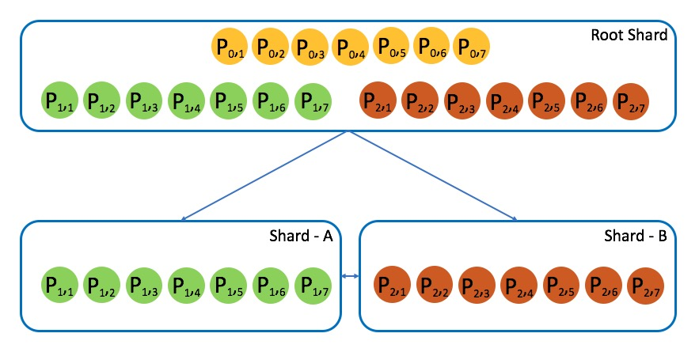

# Ontology Sharding

Ontology致力于创建一个组件化、可自由配置、跨链支持、高性能、横向可扩展的区块链底层基础设施。 让部署及调用去中心化应用变得更加非常简单。

Ontology Sharding TestNet 目前已经上线，邀请广大开发者体验。很多新的功能还处于快速的开发过程中，希望开发者在使用过程中提出宝贵的意见和建议。

## 特性

- 多层分片的网络架构
- 基于智能合约的分片策略
- 支持分片间智能合约消息通讯
- 支持分片间的原子调用


## 测试网环境

本体分片测试网包含三个分片，分片之间可以完成跨链业务。

|         |           | IP Address       | Rest     | P2P   |
| ----    | --------- | ---------------  | -------- | ----- |
| Root Shard | **Peer_{0,1}** | 139.217.111.185  | 20334    | 20338 | 
|            | **Peer_{0,2}** | 139.217.103.126  | 20334    | 20338 | 
|            | **Peer_{0,3}** | 139.217.111.232  | 20334    | 20338 | 
|            | **Peer_{0,4}** | 139.217.80.65    | 20334    | 20338 | 
|            | **Peer_{0,5}** | 139.217.111.194  | 20334    | 20338 | 
|            | **Peer_{0,6}** | 139.217.111.250  | 20334    | 20338 | 
|            | **Peer_{0,7}** | 139.217.103.26   | 20334    | 20338 | 
| Shard-A    | **Peer_{1,1}** | 139.217.111.185  | 30334    | 30338 | 
|            | **Peer_{1,2}** | 139.217.103.126  | 30334    | 30338 | 
|            | **Peer_{1,3}** | 139.217.111.232  | 30334    | 30338 | 
|            | **Peer_{1,4}** | 139.217.80.65    | 30334    | 30338 | 
|            | **Peer_{1,5}** | 139.217.111.194  | 30334    | 30338 | 
|            | **Peer_{1,6}** | 139.217.111.250  | 30334    | 30338 | 
|            | **Peer_{1,7}** | 139.217.103.26   | 30334    | 30338 | 
| Shard-B    | **Peer_{2,1}** | 139.217.111.185  | 40334    | 40338 | 
|            | **Peer_{2,2}** | 139.217.103.126  | 40334    | 40338 | 
|            | **Peer_{2,3}** | 139.217.111.232  | 40334    | 40338 | 
|            | **Peer_{2,4}** | 139.217.80.65    | 40334    | 40338 | 
|            | **Peer_{2,5}** | 139.217.111.194  | 40334    | 40338 | 
|            | **Peer_{2,6}** | 139.217.111.250  | 40334    | 40338 | 
|            | **Peer_{2,7}** | 139.217.103.26   | 40334    | 40338 | 

从上表中可以看出，整个分片网络中有21个节点。如图所示：


#### 多层分片的网络结构

从上图中可以看出，所有21个节点都参与到root shard中，另外7个节点组建Shard-A，7个节点组建Shard-B。
整个分片网络形成了两层的结构，有7个节点只参与最上层的Root Shard。第二层中由两个分片子网络构成。

## 测试币获取

测试币获取申请入口：https://developer.ont.io/applyOng

该入口可供一个地址申请一次1000 Ont和10 Ong的分片测试币。


## 获取Ontology

首先通过从 github.com/ontio/ontology.git 获取ontology源代码。

```
$ git clone https://github.com/ontio/ontology.git
```

从中checkout sharding分支。

```
$ git checkout -b sharding remotes/origin/sharding
```

用第三方包管理工具glide拉取依赖库

```
$ cd $GOPATH/src/github.com/ontio/ontology
$ glide install
```

如果项目有新的第三方依赖包，使用glide更新依赖库

```
$ cd $GOPATH/src/github.com/ontio/ontology
$ glide update
```

用make编译源码

```
$ make all
```

成功编译后会生成的ontology应用程序即为支持 Ontology Sharding 的Ontology节点程序。

#### 获取Ontology分片管理工具

首先通过从 https://github.com/qiluge/ontology-tool.git 获取Ontology-tool的代码

```
$ git clone https://github.com/qiluge/ontology-tool.git
```

通过go build编译源码

```
$ go build main.go -o ontology-tool
```

配置Ontology tool目录中的 config_test.json，更新如下字段。

```
  "JsonRpcAddress": "http://139.217.111.185:20336",
  "WalletFile": "./your-wallet.dat",
  "Password": "your-password",
```

#### 启动分片节点
（可选操作）
下载Ontology Sharding测试网的配置文件 [config.json](./resources/config.json)。 保存到Ontology应用程序相同的目录中。
启动Ontology分片测试网的同步节点。

```
$ ./ontology --config config.json --networkid 606
```

一个分片的完整启动流程为：

1. 创建分片：在Root Shard中申请Shard ID
2. 配置分片：配置新的Shard的参数，包括共识，Gas相关参数
3. 节点加入分片：Root Shard中的节点通过质押stake加入到新的分片网络中
4. 启动分片

#### 创建分片
通过Ontology-tool申请创建分片。创建分片的参数保存于 params/shardmgmt/ShardCreate.json。创建命令为：
```
$ ./ontology-tool -t ShardInit
```

分片创建请求处理完成后，将为申请的分片分配一个Shard ID。后续对此分片的配置和操作都将基于此Shard ID。

#### 配置分片
得到对应的Shard ID后，分片的创建者首先需要对分片进行配置。
配置分片的参数保存于 params/shardmgmt/ShardConfig.json。
当前分片配置的参数如下（可能根据功能需求而增加）：

* Network Size : 分片网络的节点规模
* N ： 分片网络的共识节点数目
* Block Msg Delay ：分片网络共识过程中区块消息传播的最大delay (ms为单位)
* Max Block Change View ：分片网络共识周期切换时间（以区块数目计算）
* Min Init Stake ：加入分片网络节点需要质押的最少Stake数目

配置分片的命令为：
```
$ ./ontology-tool -t ShardConfig
```

#### 节点加入分片

分片完成配置后，Root Shard中的节点将可以通过质押Stake神器加入到分片网络中。
加入到分片网络中的节点需要为此分片启动新的Ontology节点。
申请加入分片也需要使用Ontology-tool进行申请操作，参数保存于 params/shardmgmt/ShardPeerJoin.json。
当前节点申请加入分片的参数如下：

* Shard ID : 要申请加入分片的Shard ID
* IP Address : 将为此分片启动的分片节点IP地址和P2P端口号
* Public Key : 节点的公钥
* Stake Amount : 为此节点质押的Staking

节点申请加入分片的命令为：

```
$ ./ontology-tool -t ShardPeerApply
```

节点加入分片后，可以随时申请退出分片。
如果申请退出时分片尚未完成启动，节点将可以立即退出，并得到自己质押的staking。
如果分片已经完成启动，根据节点在分片中担任的角色，在共识周期后才能够完成节点退出操作。
节点退出的命令为：

```
$ ./ontology-tool -t ShardPeerExit
```

#### 启动Ontology sharding节点

在节点加入到分片后，即可以启动分片分片客户端，开始同步root shard区块。
启动命令为：
```
$ ./ontology  --ShardID  <shard-ID>  --config config.json --networkid 606 --enable-consensus
```
Ontology Sharding节点启动后，将首先同步root shard区块，同时等待对应Shard的启动。

#### 启动分片

在有足够多的节点加入到分片后，分片可以开始启动运行。
启动运行操作由分片的创建者完成。
启动分片的参数保存于 params/shardmgmt/ShardActivate.json。
启动分片命令为：
```
$ ./ontology-tool -t ShardActivate
```

## 分片智能合约开发

Ontology Sharding采用了面向智能合约的分片策略，将root shard中的智能合约分配到sharding中，而资产可以保持在root shard中，因此同时实现业务智能合约性能提高和保证区块链资产的安全。

在Ontology Sharding中，所有智能合约都部署在root shard中，而智能合约的运行有两种模式

* All-Shard : 智能合约将可以同时运行在所有分片上。
* One-Shard ： 智能合约同一时刻只能运行在某一个分片上。

运行在All-Shard的智能合约状态将由其运行的所有分片中保存的对应状态，因此All-Shard智能合约的状态将必须以帐户形式保存。在当前Ontology Sharding网络中，基于shardAsset合约的智能合约可以实现帐户形式的智能合约状态管理，具体可以参考[OEP-9](https://github.com/ontio/OEPs/pull/50)。

#### 跨分片智能合约开发
分片智能合约开发与当前Ontology的智能合约开发基本一致，分片中添加了跨分片智能合约调用的接口。在分片的网络环境中，ontology提供了两个跨分片通信的接口：<code>NotifyRemoteShard</code>和<code>InvokeRemoteShard</code>，分别用来进行异步调用和同步调用。因为跨分片调用中的通信过程依赖于网络传输，所以跨分片调用时传输的参数应序列化成byte array。

* NotifyRemoteShard
* InvokeRemoteShard

NotifyRemoteShard 用来进行跨分片异步调用。但是，caller无法取到callee的调用结果，也不知道callee在目标分片上什么时候执行，也不知道callee执行成功还是失败。

InvokeRemoteShard 用来进行跨分片同步调用，caller可以取到callee的调用结果。可以将其视为延时执行的跨合约调用。由于调用的结果经网络传输返回，所以callee的返回结果应该是序列化之后的byte array。

## 部署分片智能合约

分片环境下支持了新的智能合约特性，最重要的两个特性以OEP的形式提出了，可以参阅[OEP-9](https://github.com/ontio/OEPs/pull/50)以及[OEP-11](https://github.com/ontio/OEPs/pull/54)了解详情。

为了支持这些新的特性，智能合约的编译器也做了升级，增加了新的分片的特有的Runtime API。目前只有Python版本的编译器做了升级，升级之后的编译器参阅[Ontology Sharding Compiler](https://github.com/qiluge/ontology-python-compiler/tree/sharding)，使用方法与之前一致。

同样的，在分片环境下，为了支持分片的特性，交易的结构发生了变化，目前暂时只有[ontology-go-sdk](https://github.com/ontio/ontology-go-sdk/tree/sharding)对分片交易作出了支持。

这里提供一个跨分片合约调用的例子，该合约是[OEP-9的例子](https://github.com/qiluge/ontology-xshard-contract/blob/master/xshardasset/xshardassetdemo.py)。

### 编译

```
git clone https://github.com/qiluge/ontology-python-compiler
git clone https://github.com/qiluge/ontology-xshard-contract
cd ontology-python-compiler
python3 -m venv venv
source venv/bin/activate
pip install -r requirements.txt
git checkout -b sharding origin/sharding
./run.py -n ../ontology-xshard-contract/xshardasset/xshardassetdemo.py -m 1
```
编译完成之后进入```ontology-xshard-contract/xshardasset```目录，其中含有的文件如下：
```
xshardassetdemo.Func.Map
xshardassetdemo.abi.json
xshardassetdemo.avm
xshardassetdemo.avm.str
xshardassetdemo.debug.json
xshardassetdemo.py
xshardassetdemo.warning
```
其中的```xshardassetdemo.avm.str```即是我们编译得到的字节码文件。

### 部署

根据[OEP-11]的描述，如果需要合约能够跨分片运行，则应将合约部署到root shard上。
可以使用ontology-go-sdk部署智能合约，示例代码如下：
```
    avmCode, err := ioutil.ReadFile("xshardassetdemo.avm.str")
    if err != nil {
        log.Error(err)
        return
    }
    InitSdk()
    testOntSdk.ClientMgr.GetRpcClient().SetAddress("http://139.217.111.185:20336")
    hash, err := testOntSdk.NeoVM.DeployNeoVMSmartContract(0, 20000000, testDefAcc, true, string(avmCode),
        "xshard asset demo", "1.0.0", "tester", "test@test.com", "xshard asset demo")
    if err != nil {
        log.Error(err)
        return
    }
    log.Infof("deploy success, tx hash: %s", hash.ToHexString())
```

## 调用分片智能合约

目前提供了两种方式调用分片合约：ontology-cli和ontology-go-sdk。

### 使用cli调用

使用ontology-cli调用的方法与[已有的cli](https://github.com/ontio/ontology/blob/master/docs/specifications/cli_user_guide_CN.md)一致，只是需要多加一个参数```--ShardID```。新增的```--ShardID```参数用来指明调用哪个分片上的合约，不指定则默认为0。使用ontology-cli调用分片智能合约有两点限制：
1. cli程序需要使用[ontology sharding 分支](https://github.com/ontio/ontology/tree/sharding)的代码编译；
2. 必须在本机启动分片测试网的同步节点才能使用，要调用哪个分片的合约，则需要同步哪个分片的区块。

调用示例如下：
```
./ontology contract invoke --address 8ae002c5c3fe5bf8c3ef8a043fc618645c314c42 --params string:init,[int:0] --gasprice 0 --gaslimit 3000000 --ShardID 1 --rpcport 30336
```
这将调用合约```8ae002c5c3fe5bf8c3ef8a043fc618645c314c42```的init方法。
需要注意的是，如果调用的合约方法不需要参数，cli仍需要传任意参数，同时cli也不支持较为复杂的数据类型。

### 使用ontology-go-sdk调用

使用ontology-go-sdk调用智能合约时，没有ontology-cli的限制。例如，调用示例智能合约```xshardassetdemo.py```的跨分片转账的示例代码如下：
```
txHash, err := ctx.Ont.NeoVM.InvokeShardNeoVMContract(shardId, gasPrice,
                gasLimit, user, contractAddress,
                []interface{}{"xshardTransfer", []interface{}{from, toAddr, toShard, num}})
```

### 完整示例

部署好了一本OEP-9合约之后，可以进行跨分片转账，示例如下：

1. 调用```init```方法，对合约初始化：
    ```
    contract, err := common.AddressFromHexString("8ae002c5c3fe5bf8c3ef8a043fc618645c314c42")
    if err != nil {
        log.Error(err)
        return
    }
    initTx, err := testOntSdk.NeoVM.InvokeNeoVMContract(0, 20000, testDefAcc, contract, []interface{}{"init", []interface{}{}})
    if err != nil {
        log.Error(err)
        return
    }
    log.Infof("init success, tx hash: %s", initTx.ToHexString())
    ```
2. 初始化完成之后，查询Owner账户中的资产余额：

    ```
    value, err := ctx.Ont.NeoVM.PreExecInvokeShardNeoVMContract(0, contract,
        []interface{}{"balanceOf", []interface{}{user}})
    if err != nil {
        return fmt.Errorf("pre-execute err: %s", err)
    }
    info, err := value.Result.ToInteger()
    if err != nil {
        return fmt.Errorf("parse result failed, err: %s", err)
    }
    log.Infof("balance of %s is: %s", user.ToBase58(), info.String())
    ```
    查询的结果为：

    ```
    balance of AZ3BTJt7jNGwJjVLsYJAyfLtCJ38Cd8Uri is: 100000000000000000
    ```

3. 跨分片从Owner转账1000000000个到分片1的```AZqk4i7Zhfhc1CRUtZYKrLw4YTSq4Y9khN```地址上：

    ```
    txHash, err = ctx.Ont.NeoVM.InvokeShardNeoVMContract(0, 0, 200000, user, contractAddress,
                []interface{}{"xshardTransfer", []interface{}{from, toAddr, 1, 1000000000}})
    if err != nil {
        return fmt.Errorf("invokeNativeContract error :", err)
    }
    log.Infof("txHash is: %s", txHash.ToHexString())
    ```

查询Owner账户中的资产余额：

```
balance of AZ3BTJt7jNGwJjVLsYJAyfLtCJ38Cd8Uri is: 99999999000000000
```
等待分片1出块，查询```AZqk4i7Zhfhc1CRUtZYKrLw4YTSq4Y9khN```在分片1上的资产：

```
balance of AZ3BTJt7jNGwJjVLsYJAyfLtCJ38Cd8Uri is: 1000000000
```