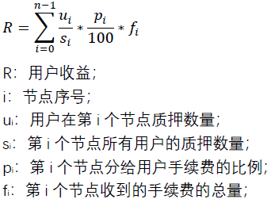
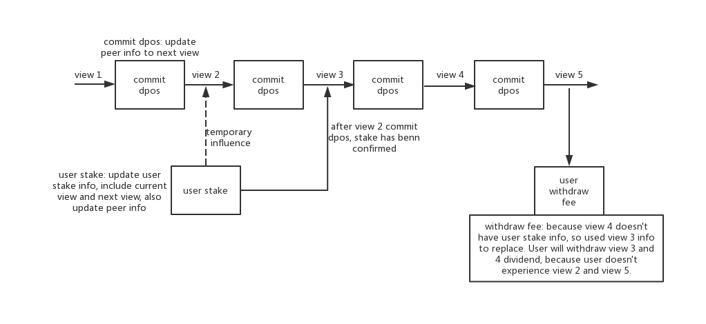

# Shard Stake

## 功能

1. 管理用户参与分片治理的质押信息；
2. 给参与分片治理的用户分手续费；

## 设计原理

### 分账逻辑

现有主链的手续费分配是直接在一笔交易里将所有手续费分给每个参与治理的用户，所以当参与的用户过多时，这笔交易将执行很长时间。为回避这个弊端，分片治理的手续费分润将采取用户自主提取的模式。

用户将ONT（以ONT为例，后续会支持其他质押token）在主链上质押到分片共识节点，然后按质押比例享受手续费分成。这种质押和分成是按照轮次来的，也即是共识周期，在合约里称为View。由于是用户自主提取，所以需要记录下每一轮的质押情况和手续费金额总值。用户在每一轮的分成金额等于该用户质押的所有节点的分成金额的总额。用户每一轮在每个节点能够获得的收益是按照节点分配给其他用户的比例以及用户自己的质押比例分配的。具体参考如下公式：



从公式中可以看出，要计算出用户每一轮的收益，合约需要存储具体的质押情况，包括节点质押情况和用户质押情况。并且，由于用户行为的不可控，用户不可能每一轮都来提取收益，所以合约还应允许用户提取历史view的收益，这就要求合约存储下每一轮的质押情况。

这时用户可以一次性提取历史轮到当前轮的所有收益，但是出于gasLimit的考虑，合约将限制用户每一次能够提取的轮数，目前的限制是100轮。则用户的收益可以用如下公式计算：


由于每一轮参与质押的用户数未知，可能很大也可能很小，所以合约不可能在每一轮CommitDpos的时候，遍历更新用户的质押信息到下一轮，如果这样做，依旧会有非常大的计算量，与主链治理并无区别。

所以合约要做的事情其实是在每次切共识的时候，将节点的质押信息和分给节点的手续费保存下来，然后更新view，使下一个周期的配置和质押信息生效，并不用更新用户的质押信息到下一轮。用户的质押信息更新只受用户操作影响。这里的用户操作包括：质押，解冻，提取质押资产，提取手续费收益等。用户每次操作会影响当前轮和下一轮的状态，例如质押资产，因为质押到下一轮才生效，所以质押操作将影响两轮共识（当前轮的临时转态，下一轮的持久状态），这种影响包括节点质押信息（用户质押的数量变多了）和用户质押信息。

当用户提取收益时，由于合约并不会保存每一轮用户的质押情况，所以用户可能在某几轮没有质押信息，这样将无法计算用户在这些轮的收益。解决方法是“就近原则”：当用户在v1轮没有质押信息时，使用用户在v1轮之前的离v1轮最近的质押信息代替v1。因为用户的质押信息更新只受用户操作影响，所以用户在v1轮没有信息证明了该用户在v1轮之前没有操作，即用户状态没有变化，所以可以用v1轮之前的离v1轮最近的质押信息作为替代。用户每次提取完收益之后，合约会更新一个变量，这个变量记录该用户在当前shard的收益提取到第几轮。

所以，合约对于用户质押数据的存储将会是基于view的间隔式地存储。用户操作了，则更新（当前轮或当前轮和下一轮），用户未操作，则无更新。可以用下图来表示合约的存储逻辑：



### 共识切换逻辑

分片共识切换改成主链、分片异步切换之后，需要在异步通信过程时锁定shard stake合约，禁止影响共识投票信息的操作。异步共识切换对shard stake来说分成两步，PreCommitDpos和CommitDpos。PreCommitDpos仅仅将view加一，并且在合约内部上锁；CommitDpos进行节点的手续费分账，同时更新质押信息，最后解除合约的内部锁定。

## 实现

ShardStake通过快照每一轮节点质押信息，和按需记录用户质押信息，来给用户分润每一轮的手续费。

### 持久化存储数据

1. 共识周期标识
    ```
    type View uint64 // shard consensus epoch index
    ```
2. 单个节点质押信息
    ```
    type PeerViewInfo struct { // record each peer stake info at every view
        PeerPubKey             string
        Owner                  common.Address
        CanStake               bool   // if user can stake peer
        WholeFee               uint64 // each epoch handling fee
        FeeBalance             uint64 // each epoch handling fee not be withdrawn
        InitPos                uint64 // node stake amount
        UserUnfreezeAmount     uint64 // all user can withdraw amount
        CurrentViewStakeAmount uint64 // current view user stake amount
        UserStakeAmount        uint64 // user stake amount
        MaxAuthorization       uint64 // max user stake amount
        Proportion             uint64 // proportion to user
    }
    ```
3. 每个共识周期内的所有节点质押信息
    ```
    type ViewInfo struct { // record all peer stake info at each view
        Peers map[string]*PeerViewInfo
    }
    ```
4. 用户质押单个节点的信息
    ```
    type UserPeerStakeInfo struct { // record user stake peer info
        PeerPubKey             string
        StakeAmount            uint64
        CurrentViewStakeAmount uint64 // user stake amount at current view
        UnfreezeAmount         uint64
    }
    ```
5. 用户的所有质押信息
    ```
    type UserStakeInfo struct { // record user stake info
        Peers map[string]*UserPeerStakeInfo
    }
    ```
6. 用户解绑ONG的信息
    ```
    type UserUnboundOngInfo struct { // record user stake ONT and unbound ong info
        Time        uint32 // latest stake ONT time
        StakeAmount uint64 // latest stake ONT whole amount
        Balance     uint64 // latest ONG amount that can be withdrawan
    }
    ```
7. Shard上节点最小的质押数量minNodeStake，uint64类型
8. Shard上质押资产的合约地址stakeAssetAddr
9. 用户每次影响质押状态时要记录下该用户最后一次操作时的共识周期标识userLastStakeView
10. 用户已提取收益的共识周期的下一轮共识周期标识userLastWithdrawView
11. 合约是否正在某一个分片的共识isCommitting
### InitShard

在ShardStake合约中初始化相关的ShardId对应的信息。

#### Check shard is committing

No need check。

#### 参数

```
type InitShardParam struct {
    ShardId        types.ShardID
    StakeAssetAddr common.Address
    MinStake       uint64
}
```

#### 处理过程

1. 验证只有shardmgmt合约能调用；
2. 存储该shard的view为0;
3. 设置该shard的stakeAssetAddr;
4. 设置该shard的minNodeStake。

### PeerInitStake

节点调用ShardMgmt的PeerJoin加入分片时，ShardMgmt合约会调用该方法，初始化节点的质押信息。

#### Check shard is committing

Need check, if is committing, return error。

#### 参数

```
type PeerInitStakeParam struct {
    ShardId        types.ShardID
    PeerOwner      common.Address
    Value          *PeerAmount
}
```
```
type PeerAmount struct {
    PeerPubKey string
    Amount     uint64
}
```

#### 处理过程

1. 验证只有shardmgmt合约能调用；
2. 初始化节点的质押信息，如果当前轮是第0轮，即刚开始共识，则将质押信息记录到当前轮和下一轮；
3. 如果当前轮不是刚开始共识，则将质押信息记录到当前轮的后面两轮；
4. 校验该peer质押的token是否小于最小值；
5. 如果质押token是ONT，记录该peerOwner的UserUnboundOngInfo；
6. 将质押资产转入到ShardStake合约。

### AddInitPos

Peer owner调用，给自己的节点增加质押资产。

#### Check shard is committing

Need check, if is committing, return error。

#### 参数

```
type PeerStakeParam struct {
    ShardId   types.ShardID
    PeerOwner common.Address
    Value     *PeerAmount
}
```

#### 处理过程

1. 取下一轮的节点信息；
2. 增加该信息的initPos值；
3. 更新下一轮的节点信息；
4. 如果质押token是ONT，记录该peerOwner的UserUnboundOngInfo；
5. 将质押的资产转入shard stake合约。

### ReduceInitPos

Peer owner调用，减少节点的initPos。

#### Check shard is committing

Need check, if is committing, return error。

#### 参数

```
type PeerStakeParam struct {
    ShardId   types.ShardID
    PeerOwner common.Address
    Value     *PeerAmount
}
```

#### 处理过程

1. 取下一轮的节点信息；
2. 校验reduce的值；
3. 下一轮节点信息的initPos减少reduce的值，UserUnfreezeAmount的值增加reduce的值；
4. 取该owner的用户质押信息，将reduce的值加到下一轮用户质押信息的可提取质押资产的值上；
5. 更新用户的质押信息；
6. 更新用户的userLastStakeView。

### PeerExit

节点退出，此时节点将不接受用户质押，只能有ShardMgmt调用。

#### Check shard is committing

Need check, if is committing, return error。

#### 参数

```
type PeerExitParam struct {
    ShardId types.ShardID
    Peer    string // peer pub key
}
```

#### 处理过程

1. 校验调用者是否是ShardMgmt；
2. 取当前轮的节点质押信息，检查peer是否在节点中；
3. 如果在节点中，将peer的CanStake属性设为false，表示其不接受用户质押；
4. 更新当前轮和下一轮的peer信息。

### DeletePeer

删除节点信息，只能在CommitDpos的时候由ShardMgmt合约调用。

#### Check shard is committing

Need check, if is committing, return error。

#### 参数

```
type DeletePeerParam struct {
    ShardId types.ShardID
    Peers   []string
}
```

#### 处理过程

1. 校验调用者是否是ShardMgmt；
2. 取下一轮的质押信息；
3. 将peers的质押信息删除；
4. 将节点质押的资产归到peer owner的可提取资产下；
5. 更新下一轮的质押信息。

### UserStake

用户质押节点。peer owner不能质押自己的节点；用户的质押在当前轮不生效，下一轮才生效；用户在当前轮的质押可以在当前轮提取，一旦到了下一轮就不能立即提取了。

#### Check shard is committing

Need check, if is committing, return error。

#### 参数

```
type UserStakeParam struct {
    ShardId types.ShardID
    User    common.Address
    Value   []*PeerAmount
}
```

#### 处理过程

1. 取用户的userLastStakeView；
2. 取当前共识周期的view，称为currentView；
3. 声明nextView为currentView+1；
4. 如果lastStakeView大于nextView，返回error，因为用户最新质押影响到的view不可能超过当前轮的下一轮；
5. 如果lastStakeView等于nextView，则将currentView的值赋给lastStakeView；
6. 取lastStakeView和nextView对应的用户的质押信息；
7. 取currentView和nextView对应的节点的质押信息；
8. 按照输入的参数，分别更新用户和节点的质押信息：校验节点状态，将lastStakeView对应的用户信息更新到当前轮，将其他质押信息更新；
9. 由于当前轮的质押要求是当前轮可以提取，所以用户的质押对当前轮和下一轮有一个暂时的影响，这里需要在节点质押信息和用户质押信息里设置一个变量记录这个信息；
10. 更新lastStakeView的值为nextView；
11. 质押信息更新完之后，如果质押token是ONT，还需更新用户对应的解绑的ONG的信息；
12. 将用户的质押token转入ShardStake合约。

### UnfreezeStake

用户解冻质押资产。用户解冻只会影响下一轮的质押信息，对当前轮不造成影响。用户在当前轮解冻的资产在下一轮才能提取，且下一轮无法获得收益，但是当前轮的收益不受影响。

#### Check shard is committing

Need check, if is committing, return error。

#### 参数

```
type UnfreezeFromShardParam struct {
    ShardId types.ShardID
    User    common.Address
    Value   []*PeerAmount
}
```

#### 处理过程

1. 校验调用者；
2. 取用户的userLastStakeView；
3. 取当前共识周期的view，称为currentView；
4. 声明nextView为currentView+1；
5. 如果lastStakeView大于nextView，返回error，因为用户最新质押影响到的view不可能超过当前轮的下一轮；
6. 如果lastStakeView等于nextView，则将currentView的值赋给lastStakeView；
7. 取用户在lastStakeView和nextView对应的质押信息；
8. 取节点在nextView的质押信息；
9. 校验输入的参数并更新相应的质押信息：更新用户下一轮可以提取的数量，更新相应的节点下一轮的有效质押的数量；
10. 将lastStakeView的用户质押信息更新到当前轮；
11. 更新lastStakeView的值为nextView。

### WithdrawStake

提取已解冻的质押token。由于用户在当前轮的质押可以在当前轮提取，所以理论上只影响当前轮的提取解冻的操作会影响到下一轮的状态。

#### Check shard is committing

Need check, if is committing, return error。

#### 参数

```
type WithdrawStakeAssetParam struct {
    ShardId types.ShardID
    User    common.Address
}
```

#### 处理过程

1. 校验调用者；
2. 取用户的userLastStakeView；
3. 取当前共识周期的view，称为currentView；
4. 声明nextView为currentView+1；
5. 如果lastStakeView大于nextView，返回error，因为用户最新质押影响到的view不可能超过当前轮的下一轮；
6. 如果lastStakeView等于nextView，则将currentView的值赋给lastStakeView；
7. 取用户在lastStakeView和nextView对应的质押信息；
8. 取节点在currentView和nextView的质押信息；
9. 更新质押信息，四个质押信息都需要更新；
10. 更新用户的lastStakeView。
11. 质押信息更新完之后，如果质押token是ONT，还需更新用户对应的解绑的ONG的信息。

### WithdrawFee

用户提取收益。

#### Check shard is committing

Need check, if is committing, return error。

#### 参数

```
type WithdrawFeeParam struct {
    ShardId types.ShardID
    User    common.Address
}
```

#### 处理过程

1. 取用户上一次已提取的view的下一轮view,称为userWithdrawView，这代表用户还未提取userWithdrawView的收益；
2. 按照[前文](#设计原理)所述的原理提取每一轮的收益；
3. 计算完可提取收益后，会得到userLastStakeViewInfo，这代表用户在提取的最新轮次的质押信息；
4. 更新userWithdrawView在账本中的值为该次已提取的轮数+1，这个轮数可能是当前轮也可能是当前轮之前的某一轮，这取决于用户是否有过多的轮数没有提取收益；
5. 更新该次已提取的轮数+1的用户的质押信息为userLastStakeViewInfo，注意这里并不会更新当前轮的下一轮的用户质押信息，因为用户提取收益不会影响下一轮的质押状态。

### ChangeMaxAuthorization & ChangeProportion

ChangeMaxAuthorization改变节点允许的用户质押的数量，ChangeProportion改变节点分给用户质押的手续费的比例。这种设置只能由peer owner操作，并且到下一轮共识才会生效。

#### Check shard is committing

Need check, if is committing, return error。

#### 参数

```
type ChangeMaxAuthorizationParam struct {
    ShardId types.ShardID
    User    common.Address
    Value   *PeerAmount
}
```
```
type ChangeProportionParam struct {
    ShardId types.ShardID
    User    common.Address
    Value   *PeerAmount
}
```

### WithdrawOng

用户每次质押或者提取ONT都会更新合约记录的用户的解绑ONG的信息，根据这种更新，可以计算出用户可以提取多少自然解绑的ONG；用户每次调用该方法会将所有解绑的ONG提取，并且更新解绑信息；在每次转账ONG之前，ShardStake合约都会先自己向自己转1个ONT确保合约中所有ONT自然解绑的ONG都处于可提取状态。

#### Check shard is committing

No need check。

#### 参数

```
common.Address
```

#### 合约记录的用户解绑信息

```
type UserUnboundOngInfo struct {
    Time        uint32
    StakeAmount uint64
    Balance     uint64
}
```

time记录用户上一次的操作时间，StakeAmount记录用户上一次操作后的最新的质押ONT的数量。

#### 处理过程

用户每次质押和提取ONT，都会先使用Time和StakeAmount计算出到当前位置的可提取的ONG，然后将这个数量加到balance中，然后更新time和amount为最新的值；用户提取时，会使用当前的time和amount计算最新的可提取的ONG，则用户可提取的数量为这个值加上balance；提取完成后，将time的值更新到当前值，amount保持不变，balance设为0.

### PreCommitDPos

预切换共识，当主链收到分片切共识的请求时，由shardmgmt调用。参考[分片切换共识过程](shardmgmt.md#共识切换)。

#### Check shard is committing

Need check, if is committing, return error。

#### 参数

```ShardId types.ShardID```

#### 处理过程

1. 检查是否已经处于committing中，如果不是，锁定分片处于committing;
2. 将view值加一。


### CommitDpos

主链切分片共识，只能由ShardMgmt调用；记录每一个Peer在当前轮分到的手续费，更新节点的质押信息。

#### 参数

```
type CommitDposParam struct {
    ShardId   types.ShardID
    Height    uint32
    Hash      common.Uint256
    FeeAmount uint64
}
```

#### 处理过程

1. 校验调用者是否是ShardSysMsg；
2. 检查分片是否处于committing状态，如果不是，返回error；
3. 解除合约的committing状态；
4. 取currentView，减去一，得到lastView，currentView加上一得到nextView；
5. 取lastView对应的质押信息lastViewInfo， currentView对应的currentViewInfo，nextView对应的nextViewInfo；
6. 检查nextViewInfo和currentViewInfo，如果为空，则将lastViewInfo设置到currentViewInfo和nextViewInfo中；
7. 按照lastViewInfo的质押信息分账手续费，并且将分配信息更新到lastViewInfo；
8. 将参数的height和hash记录到lastView里；
9. 完成共识切换。