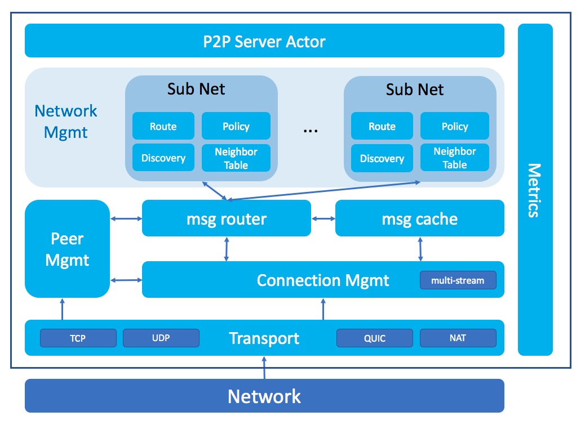

# Sharding Network Design

Requirements:

* Multiple SubNetwork
  * Consensus
  * Shard
  * Auto-configured SubNetwork
      * Candidate <--> Consensus
* NeighTable for Root and Shard
* Block Propagation (from consensus to sync)
* Tx Propagation (from sync to consensus)
* Shard-Tx Propagation (cross shard subnet)
* Consensus-Msg relay
  * Consensus Network
* Node discovery
  * Find peer with peer-pk
* Connection Management
  * per-peer connection
  * connection should be shared with multi-subnet
* Memory Management
  * msg throttling
* Security
  * Randomized PeerID
* NAT
* Performance vs Msg-Duplication

## Network Design

#### P2P Server Actor

* accept requests from all other modules
* forward network messages to their target modules
* Notify Peer state changes to other modules

#### Network Management

NetworkMgmt will be responsable for

* join sub-network
* leave sub-network
* configure routing policy/parameters of sub-network

#### Sub-Network

Sub-network is designed to support shard network.

* network policy
* routing decision in sub-network
* sub-network neighbour discovery and management

One shard node can be in multiple sub-network, 
including parent shard syncNet to sync parent blocks, 
shard consensusNet to participant in shard consensus, 
shard syncNet to sync/provide shard blocks to other nodes.

Sub-network is isolated from each other.  Neighbor tables of sub-network are managed independently.
For example, Peer1 and Peer2 is in same shard.
They should in same parent-sync-network to sync parent blocks, 
and in same shard-sync-network to sync shard blocks.  
They could not be neighbor in parent-sync-network, but be neighor in shard-sync-network.

#### Peer Management

Peer Management, or Host Management is to manage information of all connected peers, including:
* keep peers alive
* peer info (IPAddress, Peer ID, Peer PublicKey)
* peer capability (sync, relay)
* blockchain info (heights)

#### Msg Router

MsgRouter is to pre-processing all incoming messages, and forward to different network modules.

There's one MsgCache with MsgRouter to help discard duplicated messages.

#### Connection Management

Connection Management is to manage all connections with other peers, for all sub-networks.

* create connection
* close connection if no sub-network referece the connection
* throttling read/write
* multi-stream & scheduling support

#### Transport

Transport is the common interface for network IO.

* Dial: to initiate one connection with remote peer
* Listen: to listen on given network port
* Read/Write: for network IO

### Role of Peer

from role:

* Consensus
* Sync

from shard:

* shard ID

### SubNetwork

SubNetwork for each role of Peer.

Function requirements of SubNetwork:

* subnet = (shardId, role), role = (consensus, sync)
* In-subnet broadcasting
* Cross-subnet msg broadcasting
* open subnet vs. contract-managed subnet

### Routing

associated with subnet.

* Gossip-based routing
* NeighTable
* Discovery
  * Contract-managed member
  * open subnet

### Connection Management

Support for all subnets.

* peer handshake
* subnet join/leave protocol
* 
