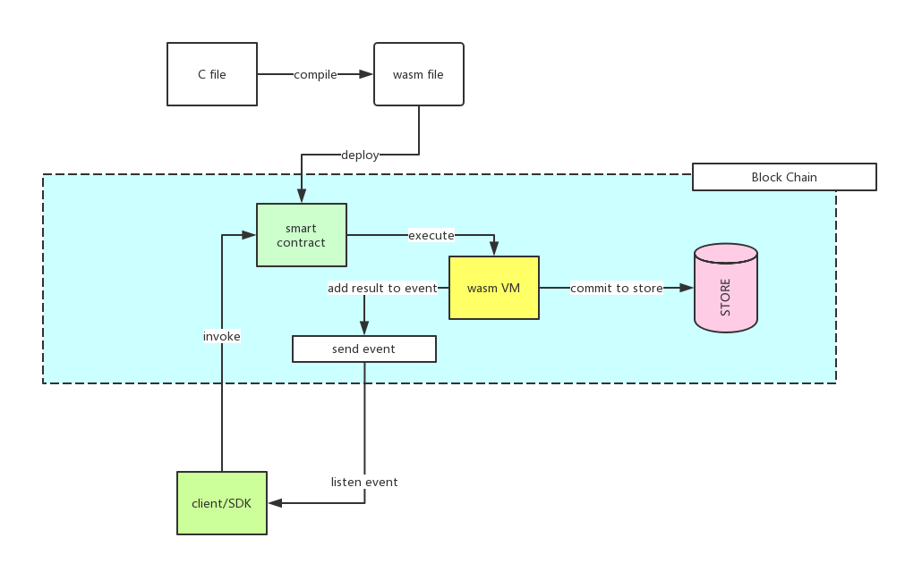
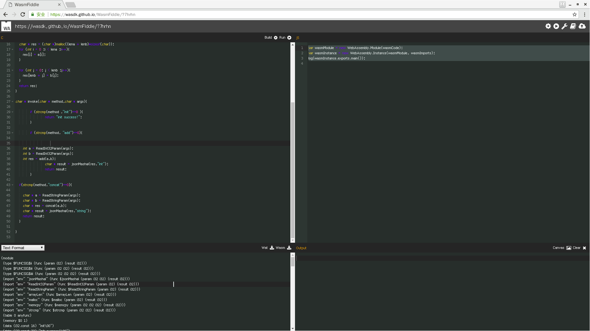

# Wasm Smart Contract

## Introduction
Wasm (WebAssembly) is a binary instruction format for stack-based virtual machines. Wasm is designed to be a portable target for compiling high-level languages such as C/C++/Rust, and supports deployment of client and server applications on the web. Ontology supports smart contracts written in the Wasm format.



## Compilation

1. First, we will prepare a simple c language contract that calculates the sum of two integers or concatenates two strings.

```c
//system apis
void * calloc(int count,int length);
void * malloc(int size);
int arrayLen(void *a);
int memcpy(void * dest,void * src,int length);
int memset(void * dest,char c,int length);

//utility apis
int strcmp(char *a,char *b);
char * strconcat(char *a,char *b);
int Atoi(char * s);
long long Atoi64(char *s);
char * Itoa(int a);
char * I64toa(long long amount,int radix);
char * SHA1(char *s);
char * SHA256(char *s);

//parameter apis
int ONT_ReadInt32Param(char *args);
long long ONT_ReadInt64Param(char * args);
char * ONT_ReadStringParam(char * args);
void ONT_JsonUnmashalInput(void * addr,int size,char * arg);
char * ONT_JsonMashalResult(void * val,char * types,int succeed);
char * ONT_JsonMashalParams(void * s);
char * ONT_RawMashalParams(void *s);
char * ONT_GetCallerAddress();
char * ONT_GetSelfAddress();
char * ONT_CallContract(char * address,char * contractCode,char * method,char * args);
char * ONT_MarshalNativeParams(void * s);
char * ONT_MarshalNeoParams(void * s);

//Runtime apis
int ONT_Runtime_CheckWitness(char * address);
void ONT_Runtime_Notify(char * address);
int ONT_Runtime_CheckSig(char * pubkey,char * data,char * sig);
int ONT_Runtime_GetTime();
void ONT_Runtime_Log(char * message);

//Attribute apis
int ONT_Attribute_GetUsage(char * data);
char * ONT_Attribute_GetData(char * data);

//Block apis
char * ONT_Block_GetCurrentHeaderHash();
int ONT_Block_GetCurrentHeaderHeight();
char * ONT_Block_GetCurrentBlockHash();
int ONT_Block_GetCurrentBlockHeight();
char * ONT_Block_GetTransactionByHash(char * hash);
int * ONT_Block_GetTransactionCountByBlkHash(char * hash);
int * ONT_Block_GetTransactionCountByBlkHeight(int height);
char ** ONT_Block_GetTransactionsByBlkHash(char * hash);
char ** ONT_Block_GetTransactionsByBlkHeight(int height);


//Blockchain apis
int ONT_BlockChain_GetHeight();
char * ONT_BlockChain_GetHeaderByHeight(int height);
char * ONT_BlockChain_GetHeaderByHash(char * hash);
char * ONT_BlockChain_GetBlockByHeight(int height);
char * ONT_BlockChain_GetBlockByHash(char * hash);
char * ONT_BlockChain_GetContract(char * address);

//header apis
char * ONT_Header_GetHash(char * data);
int ONT_Header_GetVersion(char * data);
char * ONT_Header_GetPrevHash(char * data);
char * ONT_Header_GetMerkleRoot(char  * data);
int ONT_Header_GetIndex(char * data);
int ONT_Header_GetTimestamp(char * data);
long long ONT_Header_GetConsensusData(char * data);
char * ONT_Header_GetNextConsensus(char * data);

//storage apis
void ONT_Storage_Put(char * key,char * value);
char * ONT_Storage_Get(char * key);
void ONT_Storage_Delete(char * key);

//transaction apis
char * ONT_Transaction_GetHash(char * data);
int ONT_Transaction_GetType(char * data);
char * ONT_Transaction_GetAttributes(char * data);


int add(int a, int b ){
        return a + b;
}

char * concat(char * a, char * b){
	int lena = arrayLen(a);
	int lenb = arrayLen(b);
	char * res = (char *)malloc((lena + lenb)*sizeof(char));
	for (int i = 0 ;i < lena ;i++){
		res[i] = a[i];
	}

	for (int j = 0; j < lenb ;j++){
		res[lena + j] = b[j];
	}
	return res;
}


int sumArray(int * a, int * b){

	int res = 0;
	int lena = arrayLen(a);
	int lenb = arrayLen(b);

	for (int i = 0;i<lena;i++){
		res += a[i];
	}
	for (int j = 0;j<lenb;j++){
		res += b[j];
	}
	return res;
}


char * invoke(char * method,char * args){

    if (strcmp(method ,"init")==0 ){
            return "init success!";
    }

    if (strcmp(method, "add")==0){
        int a = ONT_ReadInt32Param(args);
	int b = ONT_ReadInt32Param(args);
        int res = add(a,b);
        char * result = ONT_JsonMashalResult(res,"int",1);
        ONT_Runtime_Notify(result);
        return result;
    }

	if(strcmp(method,"concat")==0){
		char * a = ONT_ReadStringParam(args);
		char * b = ONT_ReadStringParam(args);
		char * res = concat(a,b);
		char * result = ONT_JsonMashalResult(res,"string",1);
		ONT_Runtime_Notify(result);
		return result;
	}
	if(strcmp(method,"addStorage")==0){
		char * a = ONT_ReadStringParam(args);
		char * b = ONT_ReadStringParam(args);
		ONT_Storage_Put(a,b);
		char * result = ONT_JsonMashalResult("Done","string",1);
		ONT_Runtime_Notify(result);
		return result;
      }

      if(strcmp(method,"getStorage")==0){
		char * a = ONT_ReadStringParam(args);
		char * value = ONT_Storage_Get(a);
		char * result = ONT_JsonMashalResult(value,"string",1);
		ONT_Runtime_Notify(result);
		return result;
     }

     if(strcmp(method,"deleteStorage")==0){

        char * a = ONT_ReadStringParam(args);
        ONT_Storage_Delete(a);
        char * result = ONT_JsonMashalResult("Done","string",1);
        ONT_Runtime_Notify(result);
        return result;
    }
}


```

The following functions are provided by the virtual machine API and need to be declared at the head of the file.

```c
//system apis
void * calloc(int count,int length);
void * malloc(int size);
int arrayLen(void *a);
int memcpy(void * dest,void * src,int length);
int memset(void * dest,char c,int length);

//utility apis
int strcmp(char *a,char *b);
char * strconcat(char *a,char *b);
int Atoi(char * s);
long long Atoi64(char *s);
char * Itoa(int a);
char * I64toa(long long amount,int radix);
char * SHA1(char *s);
char * SHA256(char *s);

//parameter apis
int ONT_ReadInt32Param(char *args);
long long ONT_ReadInt64Param(char * args);
char * ONT_ReadStringParam(char * args);
void ONT_JsonUnmashalInput(void * addr,int size,char * arg);
char * ONT_JsonMashalResult(void * val,char * types,int succeed);
char * ONT_JsonMashalParams(void * s);
char * ONT_RawMashalParams(void *s);
char * ONT_GetCallerAddress();
char * ONT_GetSelfAddress();
char * ONT_CallContract(char * address,char * contractCode,char * method,char * args);
char * ONT_MarshalNativeParams(void * s);
char * ONT_MarshalNeoParams(void * s);

//Runtime apis
int ONT_Runtime_CheckWitness(char * address);
void ONT_Runtime_Notify(char * address);
int ONT_Runtime_CheckSig(char * pubkey,char * data,char * sig);
int ONT_Runtime_GetTime();
void ONT_Runtime_Log(char * message);

//Attribute apis
int ONT_Attribute_GetUsage(char * data);
char * ONT_Attribute_GetData(char * data);

//Block apis
char * ONT_Block_GetCurrentHeaderHash();
int ONT_Block_GetCurrentHeaderHeight();
char * ONT_Block_GetCurrentBlockHash();
int ONT_Block_GetCurrentBlockHeight();
char * ONT_Block_GetTransactionByHash(char * hash);
int * ONT_Block_GetTransactionCountByBlkHash(char * hash);
int * ONT_Block_GetTransactionCountByBlkHeight(int height);
char ** ONT_Block_GetTransactionsByBlkHash(char * hash);
char ** ONT_Block_GetTransactionsByBlkHeight(int height);


//Blockchain apis
int ONT_BlockChain_GetHeight();
char * ONT_BlockChain_GetHeaderByHeight(int height);
char * ONT_BlockChain_GetHeaderByHash(char * hash);
char * ONT_BlockChain_GetBlockByHeight(int height);
char * ONT_BlockChain_GetBlockByHash(char * hash);
char * ONT_BlockChain_GetContract(char * address);

//header apis
char * ONT_Header_GetHash(char * data);
int ONT_Header_GetVersion(char * data);
char * ONT_Header_GetPrevHash(char * data);
char * ONT_Header_GetMerkleRoot(char  * data);
int ONT_Header_GetIndex(char * data);
int ONT_Header_GetTimestamp(char * data);
long long ONT_Header_GetConsensusData(char * data);
char * ONT_Header_GetNextConsensus(char * data);

//storage apis
void ONT_Storage_Put(char * key,char * value);
char * ONT_Storage_Get(char * key);
void ONT_Storage_Delete(char * key);

//transaction apis
char * ONT_Transaction_GetHash(char * data);
int ONT_Transaction_GetType(char * data);
char * ONT_Transaction_GetAttributes(char * data);


```

The entry of Wasm contract is unified as ```char * invoke(char * method, char * args)```.

**method** is the method’s name that needs to be called.

**args** are the incoming parameters, raw bytes.

[More details on Wasm contract APIs](wasm_api.md)

2. Compile the above C file into a smart contract in Wasm format.
    * Emscripten tool [http://kripken.github.io/emscripten-site/](http://http://kripken.github.io/emscripten-site/)
    * Online compiler WasmFiddle [https://wasdk.github.io/WasmFiddle](https://wasdk.github.io/WasmFiddle)
    * Use WasmFiddle as an Example
​    

Paste the C code into the edit window of "c". Please ignore the contents of the "JS" window and click the "Build" button. If the compilation is correct, you can see the compiled Wasm format code in the "Text Format" window. If the compilation is wrong, an error message will be displayed in the "output" window.



If you are familiar with [wast syntax](http://webassembly.org/docs/binary-encoding/), you can modify the wast file yourself.

And use the [wabt](https://github.com/WebAssembly/wabt) tool to compile the wast file into Wasm format.

​    
3. Click the "Wasm" button to download the compiled Wasm file.


### Passing parameters in JSON format

Incoming parameters can be in JSON format:

```c
//system apis
void * calloc(int count,int length);
void * malloc(int size);
int arrayLen(void *a);
int memcpy(void * dest,void * src,int length);
int memset(void * dest,char c,int length);

//utility apis
int strcmp(char *a,char *b);
char * strconcat(char *a,char *b);
int Atoi(char * s);
long long Atoi64(char *s);
char * Itoa(int a);
char * I64toa(long long amount,int radix);
char * SHA1(char *s);
char * SHA256(char *s);

//parameter apis
int ONT_ReadInt32Param(char *args);
long long ONT_ReadInt64Param(char * args);
char * ONT_ReadStringParam(char * args);
void ONT_JsonUnmashalInput(void * addr,int size,char * arg);
char * ONT_JsonMashalResult(void * val,char * types,int succeed);
char * ONT_JsonMashalParams(void * s);
char * ONT_RawMashalParams(void *s);
char * ONT_GetCallerAddress();
char * ONT_GetSelfAddress();
char * ONT_CallContract(char * address,char * contractCode,char * method,char * args);
char * ONT_MarshalNativeParams(void * s);
char * ONT_MarshalNeoParams(void * s);

//Runtime apis
int ONT_Runtime_CheckWitness(char * address);
void ONT_Runtime_Notify(char * address);
int ONT_Runtime_CheckSig(char * pubkey,char * data,char * sig);
int ONT_Runtime_GetTime();
void ONT_Runtime_Log(char * message);

//Attribute apis
int ONT_Attribute_GetUsage(char * data);
char * ONT_Attribute_GetData(char * data);

//Block apis
char * ONT_Block_GetCurrentHeaderHash();
int ONT_Block_GetCurrentHeaderHeight();
char * ONT_Block_GetCurrentBlockHash();
int ONT_Block_GetCurrentBlockHeight();
char * ONT_Block_GetTransactionByHash(char * hash);
int * ONT_Block_GetTransactionCountByBlkHash(char * hash);
int * ONT_Block_GetTransactionCountByBlkHeight(int height);
char ** ONT_Block_GetTransactionsByBlkHash(char * hash);
char ** ONT_Block_GetTransactionsByBlkHeight(int height);


//Blockchain apis
int ONT_BlockChain_GetHeight();
char * ONT_BlockChain_GetHeaderByHeight(int height);
char * ONT_BlockChain_GetHeaderByHash(char * hash);
char * ONT_BlockChain_GetBlockByHeight(int height);
char * ONT_BlockChain_GetBlockByHash(char * hash);
char * ONT_BlockChain_GetContract(char * address);

//header apis
char * ONT_Header_GetHash(char * data);
int ONT_Header_GetVersion(char * data);
char * ONT_Header_GetPrevHash(char * data);
char * ONT_Header_GetMerkleRoot(char  * data);
int ONT_Header_GetIndex(char * data);
int ONT_Header_GetTimestamp(char * data);
long long ONT_Header_GetConsensusData(char * data);
char * ONT_Header_GetNextConsensus(char * data);

//storage apis
void ONT_Storage_Put(char * key,char * value);
char * ONT_Storage_Get(char * key);
void ONT_Storage_Delete(char * key);

//transaction apis
char * ONT_Transaction_GetHash(char * data);
int ONT_Transaction_GetType(char * data);
char * ONT_Transaction_GetAttributes(char * data);
int add(int a, int b ){
        return a + b;
}

char * concat(char * a, char * b){
	int lena = arrayLen(a);
	int lenb = arrayLen(b);
	char * res = (char *)malloc((lena + lenb)*sizeof(char));
	for (int i = 0 ;i < lena ;i++){
		res[i] = a[i];
	}

	for (int j = 0; j < lenb ;j++){
		res[lena + j] = b[j];
	}
	return res;
}


int sumArray(int * a, int * b){

	int res = 0;
	int lena = arrayLen(a);
	int lenb = arrayLen(b);

	for (int i = 0;i<lena;i++){
		res += a[i];
	}
	for (int j = 0;j<lenb;j++){
		res += b[j];
	}
	return res;
}


char * invoke(char * method,char * args){

    if (strcmp(method ,"init")==0 ){
            return "init success!";
    }

    if (strcmp(method, "add")==0){
        struct Params {
                int a;
                int b;
        };
        struct Params *p = (struct Params *)malloc(sizeof(struct Params));

        ONT_JsonUnmashalInput(p,sizeof(struct Params),args);
        int res = add(p->a,p->b);
        char * result = ONT_JsonMashalResult(res,"int",1);
        ONT_Runtime_Notify(result);
        return result;
    }

	if(strcmp(method,"concat")==0){
		struct Params{
			char *a;
			char *b;
		};
		struct Params *p = (struct Params *)malloc(sizeof(struct Params));
		ONT_JsonUnmashalInput(p,sizeof(struct Params),args);
		char * res = concat(p->a,p->b);
		char * result = ONT_JsonMashalResult(res,"string",1);
		ONT_Runtime_Notify(result);
		return result;
	}
	
	if(strcmp(method,"sumArray")==0){
		struct Params{
			int *a;
			int *b;
		};
		struct Params *p = (struct Params *)malloc(sizeof(struct Params));
		ONT_JsonUnmashalInput(p,sizeof(struct Params),args);
		int res = sumArray(p->a,p->b);
		char * result = ONT_JsonMashalResult(res,"int",1);
		ONT_Runtime_Notify(result);
		return result;
	}

	if(strcmp(method,"addStorage")==0){

		struct Params{
			char * a;
			char * b;
		};
		struct Params *p = (struct Params *)malloc(sizeof(struct Params));
		ONT_JsonUnmashalInput(p,sizeof(struct Params),args);
		ONT_Storage_Put(p->a,p->b);
		char * result = ONT_JsonMashalResult("Done","string",1);
		ONT_Runtime_Notify(result);
		return result;
    }

	if(strcmp(method,"getStorage")==0){
		struct Params{
			char * a;
		};
		struct Params *p = (struct Params *)malloc(sizeof(struct Params));
		ONT_JsonUnmashalInput(p,sizeof(struct Params),args);
		char * value = ONT_Storage_Get(p->a);
		char * result = ONT_JsonMashalResult(value,"string",1);
		ONT_Runtime_Notify(result);
		return result;
	}

	if(strcmp(method,"deleteStorage")==0){

        struct Params{
                char * a;
        };
		struct Params *p = (struct Params *)malloc(sizeof(struct Params));
		ONT_JsonUnmashalInput(p,sizeof(struct Params),args);
        ONT_Storage_Delete(p->a);
        char * result = ONT_JsonMashalResult("Done","string",1);
        ONT_Runtime_Notify(result);
        return result;
    }
}
                                                                                                                                      
```

### Deploy and Invoke
Please follow the instraction of ontology test frame work :https://github.com/ontio/ontology-test


