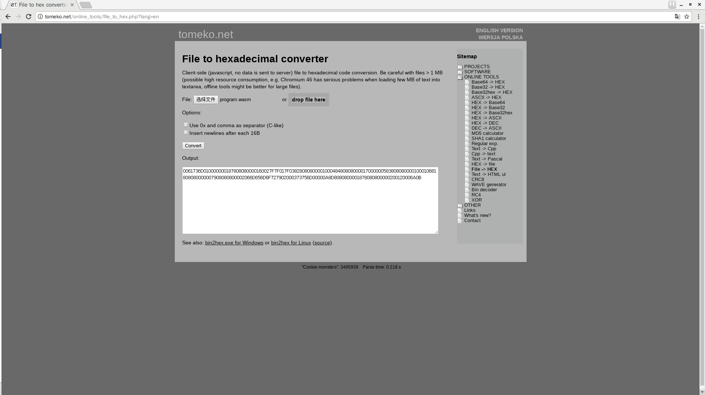

# Wasm Smart Contract

## Introduction
Wasm (WebAssembly) is a binary instruction format for stack-based virtual machines. Wasm is designed to be a portable target for compiling high-level languages such as C/C++/Rust, and supports deployment of client and server applications on the Web. Ontology supports smart contracts written in the wasm format.


## Compilation

1. First, we will prepare a simple c language contract including following actions:
   - add : calculate two integers.
   - concat : concat two strings.
   - sumArray : calculate the sumary of an integer array.
   - addStorage : add a key-value pair to ledger storage.
   - getStorage : get a ledger stored value by input key .

```c
char * JsonMashal(void * val,char * types);
int strcmp(char *a,char *b);
int arrayLen(char *a);
void * malloc(int size);
void RuntimeNotify(char * message);
void PutStorage(char * key,char *value);
char * GetStorage(char * key);
void DeleteStorage(char * key);
int ReadInt32Param(char *addr);
char * ReadStringParam(char *addr);


int add(int a, int b ){
        return a + b;
}

char * concat(char * a, char * b){
	int lena = arrayLen(a);
	int lenb = arrayLen(b);
	char * res = (char *)malloc((lena + lenb)*sizeof(char));
	for (int i = 0 ;i < lena ;i++){
		res[i] = a[i];
	}

	for (int j = 0; j < lenb ;j++){
		res[lenb + j] = b[j];
	}
	return res;
}


int sumArray(int * a, int * b){

	int res = 0;
	int lena = arrayLen(a);
	int lenb = arrayLen(b);

	for (int i = 0;i<lena;i++){
		res += a[i];
	}
	for (int j = 0;j<lenb;j++){
		res += b[j];
	}
	return res;
}


char * invoke(char * method,char * args){

        if (strcmp(method ,"init")==0 ){
                return "init success!";
        }

        if (strcmp(method, "add")==0){

		int a = ReadInt32Param(args);
		int b = ReadInt32Param(args);
		int res = add(a,b);
                char * result = JsonMashal(res,"int");
		RuntimeNotify(result);
                return result;
        }

	if(strcmp(method,"concat")==0){
		
		char * a = ReadStringParam(args);
		char * b = ReadStringParam(args);
		char * res = concat(a,b);
		char * result = JsonMashal(res,"string");
		RuntimeNotify(result);
		return result;
	}
	
	if(strcmp(method,"addStorage")==0){
		
		char * a = ReadStringParam(args);
                char * b = ReadStringParam(args);
		
		PutStorage(a,b);
		char * result = JsonMashal("Done","string");
		RuntimeNotify(result);
		return result;
	}

	if(strcmp(method,"getStorage")==0){

                char * a = ReadStringParam(args);

                char * value = GetStorage(a);
                char * result = JsonMashal(value,"string");
                RuntimeNotify(result);
                return result;
        }


}
	

```

The following functions are provided by the virtual machine API and need to be declared at the head of the file.

```c
char * JsonMashalResult(void * val,char * types);
int strcmp(char *a,char *b);
int arrayLen(char *a);
void * malloc(int size);
void RuntimeNotify(char * message);
void PutStorage(char * key,char *value);
char * GetStorage(char * key);
void DeleteStorage(char * key);

```

The entry of WASM contract is unified as ```char * invoke(char * method, char * args)```.

**method** is the method’s name that needs to be called

**args** are the incoming parameters, raw bytes

**API Description**

-  ```int strcmp(char *a,char *b)``` ：String comparison function, which can be used to judge the method’s name that needs to be called.


-  ```int ReadInt32Param(char *addr)``` : read int  param from input bytes.
-  ```char * ReadStringParam(char *addr)``` : read  string param from input bytes.


- ```int arrayLen(char *a)``` : get String length.

- ```void * malloc(int size)``` : alloc memory for input size.

- ```void RuntimeNotify(char * message)```  : add a system notification, can be catched in SDK side.

- ```void PutStorage(char * key,char *value)``` : add a  key-value storage to ledger.

- ```char * GetStorage(char * key)``` : get stored value from ledger by input key.

- ```char * JsonMashalResult(void * val,char * types)``` : mashal result to json format.  For example:```  {"type":"string","value":"hello world!"}```.

  ​

2. Compile the above C file into a smart contract in wasm format.
    * Emscripten tool [http://kripken.github.io/emscripten-site/](http://http://kripken.github.io/emscripten-site/)
    * Use the online compiler WasmFiddle [https://wasdk.github.io/WasmFiddle](https://wasdk.github.io/WasmFiddle)
    
   Use WasmFiddle as an Example
​    

Paste the C code into the edit window of "c". Please ignore the contents of the "JS" window and click the "Build" button. If the compilation is correct, you can see the compiled wast format code in the "Text Format" window. If the compilation is wrong, an error message will be displayed in the "output" window.


If you are familiar with [wast syntax](http://webassembly.org/docs/binary-encoding/)，you can modify the wast file yourself.

And use the [wabt](https://github.com/WebAssembly/wabt) tool to compile the wast file into wasm format.


​    
3. Click the "wasm" button to download the compiled wasm file


### Passing parameters in Json format

Incoming parameters can be in Json format:

```c
void JsonUnmashalInput(void * addr,int size,char * arg);
char * JsonMashalResult(void * val,char * types);
int strcmp(char *a,char *b);
int arrayLen(char *a);
void * malloc(int size);
void RuntimeNotify(char * message);
void PutStorage(char * key,char *value);
char * GetStorage(char * key);
void DeleteStorage(char * key);


int add(int a, int b ){
        return a + b;
}

char * concat(char * a, char * b){
	int lena = arrayLen(a);
	int lenb = arrayLen(b);
	char * res = (char *)malloc((lena + lenb)*sizeof(char));
	for (int i = 0 ;i < lena ;i++){
		res[i] = a[i];
	}

	for (int j = 0; j < lenb ;j++){
		res[lenb + j] = b[j];
	}
	return res;
}


int sumArray(int * a, int * b){

	int res = 0;
	int lena = arrayLen(a);
	int lenb = arrayLen(b);

	for (int i = 0;i<lena;i++){
		res += a[i];
	}
	for (int j = 0;j<lenb;j++){
		res += b[j];
	}
	return res;
}


char * invoke(char * method,char * args){

        if (strcmp(method ,"init")==0 ){
                return "init success!";
        }

        if (strcmp(method, "add")==0){
                struct Params {
                        int a;
                        int b;
                };
                struct Params param;

                JsonUnmashalInput(&param,sizeof(param),args);
                int res = add(param.a,param.b);
                char * result = JsonMashalResult(res,"int");
                RuntimeNotify(result);
		return result;
        }

	if(strcmp(method,"concat")==0){
		struct Params{
			char *a;
			char *b;
		};
		struct Params param;
		JsonUnmashalInput(&param,sizeof(param),args);
		char * res = concat(param.a,param.b);
		char * result = JsonMashalResult(res,"string");
		RuntimeNotify(result);
		return result;
	}
	
	if(strcmp(method,"sumArray")==0){
		struct Params{
			int *a;
			int *b;
		};
		struct Params param;
		JsonUnmashalInput(&param,sizeof(param),args);
		int res = sumArray(param.a,param.b);
		char * result = JsonMashalResult(res,"int");
		RuntimeNotify(result);
		return result;
	}

	if(strcmp(method,"addStorage")==0){

		struct Params{
			char * a;
			char * b;
		};
		struct Params param;
		JsonUnmashalInput(&param,sizeof(param),args);
		PutStorage(param.a,param.b);
		char * result = JsonMashalResult("Done","string");
		RuntimeNotify(result);
		return result;
        }
	if(strcmp(method,"getStorage")==0){

		struct Params{
			char * a;
		};
		struct Params param;
		JsonUnmashalInput(&param,sizeof(param),args);
		char * value = GetStorage(param.a);
		char * result = JsonMashalResult(value,"string");
		RuntimeNotify(result);
		return result;
	}
	if(strcmp(method,"deleteStorage")==0){

                struct Params{
                        char * a;
                };
                struct Params param;
                JsonUnmashalInput(&param,sizeof(param),args);
                DeleteStorage(param.a);
                char * result = JsonMashalResult("Done","string");
                RuntimeNotify(result);
                return result;
        }
}	                                                                                 
```

This example adds the new APIs:
```go
void JsonUnmashalInput(void * addr,int size,char * arg);
void DeleteStorage(char * key):
```

-  ```void JsonUnmashalInput(void * addr,int size,char * arg)``` ：parse the parameters in json format into defined structures.
- ```void DeleteStorage(char * key)``` : delete storage from ledger by input key.

Since webFiddle has problems with the compilation of the ```&``` operation of the C language, it needs to use Emscripten to compile it.

* For installation of Emscripten, please refer to [http://kripken.github.io/emscripten-site/](http://http://kripken.github.io/emscripten-site/)
* Use the command ```emcc cfiles/{file}.c -Os -s WASM=1 -s SIDE_MODULE=1 -o cfiles/{file}.wasm``` to compile the C file to a wasm format file.
* Install WABT [https://github.com/WebAssembly/wabt](https://github.com/WebAssembly/wabt)
* Use the wasm2wat {file}.wasm > {file}.wast command to view.


* You can see that the method names are compiled into names that start with ```_``` , which needs to be modified manually.

* We only want to export the ```invoke``` method and need to delete the other "export"
* ```(import "env" "memory" (memory (;0;) 256))``` memory size is set to 256 pages, according to Webassembly [spec](https://github.com/WebAssembly/design/blob/27ac254c854994103c24834a994be16f74f54186/Semantics.md#linear-memory), each page is 64K. Our contract does not require so much memory. So we can change 256 to 1.
* Use```wat2wasm {file}.wast ```to compile the wasm format file


### Get the binary contents of the wasm file
Use the online tool [http://tomeko.net/online_tools/file_to_hex.php?lang=en](http://tomeko.net/online_tools/file_to_hex.php?lang=en)

