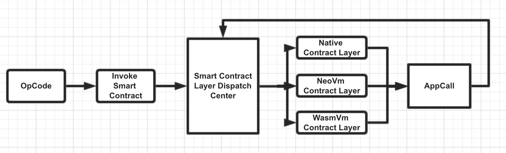

[English](./overview.md) / 中文


<h1 align="center">Ontology Smart Contract Overview</h1>
<p align="center" class="version">Version 0.7.0 </p>

## 1. Introduction
The concept of “smart contract” was first introduced in 1994 by Nick Szabo as a goal of information dissemination, authentication, or practices of contract law through electronic protocols designed to allow transactions to proceed between entities excluding third-party middlemen. However, these transactions were traceable but irreversible. Ontology Smart Contract possesses dynamic features, including high scalability, high performance, multilingual, cross-contracts, cross-virtual-machines, etc., all integrated into one system. Ontology Smart Contract supports various smart contract modules, such as Native Smart Contract, NeoVM Smart Contract and Wasm Smart Contract. Ontology Smart Contract supports multiple programming languages without developers having to learn a new specific language, providing them with easy accessibility and smart contract editing capability. Current programming languages include: Java, C#, Python, C, C++, Kotlin, etc. Additional mainstream programming languages will be onboarded in the near future, such as Rust, Go, JavaScript, etc.


## 2. Contract Type
Ontology Smart Contract currently has three types of contracts: Native Contract, NeoVM Contract, and WasmVM Contract. Ontology uses Native Contract as a base layer to write its contracts. Native code optimizes standard contract deployment while also enhancing its performance and execution process. General services include: Oracle, DID, Authority Management, and Data Exchange – all using the Native Contract to enact. NeoVM uses NeoVM virtual machine for operating contracts, and needs to write its corresponding codes, combining high top language analysis and conversion, currently supporting programming languages such as Java, C#, and Python. Combining the Interop Service layer enables easy access for the Virtual Machine and the ledger layer framework to correspond. WasmVM contract uses Wasm virtual machine for operating contracts and needs corresponding contract coding. Current programming languages include: C and C++. Wasm itself possesses a favorable editing machine while Wasm virtual machine has the characteristics of being high-performance and lightweight.


## 3. Smart Contract Scheduling
VM Type
```
// Prefix of address
type VmType byte

const (
	Native = VmType(0xFF)
	NEOVM  = VmType(0x80)
	WASMVM = VmType(0x90)
)
```
VMcode struct
```
type VmCode struct {
	VmType VmType
	Code   []byte
}
```
invoke transaction payload
```
// InvokeCode is an implementation of transaction payload for invoke smartcontract
type InvokeCode struct {
	GasLimit common.Fixed64
	Code     stypes.VmCode
}
```
The execution of Ontology Smart Contract requires input parameters and the corresponding virtual machine type. According to the different types of virtual machines, the Scheduler will start the corresponding virtual machine for smart contract execution. During the execution, the contract uses AppCall command (which includes the needed parameters for contract operation), enacting the Smart Contract Scheduler. The Scheduler will signal the according virtual machines to execute corresponding scripts with its parameters, until contract operation has been completed. 


