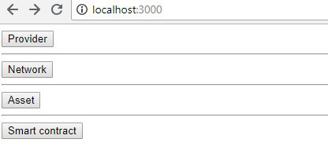
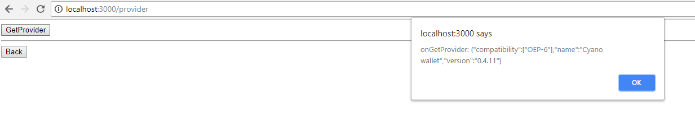
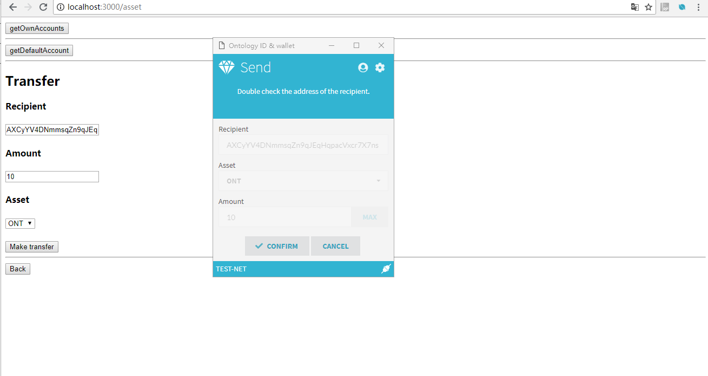
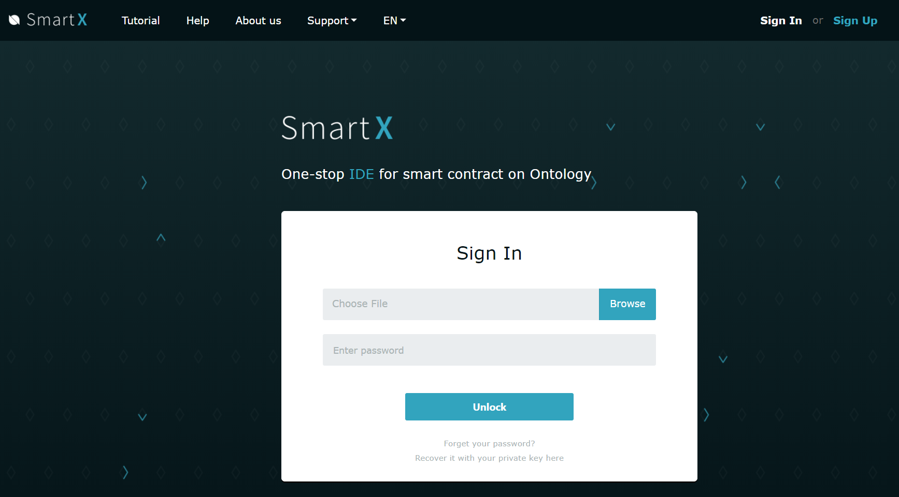
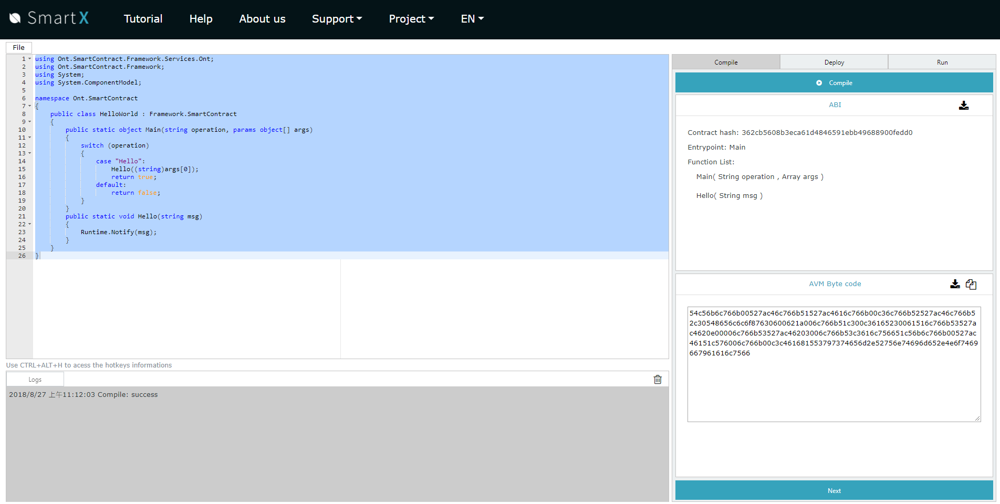

[English](./ontology_dapp_dev_tutorial_en.html) / 中文

<h1 align="center">Ontology DAPP开发教材</h1>
<p align="center" class="version">Version 1.0.0 </p>

这个教程教你如何使用Ontology dApp API (dAPI)开发dApp。

大纲:

[安装开发环境](#安装开发环境)

[Ontology dAPI](#ontology-dapi)
+ [dAPI 安装](#dapi-安装)
+ [dAPI 实例](#dapi-实例)
+ [dAPI 方法](#dapi-方法)
	+ [与链交互方法](#与链交互方法)
	+ [转账方法](#转账方法)
	+ [智能合约方法](#智能合约方法)

[运行例子](#运行例子)

[为你的dApp写智能合约](#为你的dApp写智能合约)
+ [编译你的智能合约](#编译你的智能合约)
+ [部署你的智能合约](#部署你的智能合约)
+ [测试你的智能合约](#测试你的智能合约)


### 安装开发环境

请确保安装以下软件。.

- [Node.js v6+ LTS with npm](https://nodejs.org/en/)

- [Cyano Wallet]( https://chrome.google.com/webstore/detail/ontology-web-wallet/dkdedlpgdmmkkfjabffeganieamfklkm)

- [Git](https://git-scm.com/)


### Ontology dAPI
#### dAPI 安装
创建dApp时，Ontology dAPI是与Ontology链交互的核心API之一，可以从这里下载源码。 [这里](https://github.com/ontio/ontology-dapi). 通过 ```npm``` 安装```ontology-dapi``` : 

```
$ npm install ontology-dapi
```

#### dAPI 实例

创建dAPI 实例时，要先导入库ontology-dapi，并注册客户端:

```typescript
import { client } from 'ontology-dapi';

client.registerClient({});
```

#### dAPI 方法
创建dAPI 实例成功后, 就可以在你的dApp中调用 dAPI 方法.
##### 与链交互方法
```typescript
const network = await client.api.network.getNetwork();
const height = await client.api.network.getBlockHeight();
const block = await client.api.network.getBlock({ block: 1 });
const transaction = await client.api.network.getTransaction({txHash: '314e24e5bb0bd88852b2f13e673e5dcdfd53bdab909de8b9812644d6871bc05f'});
const balance = await client.api.network.getBalance({ address: 'AcyLq3tokVpkMBMLALVMWRdVJ83TTgBUwU' });
```
##### 转账方法
```
const result = await client.api.asset.makeTransfer({ recipient, asset, amount });
```
##### 智能合约方法
```typescript
const result = await client.api.smartContract.invoke({contract,method,parameters,gasPrice,gasLimit,requireIdentity});
const result = await client.api.smartContract.invokeRead({ contract, method, parameters });
const result = await client.api.smartContract.deploy({code,name,version,author,email,description,needStorage,gasPrice,gasLimit});
```
##### 数据签名

```
const message: string = values.message;
const signature: Signature = {
  data,
  publicKey
};
const result = await client.api.message.signMessage({ message });
const result = await client.api.message.verifyMessage({ message, signature });
```

所有方法列表可以在文档中找到 [dAPI 规范](https://github.com/backslash47/OEPs/blob/oep-dapp-api/OEP-6/OEP-6.mediawiki). <br> 


### 运行例子

拷贝 [dAPI 例子](https://github.com/OntologyCommunityDevelopers/ontology-dapi-demo) ，可以测试dAPI提供了哪些功能.

```
$ git clone https://github.com/OntologyCommunityDevelopers/ontology-dapi-demo.git

$ npm install

$ npm run start
```

启动成功后，在浏览器打开页面 http://localhost:3000

页面成功打开后, 点击 Provider->GetProvider.




就通过 API 调用与链交互了.  例如, 点击 Network->Get Block ，结果如下:


运行转账例子，点击 Asset->Make Transfer ， Cyano Wallet会弹出确认框. 点击 ```Confirm``` 确认交易.




### 为你的dApp写智能合约

dApp后端逻辑和存储需要使用智能合约，可以通过**SmartX**编辑和调试智能合约，**SmartX**中包含多个合约例子。[SmartX](http://smartx.ont.io/)，[Smart Contract 教程](https://github.com/ontio/documentation/tree/master/smart-contract-tutorial)




#### 编译和部署你的智能合约

**SmartX** 使用 Cyano Wallet 帮助部署和调用合约. 请确保按照了 Cyano 并创建了测试网账号.

#### 编译你的智能合约

使用 **SmartX** 编译合约



#### 部署你的智能合约

写完智能合约，编译成功后，下一步是部署和调用智能合约.  如果你没有测试网的ONG，需要 [申请 测试网 ONG in Discord](https://discordapp.com/channels/400884201773334540/453499298097922068)


 

### 测试你的智能合约

可以使用测试框架测试你的智能合约 [smart contract automated testing framework](https://github.com/lucas7788/pythontest)， 如果需要部署到私链，请下载最新版Ontology并启动， [Ontology release](https://github.com/ontio/ontology/releases).
```
$ ./ontology --testmode --gasprice 0

```
